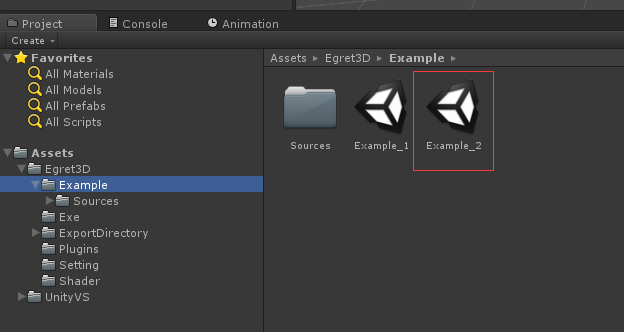
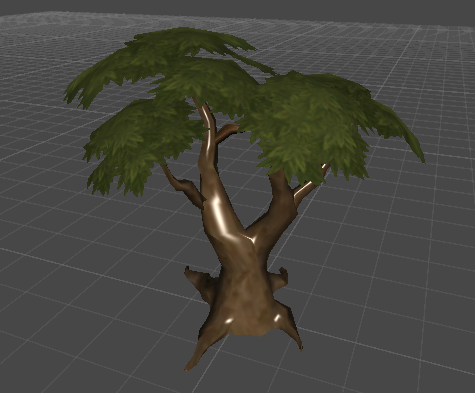
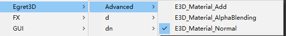
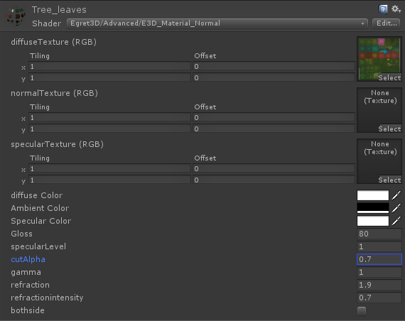
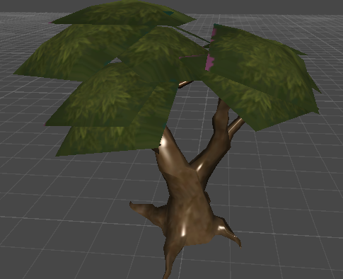
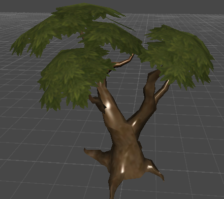
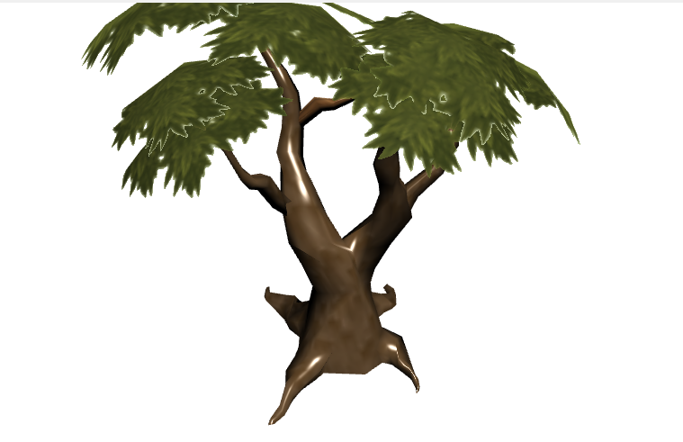
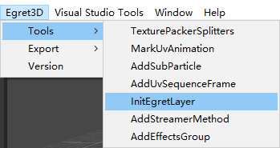
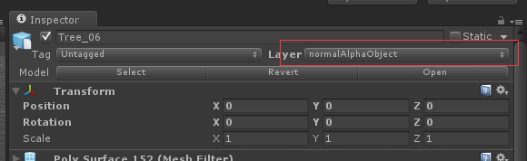
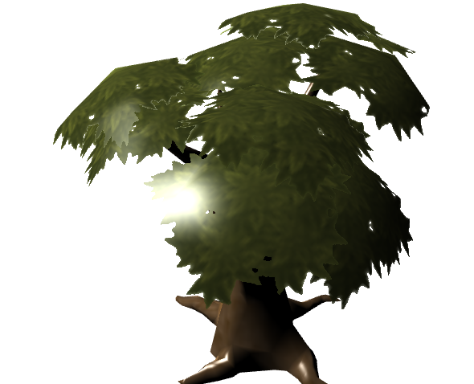

	1）我们已经成功导出了unity3d的cube立方体，接下来我们来使用Egret3D插件内的shader来一比一还原导出mesh。
	2）我们打开Example文件夹下的Example_2场景文件，目录位置如图所示：

	3) 首先我们来看一下Egret3D的unity插件为我们提供那些shader,这里我们推荐使用新版本Advanced目录下的shader,其中E3D_Material_Normal，E3D_Material_Add
	和E3D_Material_AlphaBlending分别对应了normal，add和AlphaBlending三种不同的模式，方便用户使用。
	

	5）shader的参数，抛开模式不一致，三种shader的参数几乎一致，接下来我们已E3D_Material_Normal为例子进行说明：

	
		a）diffuseTexture:漫反射贴图。
		b）normalTexture:法线贴图。
		c）specularTexture:高光贴图。
		d）diffuse Color:漫反射色。	
		e）Ambient Color:法线色。	
		f）Specular Color:高光色。	
		g）Gloss:光泽。	
		h）specularLevel:高光级别。	
		e）cutAlpha:透明裁剪,小于该值将被裁剪。	
		j）gamma:校正系数。	
		k）refraction:折射系数。	
		l）refractionintensity:折射强度。	
		m）bothside:双面。 	

	6）这次导出使用的mesh，是一个多材质的模型，可以分为树干与树叶两部分。两个部分的材质球都使用了E3D_Material_Normal，其中树叶部分比较特殊，需要设置
		cutAlpha = 0.5来去除无用的透明像素。我们来看下cutAlpha = 0和0.5的差别。

	7）参数调整完毕后，可以参考mesh导出教程内的步骤进行导出，输出结果如下：

	8) 上图中不难发现树叶边缘存在ALPHA错乱的的问题，那么我们首先菜单栏Egret3D-->Tools-->InitEgretLayer,然后选中树木，设置其layer层为
		normalAlphaObject，重新导出后如图所示：

