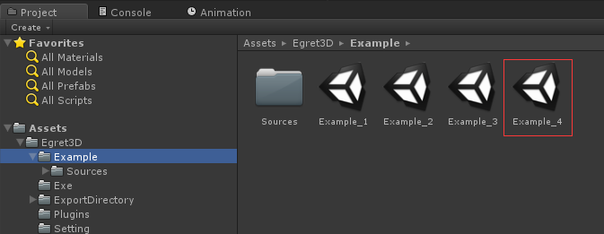
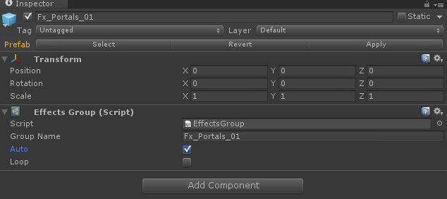
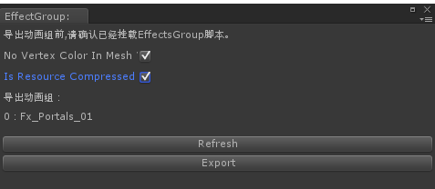
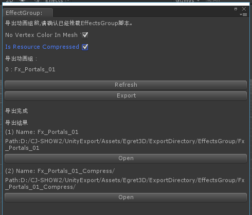
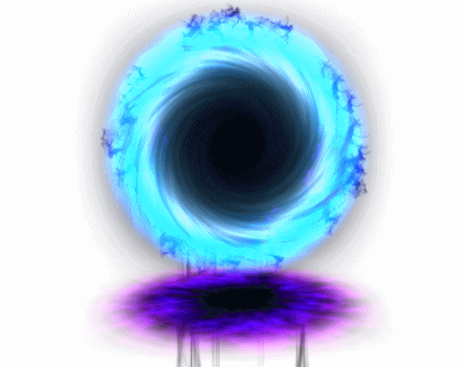

	1）本篇教程将讲述如何输出EffectGroup特效组。
	2）我们打开Example文件夹下的Example_4场景文件，目录位置如图所示：

	3）Example_4场景内如图所示：

	4）我们选中Fx_Portals_01，打开菜单栏Egret3D-->Tools-->AddEffectsGroup,为Fx_Portals_01添加EffectGroup脚本，脚本内有auto（自动播放）和
		Loop（循环）可以勾选，由于该特效制作的时候已经循环，本次的导出只勾选自动，如下图所示：

	5) 确认无误后，打开菜单栏Egret3D-->Export-->EffectGroup,打开特效组导出界面：

	6）参考上图中的面板图片，接下来详细的说明一下面板上的参数用途：
		a) No Vertex Color In Mesh：
			导出时，勾选此项将不输出Mesh信息内的顶点色信息，使用引擎内默认值替代，导出文件大小将得到优化。
		b) Is Resource Compressed:
			导出时，勾选此项将同时输出一份压缩格式的资源。
		c) 导出对象信息表，这里将罗列出将要导出的所有资源。

	7）参数确认无误后，我们可以点击Export进行导出，本次导出我们导出了一个压缩版本和未压缩版本，接下来我们使用压缩版本来进行资源加载：

	8) 打开压缩资源目录，可以看到两个文件，effect.e3dPack和effect.e3dPackc，其中e3dPackc使用zip压缩，由于游览器限制问题，这里我们使用
		effect.e3dPack拷贝至main目录下：

	9）测试代码：
		a) Main.ts
			class Main extends egret.DisplayObject {
			    // Canvas操作对象
			    protected _egret3DCanvas: egret3d.Egret3DCanvas;
			
			    // View3D操作对象
			    protected _view3D: egret3d.View3D;
			    /**
			    * look at 摄像机控制器 。

			    * 指定摄像机看向的目标对象。

			    * 1.按下鼠标左键并移动鼠标可以使摄像机绕着目标进行旋转。

			    * 2.按下键盘的(w s a d) 可以摄像机(上 下 左 右)移动。

			    * 3.滑动鼠标滚轮可以控制摄像机的视距。

			    */
			    private cameraCtl: egret3d.LookAtController;
			
			    //加载队列
			    private urlArray: Array<string> = new Array<string>();
			    //队列加载器
			    private mapLoader: egret3d.QueueLoader;
			
			
			    public constructor() {
			        super();
			
			        //创建Canvas对象。
			        this._egret3DCanvas = new egret3d.Egret3DCanvas();
			        //Canvas的起始坐标，页面左上角为起始坐标(0,0)。
			        this._egret3DCanvas.x = 0;
			        this._egret3DCanvas.y = 0;
			        //设置Canvas页面尺寸。
			        this._egret3DCanvas.width = window.innerWidth;
			        this._egret3DCanvas.height = window.innerHeight;
			
			        //创建View3D对象,页面左上角为起始坐标(0,0)
			        this._view3D = new egret3d.View3D(0, 0, window.innerWidth, window.innerHeight);
			        //当前对象对视位置,其参数依次为:
			        //@param pos 对象的位置
			        //@param target 目标的位置
			        this._view3D.camera3D.lookAt(new egret3d.Vector3D(0, 0, 1000), new egret3d.Vector3D(0, 0, 0));
			        //View3D的背景色设置
			        this._view3D.backColor = 0xffffffff;
			        //将View3D添加进Canvas中
			        this._egret3DCanvas.addView3D(this._view3D);
			
			        //插入加载任务
			        this.urlArray.push("resource/Main/effect.e3dPack");
			        this.mapLoader = new egret3d.QueueLoader();
			        for (var i = 0; i < this.urlArray.length; i++) {
			            this.mapLoader.load(this.urlArray[i]);
			        }
			        this.mapLoader.addEventListener(egret3d.LoaderEvent3D.LOADER_COMPLETE, this.OnMapLoad, this);
			
			        this.InitCameraCtl();
			
			        //启动Canvas。
			        this._egret3DCanvas.start();
			        this._egret3DCanvas.addEventListener(egret3d.Event3D.ENTER_FRAME, this.update, this);
			
			        //设置window resize事件
			        egret3d.Input.addEventListener(egret3d.Event3D.RESIZE, this.OnWindowResize, this);
			    }
			
			    public update(e: egret3d.Event3D) {
			        this.cameraCtl.update();
			    }
			
			    /**
			    * 窗口尺寸变化事件
			    */
			    private OnWindowResize(e: egret3d.Event3D): void {
			        //重置ui大小
			        this._egret3DCanvas.width = window.innerWidth;
			        this._egret3DCanvas.height = window.innerHeight;
			        this._view3D.width = window.innerWidth;
			        this._view3D.height = window.innerHeight;
			    }
			
			    /**
			    * 初始化相机控制
			    */
			    private InitCameraCtl() {
			        //摄像机控制类
			        this.cameraCtl = new egret3d.LookAtController(this._view3D.camera3D, new egret3d.Object3D());
			        //设置目标和相机的距离
			        this.cameraCtl.distance = 300;
			        //设置相机x轴旋转
			        this.cameraCtl.rotationX = 0;
			    }
			
			    ///加载完成事件
			    private OnMapLoad(e: egret3d.LoaderEvent3D) {
			
			        for (var i = 0; i < this.urlArray.length; i++) {
			             var node: egret3d.Object3D = this.mapLoader.getAsset(this.urlArray[i]);
				         this._view3D.addChild3D(node);
			        }
			    }
			
			
			}     

		b）Index.html
			<!DOCTYPE HTML>
			<html>
			<head>
			    <meta charset="utf-8">
			    <title>Egret</title>
			    <meta id="viewport" name="viewport" content="width=device-width, initial-scale=1.0, maximum-scale=1.0, user-scalable=no" />
			    <meta name="apple-mobile-web-app-capable" content="yes">
			    
			    
			
			    <!--这个标签为通过egret提供的第三方库的方式生成的 javascript 文件。删除 modules_files 标签后，库文件加载列表将不会变化，请谨慎操作！-->
			    <!--modules_files_start-->
				
				
				
				<!--modules_files_end-->
				
			    <!--这个标签为不通过egret提供的第三方库的方式使用的 javascript 文件，请将这些文件放在libs下，但不要放在modules下面。-->
			    <!--other_libs_files_start-->
			    <!--other_libs_files_end-->
			
			    <!--这个标签会被替换为项目中所有的 javascript 文件。删除 game_files 标签后，项目文件加载列表将不会变化，请谨慎操作！-->
			    <!--game_files_start-->
				
				<!--game_files_end-->
			    
			</head>
			<body>
			
			    

			    

			    
			    
			</body>
			</html>

	10）运行结果：

