	1）前面的教程已经详细的介绍插件各种导出功能，本教程将导出一个烘培过的地形场景。
	2）我们打开Example文件夹下的Example_5场景文件，目录位置如图所示：

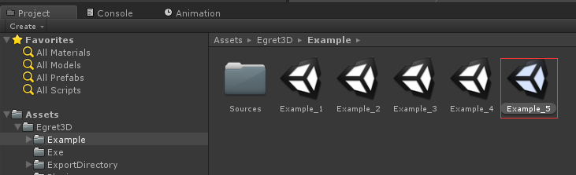

	3）场景内容如图示：

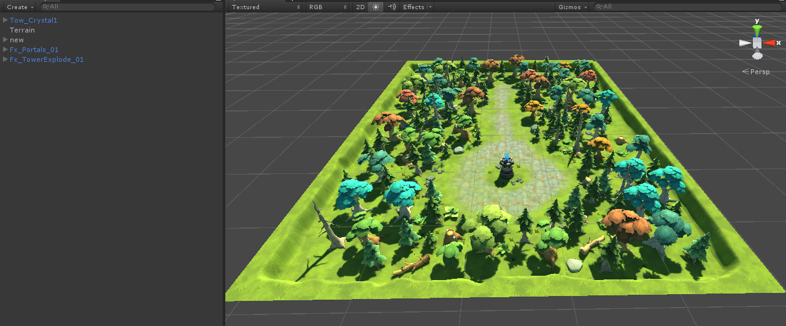
	
		a) Tow_Crystal1节点：
			该节点为一个属性动画节点，节点包含一个旋转动画控制水晶旋转。该对象导出后会导出一个epa后缀文件保存属性动画信息，当前版本的暂时只支持animator动画
			组件，支持循环动画和自动播放。其中循环播放需要勾选下图中的选项：

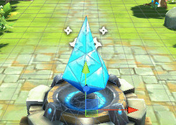
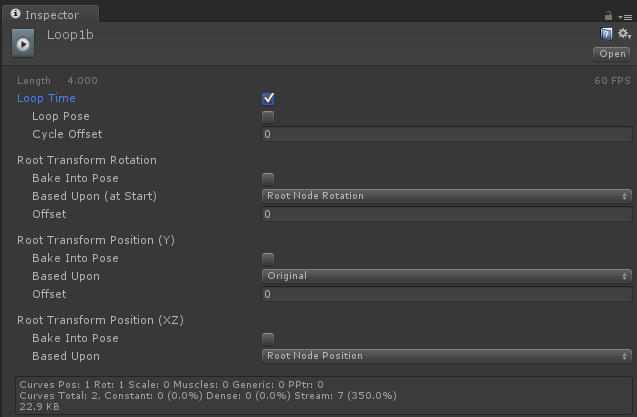

		b) Terrain节点
			该节点是一个地形节点，是通过unity的地形绘制器生成地形信息组件，但是有一些限制需要导出前确认，首先PaintTexture图片个数不能超过四个，
			超出部分无法导出。 下图为烘培过光照贴图后的地形示例：

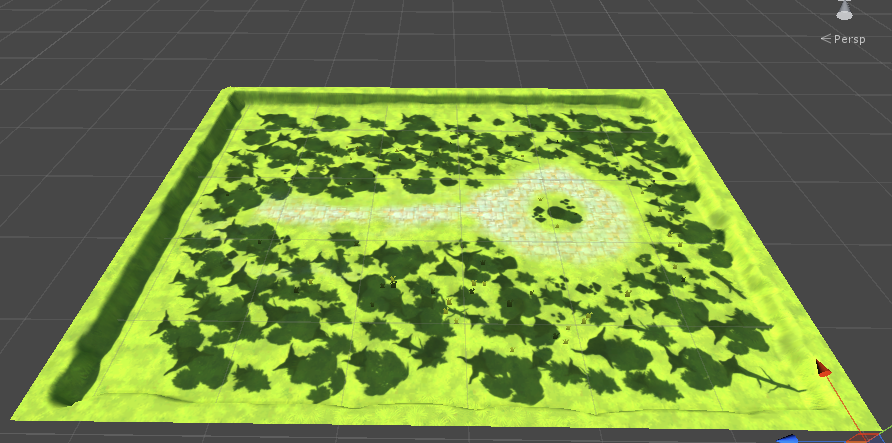

		c）new节点
			该节点是静态Mesh节点群，unity3D内该节点将勾选Static选项，导出时候勾选Using Batching进行合并导出，从而优化性能，但是Batching后就无法动态
			修改，导出参数设置可以参考Mesh导出和Material设置部分教程。

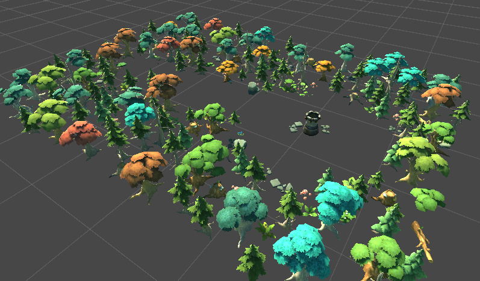
			
		d) Fx_Portals_01 和 Fx_TowerExplode_01 节点
			这两个节点都是特效组节点，可以作为特效组被场景导出，也可以作为单独特效进行导出。这里为了方便控制我们分别为其添加了特效组导出脚本，详细导出步
			骤可以参看EffectGroup导出教程部分。

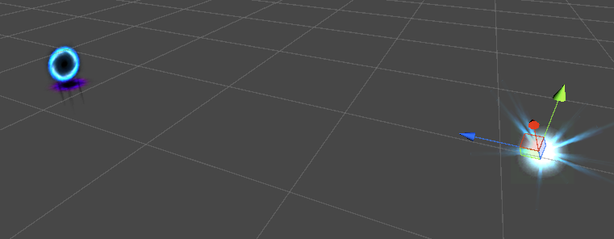

		e) 光照贴图部分
			打开菜单栏Window-->LightMapping,我们可以看到场景烘培的详细信息，暂时只支持Mode为Single Lightmaps模式下的unity3d光照贴图烘培信息导出，

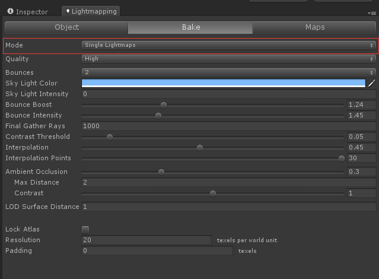

	4）然后我们选择菜单栏Egret3D-->Export-->Scene步骤打开导出场景功能块，这里我们勾选了Using Batching来对场景内的静态内容进行优化。
	
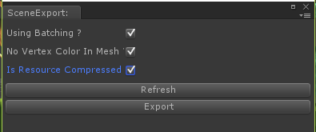

	5）点击Export开始导出，导出完毕后，我们将会获取到一个压缩格式和非压缩格式的场景文件。

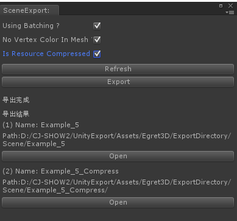

	6）我们打开压缩格式的目录信息，内容是由三部分组成的：图片内容，scene.e3dPack和scene.e3dPackc。这里我们拷贝图片内容和scene.e3dPack来进行内容演示。

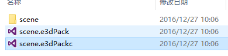
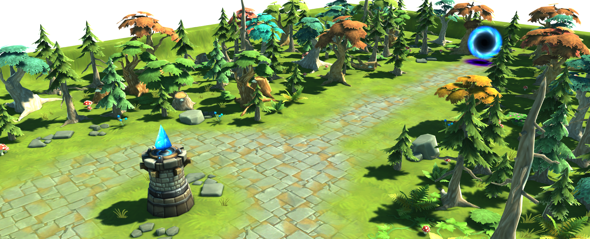
