	1）前面我们已经完整的导出了整个场景的内容，接下来我们继续了解使用unity3d粒子系统导出时候所需要注意的事项。
	2）我们打开Example文件夹下的Example_6场景文件，目录位置如图所示：

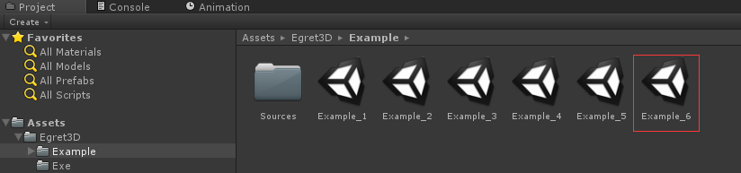

	3）场景内存在一个粒子对象，是一个默认的粒子对象，我们首先看一下Unity3D粒子编辑器的样式。

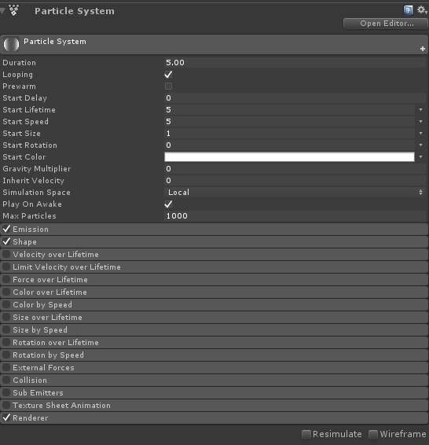

	4）unity3D 为用户提供了强大的粒子编辑功能，然后在使用unity3d粒子导出功能的时候，由于平台不同，会存在不少需要注意的地方：
		a) 不要使用unity编辑器内自带资源，否则将出现无法导出的情况。
		b) 子粒子发射器仅支持在Birth阶段事件触发，使用子粒子发射器需要给粒子对象挂载子粒子脚本，可以选中父粒子发射器后使用菜单栏Egret3D-->Tools-->
			AddSubParticle，填写子粒子信息。

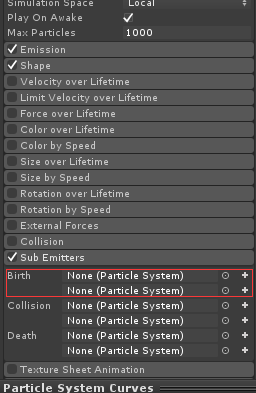
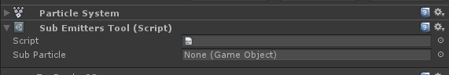

		c) 其中Emission和Render为必备的节点，请确保该节点处于勾选中的状态，

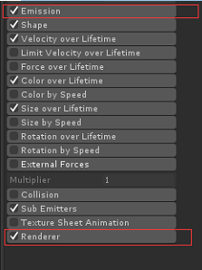
		
		d）不支持：Color by Speed,Size by Speed,Rotation by Speed,External Forces和Collision等模块。

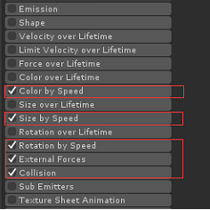

		e) Render模块内中尚未支持的属性。

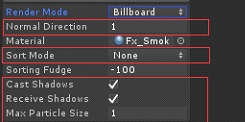

		f) 控制粒子的最大数量： webgl中顶点长度有上限。
		g) 编辑贝塞尔曲线的时候，曲线不要超过两段。下图为举例说明2段贝塞尔曲线的情况,如果使用直线线则不受段数限制;

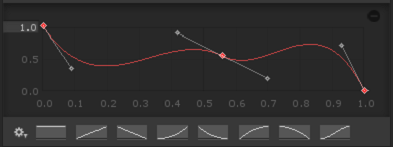

		h) 谨慎使用Space为world类型的粒子，这种类型的粒子会使用CPU检测更新顶点数据，导致渲染效率下降。

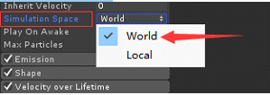
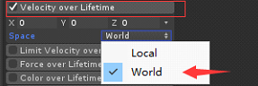
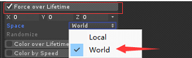

	4) 可以在场景内直接导出，也可以作为EffectGroup导出。