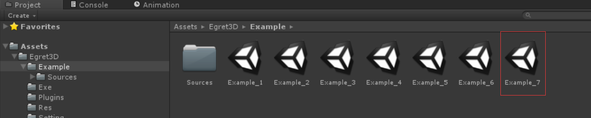
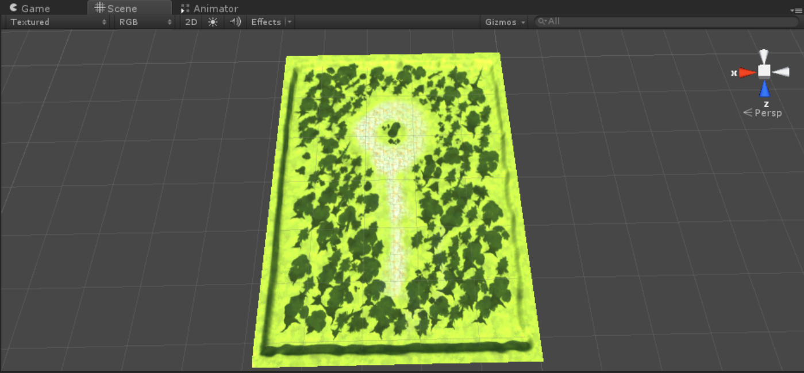
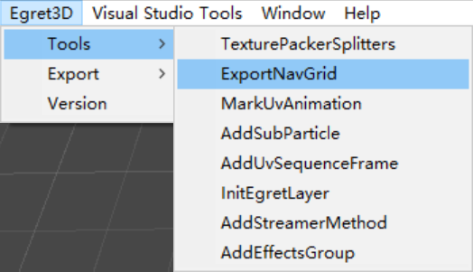
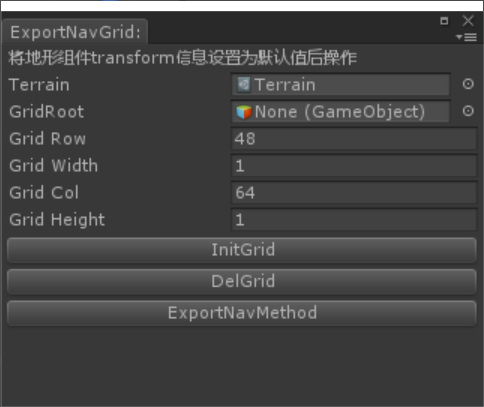
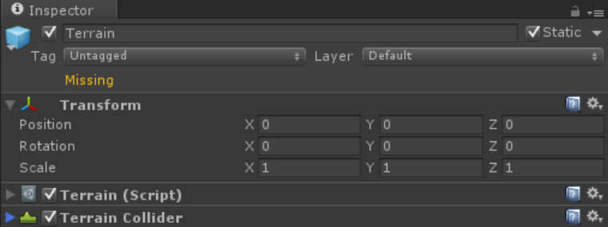
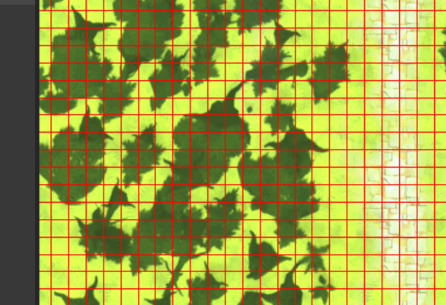
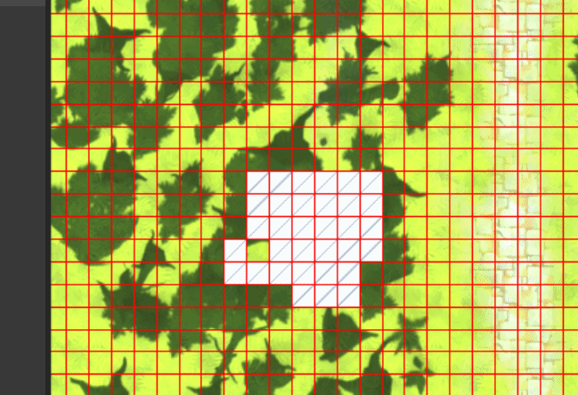
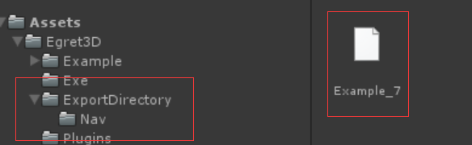

	1）前面我们已经完整的导出了整个场景的内容，接下来我们将导出寻路功能中的网格数据，这部分数据也是通过unity插件内功能实现导出的。
	2）我们打开Example文件夹下的Example_7场景文件，目录位置如图所示：

	3）场景内容如图示：

	4）然后我们选择菜单栏Egret3D-->Export-->ExportNavGrid步骤打开导出场景功能块。

	
	5）功能界面如下图，详细参数说明：
		a) terrain: 导出nav地形数据的地形组件对象，初始值为第一个索引到的地形组件。
		b) gridRoot: 绘制后生成的地形数据根节点，一般不做修改，初始值为空。
		c) gridWidth: 绘制网格的宽，一般使用默认值。
		d) gridHeight: 绘制网格的高，一般使用默认值。
		e) gridRow： 地形宽的格子总数，一般使用默认值。
		f) gridCol： 地形长的格子总数，一般使用默认值。
		g) 当全部使用默认值导出时，即生成一个和地形大小近似的网格，单个网格大小约为1m*1m。
		

	
		h) 需要注意的是，请确保terrain组件对象的transform信息为默认值，如下图所示：

	6）确认参数无误后，点击InitGrid按钮生成网格。

	7）鼠标点击选中sence内的网格，就可以开始绘制网格数据。
		a) 按住按键1后滑动鼠标，可以绘制可行走区域。

		b) 按住按键3后滑动鼠标，可以取消可行走区域。

	8）绘制完成后，可以点击ExportNavMethod导出nav数据，文件名为场景名+.nav，保存位置如下图所示：

	9）数据导出测试无误后，可以手动设置Grid(Clone)对象active为false，也可以使用DelGrid删除地形数据。