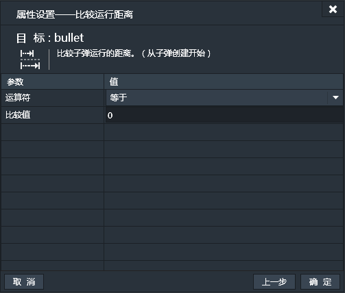
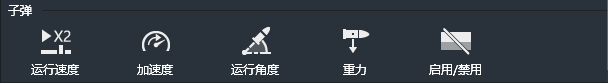
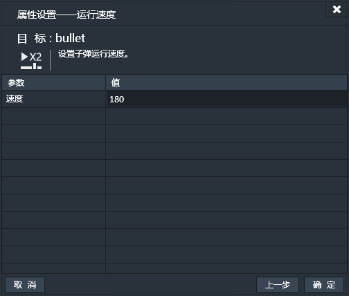
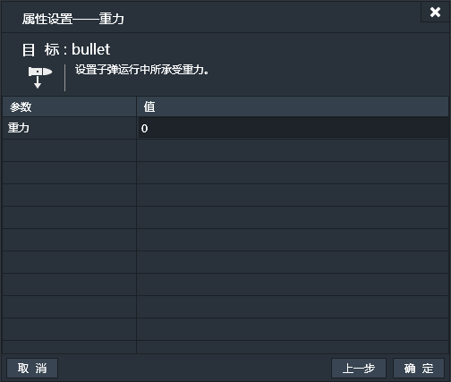

应用了子弹行为的实例会具有以一定的速度朝向指定的方向运动的行为。所以子弹是很相像的一个名称，实例应用了子弹行为后，就会像子弹一样运动。

### 属性面板：

- 速度：子弹的默认运行速度，单位为像素/秒。默认值为400，表示每秒钟移动400像素。
- 加速度：子弹运行的加速度。默认值为0，这时为匀速运动。当值为正时是加速度，当值为负时即为减速度。
- 重力：子弹运行过程中，受的引力，方向固定朝向Y轴负方向。比如子弹水平飞行，如果受重力影响，运行轨迹应该为抛物线，重力越大，抛物线的弧度越大。默认重力为0，此时子弹会保持直线飞行。
- 默认运行角度：设置子弹的默认运动角度。默认值为0。子弹的运行角度和作为子弹的实例本身的角度无关。
------------
### 子弹条件：

#### 比较运行速度：
用所选实例的子弹运行速度和指定值比较。【持续性触发】

#### 比较运行距离：
用所选实例的子弹运行距离和制定值比较。运行距离的测量是从子弹创建开始算起。【持续性触发】

------------
### 子弹动作：

#### 运行速度：
设置子弹运行的速度。

#### 加速度：
设置子弹运行的加速度。

#### 运行角度：
设置子弹运行的角度。

#### 重力：
设置子弹运行中所承受的重力。

#### 启用/禁用：
设置子弹行为是否可用。
