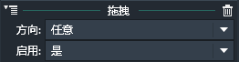
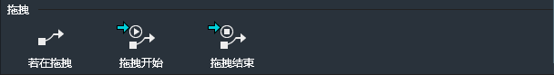
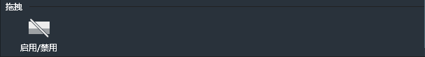

应用了拖拽行为的实例可以被鼠标或手指（手机端）拖动。

### 属性面板：

- 方向：设置允许拖拽的方向。默认为：任意。可用选项有：
 - 任意：表示可以在游戏界面平面内任意反向拖拽。
 - 水平：表示只可以在水平，也就是X轴方向拖拽。
 - 垂直：表示只可以在垂直，也就是Y轴方向拖拽。
- 启用：设置拖拽是否在游戏初始化时就可用。默认为：是。也可以设置为“否”，然后在事件表中基于特定条件再启用拖拽行为。

------------

### 拖拽条件：

#### 若在拖拽：
判断当前实例是否正在被拖拽。【持续性触发】
如果正在被拖拽，条件为真。
此条件无属性设置窗口。

#### 拖拽开始：
当拖拽开始时。【一次性触发】
特指拖拽开始的那一刻。
此条件无属性社会窗口。

#### 拖拽结束：
当拖拽结束是。【一次性触发】
特指拖拽结束的那一刻。
此条件无属性设置窗口。

------------

### 拖拽动作：

#### 启用/禁用：
设置拖拽行为是否可用。
