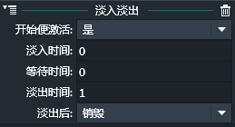
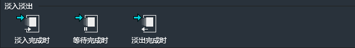
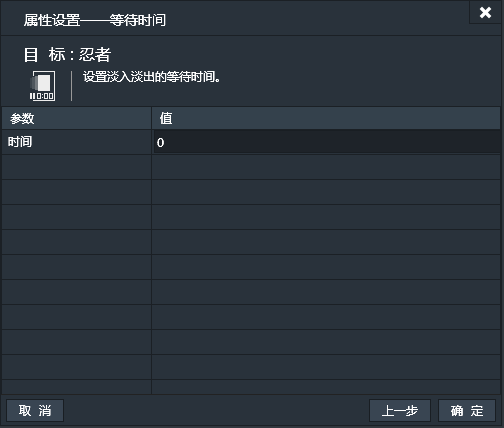
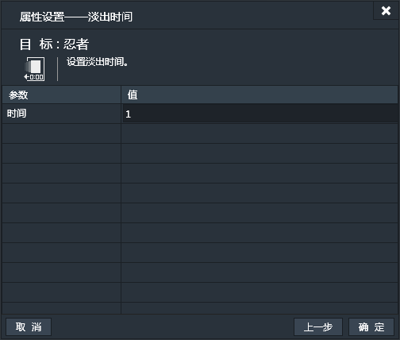

应用了淡入淡出行为的实例，会具备淡入淡出的效果。效果触发的条件，持续的时间由属性，条件或动作具体设定。

### 属性面板：

- 开始便激活：实例创建的时候是否立即执行淡入淡出操作。如果选择“是”，那么实例加载后便立即执行淡入淡出操作。如果选择“否”，则实例正常加载，在特定的动作（淡入淡出动作-开始）执行后才出发淡入淡出操作。
- 淡入时间：淡入过程经过的时间。实例透明度从0%过渡到100%所经过的时间。
- 等待时间：淡入结束后，到淡出开始前的时间段。这段时间内实例的透明度保持100%，完全可见。如果设置为0，表示淡入后立即执行淡出操作。
- 淡出时间：淡出过程经过的时间。实例透明度从100%过渡到0%所经过的时间。
- 淡出后：设置实例淡出后是否立即被销毁。可以设置“销毁”或“不销毁。

------------

### 淡入淡出条件：

#### 淡入完成时：
当淡入动作完成时。【一次性触发】
此条件无属性设置窗口。
#### 等待完成时：
等待时间结束，也就是淡出开始前一刻。【一次性触发】
此条件无属性设置窗口。
#### 淡出完成时：
当淡出动作完成时。【一次性触发】
此条件无属性设置窗口。

------------

### 淡入淡出动作：

#### 开始：
开始淡入淡出。如果应用了淡入淡出行为的实例设置“开始便激活”为“否”，并且默认透明度为100%，则淡入开始时会先把透明度降到0%，然后基于淡入时间增长到100%，完成淡入，经过等待时间，再执行淡出操作。
此动作无属性设置窗口。
#### 淡入时间：
设置淡入经过的时间。（单位：秒）

#### 等待时间：
设置淡入结束到淡出开始之间的时间。（单位：秒）

#### 淡出时间：
设置淡出经过的时间。（单位：秒）

#### 重置：
重置淡入淡出行为，重新开始淡入淡出操作执行。如果淡入淡出已经执行完成，便重新再执行一次。如果淡入淡出正在执行中，便从最开始的淡入重新开始淡入淡出操作。
此动作无属性设置窗口。