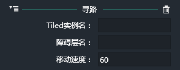
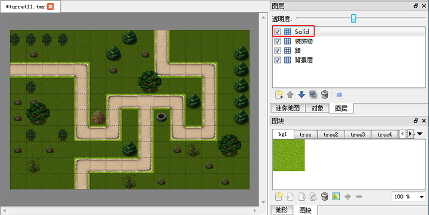
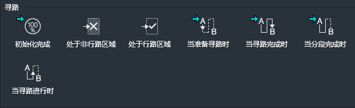
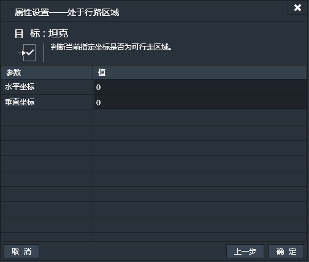
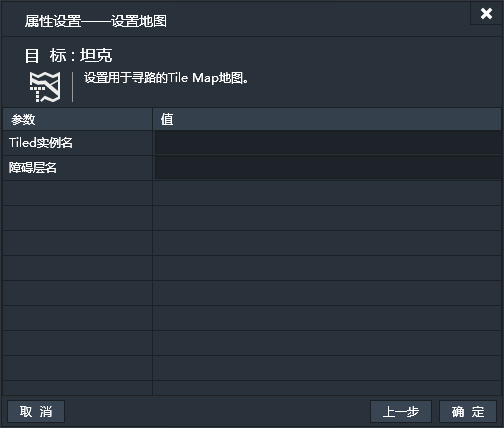

添加了寻路行为的实例，可以基于指定的Tiled地图中设定的路径来自动行进。

### 属性面板

- Tiled实例名：Tile map地图所在的Tiled组件的名称。Lakeshore寻路系统基于Tiled Map Editor软件制作的Tile Map，在Tiled组件的属性中指定Tiled Map Editor的TMX文件，便可在LakeShore中呈现与Tiled Map Editor软件中一样的地图效果。
- 障碍层名：Tile map地图中作为障碍层的图层名称。绑定寻路行为的对象在寻路过程中会避开障碍物层进行移动。这个层名取自Tiled map Editor软件中设置的层名，通常使用纯色块来设置障碍物层。如下图：

- 移动速度：寻路的移动速度。默认值为“60”。（单位：像素/秒）

------------

### 寻路条件

#### 初始化完成
当寻路的初始化完成时。【一次性触发】
这里的初始化完毕指寻路网格数据加载完毕，可以正常执行寻路操作了。一般情况下，在设置寻路目标点动作的时候，都要使用此条件，也就是在寻路初始化完成后，设置目标点坐标。
此条件无属性设置窗口。
#### 处于非行路区域
当指定坐标点处于非行路区域时。【持续性触发】
也就是判断指定坐标是不是在不可走的区域。

#### 处于行路区域
当指定坐标点处于行路区域时。【持续性触发】
也就是判断指定坐标是不是在可走的区域。

#### 当准备寻路时
当实例准备开始寻路时。【一次性触发】
当实例绑定寻路行为后，在开始寻路之前会触发。
此条件无属性设置窗口。
#### 当寻路完成时
当实例寻路完成时。【一次性触发】
当实例寻路完毕停止移动时触发。
此条件无属性设置窗口。
#### 当分段完成时
当对象寻路分阶段完成时。【一次性触发】
通常情况下，一次寻路可能会得到N个节点信息，那么，实例每到达一个节点，便会触发一次。
此条件无属性设置窗口。
#### 当寻路进行时
如果正在寻路。【持续性触发】
判断当前实例是否正在进行寻路。
此条件无属性设置窗口。

------------

### 寻路动作

#### 设置地图
设置用于寻路的Tile Map地图。
- Tiled实例名：输入放置Tile Map地图的Tiled实例的名字。
- 障碍层名：输入作为障碍层的图层名。

#### 移动速度
设置寻路的移动速度。默认值为“60”。（单位：像素/秒）

#### 目标坐标
设置寻路的终点目标的坐标。
坐标值会转化为格子的中心点坐标值，格子的宽高由Tiledmap地图文件的设置决定。

