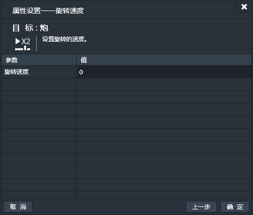
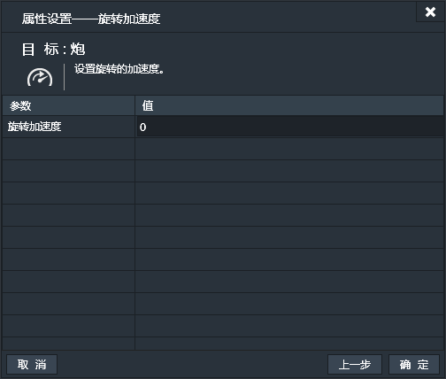
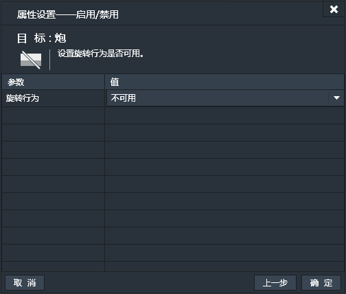

应用了旋转行为的实例会自发的以指定速度旋转。旋转中心为实例锚点。
### 属性面板：

- 速度：旋转的速度（单位：度/秒）。默认值为180。值为正时为顺时针旋转。值为负时为逆时针旋转。
- 加速度：旋转的加速度。默认值为0，此时为匀速旋转。值为正时是顺时针加速度（对逆时针旋转就是减速度），值为负时是顺时针减速度（对逆时针旋转就是加速度）。例如：速度为180，加速度为-10，那么实例就会先以180度/秒顺时针旋转，但越转越慢。速度为0后，便开始逆时针旋转，并越转越快。

------------
### 旋转条件
旋转行为没有特有条件。

------------
### 旋转动作

#### 旋转速度
设置旋转的速度。

#### 旋转加速度
设置旋转的加速度。

#### 启用/禁用
设置旋转行为是否可用。
