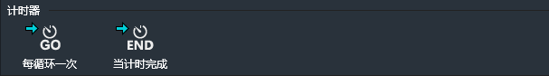
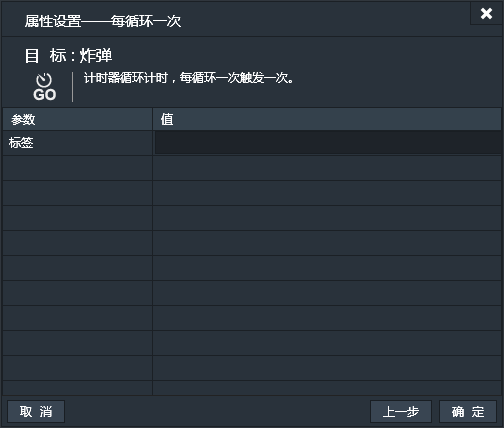
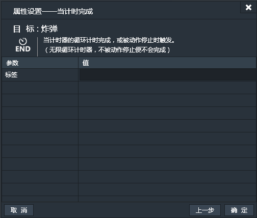
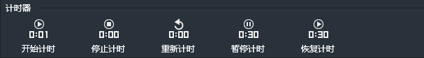
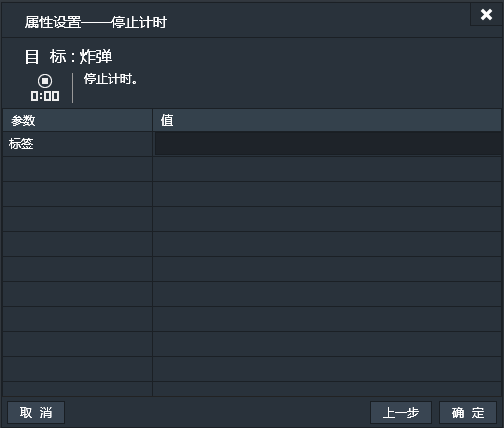
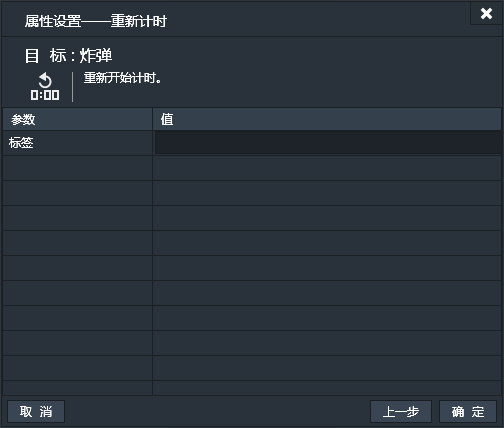
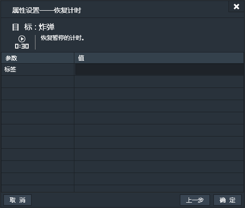

应用了计时器行为的实例可以在实例内部创建计时器以实现计时功能。通过这个行为就可以有特定的事件来触发一个计时器，并在计时中或计时结束时触发其他事件。比如：点击炸弹，炸弹开始倒计时，每过一秒，炸弹上的倒数数值就减少一秒，倒数结束，炸弹爆炸，这期间还可以通过其他事件终止计时。

### 属性面板
计时器行为没有特有的属性。

------------

### 计时器条件

#### 每循环一次：
计时器按照每X秒循环一次，共循环N次的原理来计时。当前条件为,每完成一次循环触发一次。【一次性触发】
“标签”为必填项，因为一个应用了计时器行为的实例可以创建多个计时器，而每个计时器以“标签”来彼此区分。只有指定了“标签”，程序才知道你要使用和监测触发的是那一个计时器。

#### 当计时完成：
创建计时器时会设置循环次数，当设置的次数完成时，计时完成，当前条件触发。【一次性触发】
如果计时器的循环次数设置为0，则表示无限次循环，则如果不使用计时停止动作的话计时便永远不会完成，当前条件永远不会触发。
当前条件同样要指定“标签”。

------------

### 计时器动作：

#### 开始计时：
在应用了计时器行为的实例上创建一个计时器。计时器按照每X秒循环一次，共循环N次的原理来计时。所以需要指定每次循环的时间间隔，共循环几次，还有要为计时器指定标签。标签为识别计时器的标识，需要使用计时器时要指定标签名。

#### 停止计时：
终止计时。两种情况下计时器会停止，一种是达到设置的循环次数，一种便是被动作终止。当前动作便可以终止一个指定的计时器，通过填写“标签”来指定要终止的计时器。

#### 重新计时：
重置计时器。重新从第一次循环开始指定计时器。无论计时器正处于计时循环中，还是已经计时完成。通过填写“标签”来指定要重置的计时器。

#### 暂停计时：
暂时停止计时中的计时器。必须计时器循环到第三次，当前行为暂时停止计时器在第三次循环上，之后通过下边的恢复计时动作可以从第三次开始继续计时。通过填写“标签”来指定要暂停的计时器。

#### 恢复计时：
恢复被暂停的计时器，继续计时。暂停在第几次计时，恢复便从第几次开始继续计时。通过填写“标签”来指定要恢复的计时器。
