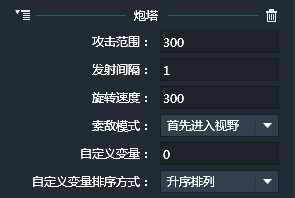
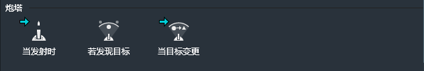
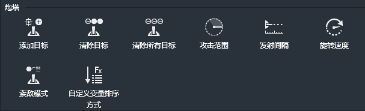
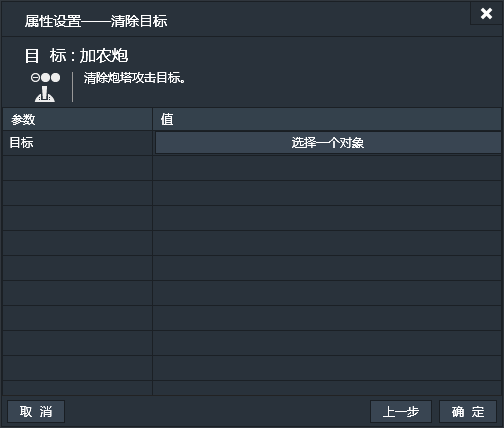
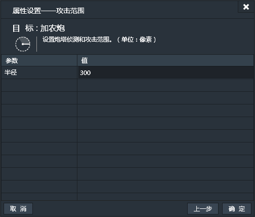
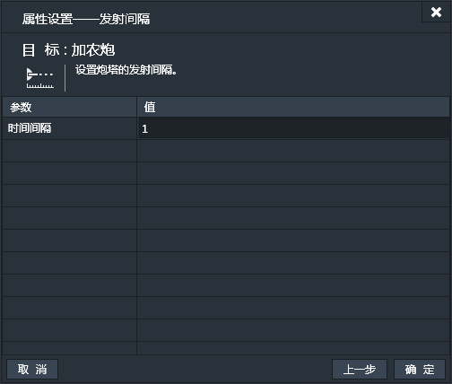
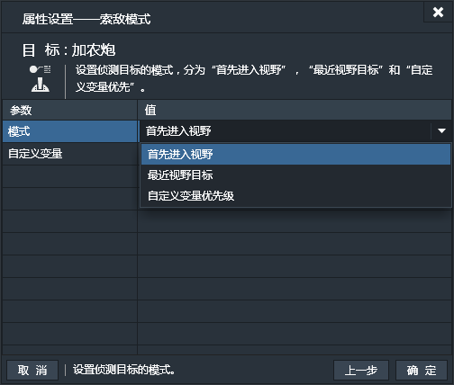

添加了炮塔行为的实例，便具备了塔防游戏中，炮塔的自动索敌，自动攻击等功能。

### 属性面板

- 攻击范围：设置炮塔的攻击范围。默认值为“300”。（单位：像素）
- 发射间隔：设置炮塔每发炮弹的间隔。默认值为“1”。（单位：秒）
- 旋转速度：设置炮塔攻击时自身的旋转速度。默认值为“300“。（单位：度/帧）
- 索敌模式：设定炮塔锁定目标的优先级。默认为“首先进入视野”，可选项有：
 - 首先进入视野：先进入炮塔视野内的为优先目标。也就是只有当最先进入的销毁后，炮塔才会锁定第二个进入炮塔视野的目标。
 - 最近视野目标：炮塔优先锁定离自身最近的目标。也就是在攻击过程中，如果有目标比当前目标离炮塔更近，炮塔就会立即更换目标。
 - 自定义变量优先级：基于目标的自定义变量来设定索敌优先级。
- 自定义变量：如果选用“自定义变量优先级”索敌模式，需要输入用于排布优先级的目标的自定义变量。假设目标为“坦克”，那么就要给“坦克”实例添加一个自定义变量，并命名为HP。那么此处就要输入HP。如果有多个目标，那么每个目标都要有一个名字相同的自定义变量，并填写在此处。
- 自定义变量排序方式：设置选定的自定义变量的优先级排序方式。
 - 升序排列
 - 降序排列

------------

### 炮塔条件

#### 当发射时
当炮塔发射炮弹时。【一次性触发】
此条件无属性设置窗口。

#### 若发现目标
如果炮塔发现了攻击目标。【持续性触发】
此条件无属性设置窗口。
#### 当目标变更
当炮塔变换了攻击目标。【一次性触发】
此条件无属性设置窗口。

------------

### 炮塔动作

#### 添加目标
给炮塔添加一个攻击目标。

#### 清除目标
从炮塔的攻击目标列表中清除一个攻击目标。

#### 清除所有目标
清除炮塔攻击列表中的所有目标。
此动作无属性设置窗口。
#### 攻击范围
设置炮塔的攻击范围。默认值为“300”。（单位：像素）

#### 发射间隔
设置炮塔发射炮塔的时间间隔。默认值为“1”。（单位：秒）

#### 旋转速度
设置炮塔在索敌攻击时的旋转速度。默认值为“10”。（单位：度/帧)

#### 索敌模式
设置炮塔的索敌模式。
- 模式：设置索敌模式。默认为“首先进入视野”，可选项有：
 - 首先进入视野：先进入炮塔视野内的为优先目标。也就是只有当最先进入的销毁后，炮塔才会锁定第二个进入炮塔视野的目标。
 - 最近视野目标：炮塔优先锁定离自身最近的目标。也就是在攻击过程中，如果有目标比当前目标离炮塔更近，炮塔就会立即更换目标。
 - 自定义变量优先级：基于自定义变量来设定索敌优先级。
- 自定义变量：如果选用“自定义变量优先级”索敌模式，需要输入用于排布优先级的目标的自定义变量。假设目标为“坦克”，那么就要给“坦克”实例添加一个自定义变量，并命名为HP。那么此处就要输入HP。如果有多个目标，那么每个目标都要有一个名字相同的自定义变量，并填写在此处。

#### 自定义变量排序方式
当索敌模式为“自定义变量优先级”时，可以设定自定义变量的排序方式。默认为“升序排列”，可选项有：
- 升序排列
- 降序排列

