精灵，按钮，文本框等大多数实例都具有的动作，我们定义为通用动作。这些动作是最基本，最常用的动作。

**快速链接：**

|通用动作||
|-----:|:-----|
|角度|[顺时针旋转](#顺时针旋转：)，[逆时针旋转](#逆时针旋转：)，[旋转到指定角度](#旋转到指定角度：)，[旋转指向指定坐标](#旋转指向指定坐标：)，[设置角度](#设置角度：)，[根据指定坐标设置角度](#根据指定坐标设置角度：)|
|其他|[制造](#制造：)，[销毁](#销毁：)，[启用](#启用：)|
|大小与位置|[朝指定角度移动](#朝指定角度移动：)，[朝自身方向移动](#朝自身方向移动：)，[坐标](#坐标：)，[相对其它实例坐标](#相对其它实例坐标：)，[缩放](#缩放：)，[水平缩放](#水平缩放：)，[垂直缩放](#垂直缩放：)，[大小](#大小：)，[水平坐标](#水平坐标：)，[垂直坐标](#垂直坐标：)|
|外观|[镜像](#镜像：)，[显隐](#显隐：)，[透明度](#透明度：)|
|实例自定义变量运算|[加法](#加法：)，[减法](#减法：)，[设置值](#设置值：)，[True/False](#True/False：)，[切换](#切换：)|
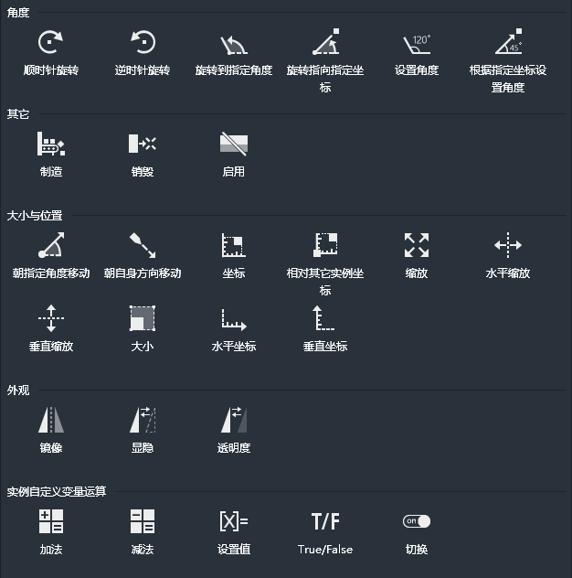
### 角度
#### 顺时针旋转：
以指定角速度顺时针旋转当前实例。
配合持续性触发条件，每次条件触发，实例都会顺时针旋转指定的角度。
配合一次性触发条件，则实例只会做一次指定角度的顺时针旋转。

#### 逆时针旋转：
以指定角速度逆时针旋转当前实例。
配合持续性触发条件，每次条件触发，实例都会逆时针旋转指定的角度。
配合一次性触发条件，则实例只会做一次指定角度的逆时针旋转。

#### 旋转到指定角度：
以指定的角度B为速度，旋转到指定的角度A。
“目标角度”即为角度A，“每次选装的角度”即为角度B。
配合持续性触发条件， 每次条件触发，实例都会旋转角度B，直到实例达到角度A，实例便不会再继续旋转。
配合一次性触发条件，则实例只会做一次角度为B的旋转，就算没有达到角度A也不会再继续旋转。
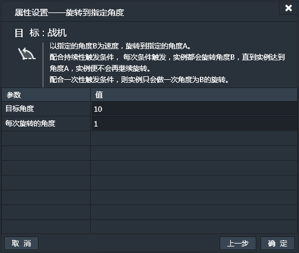
#### 旋转指向指定坐标：
以指定的角度为速度，旋转当前实例，使实例自身的X轴指向指定的坐标。
配合持续性触发条件，每次条件触发，实例都会旋转指定角度，直到实例自身X轴指向指定坐标，实例便不会再继续旋转。
配合一次性触发条件，则实例只会做一次指定角度的旋转，就算实例自身X轴没有达到指定坐标也不会再继续旋转。

#### 设置角度：
设置当前实例的角度。
实例将直接跳转到指定角度，没有旋转过程。

#### 根据指定坐标设置角度：
设置当前实例角度，使其自身的X轴指向指定坐标。
实例将直接跳转指向坐标，没有旋转过程。
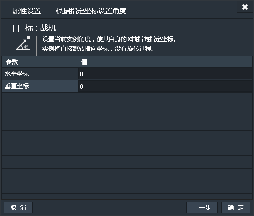
### 其他
#### 制造：
在当前实例位置制造其他实例。
 - 实例名：选择被制造的实例。
 - 图层序号：产生的实例放置的图层序号。
 - 水平偏移：产生的实例相对于制造它的实例的水平偏移。
 - 垂直偏移：差生的实例相对于制造它的实例的垂直偏移。
 - 依赖目标角度：设置产生的实例的子弹运行角度是否依赖制造它的目标实例（只对具有子弹行为的实例有效）

与System动作“创建”的区别是，“创建”是system发出的，是system特有的动作。而“制造”是由某个实例发出的，是实例的通用动作，比如飞机打子弹，那么飞机便是发出“制造”动作的实例，而子弹便是“制造”产生的实例。
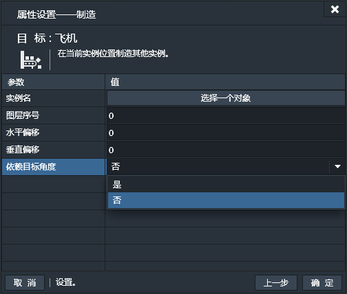
#### 销毁：
销毁当前实例。
例如游戏中被击毁的敌机，需要它从游戏画面中消失，同时游戏数据中也不再需要它，这时就可以使用销毁动作。
此动作无特有属性设置窗口。
#### 启用：
设置当前实例是否可用。
设置为“是”则可以正常操作。如果设置为“否”则实例处于不可用状态，不再接受操作。
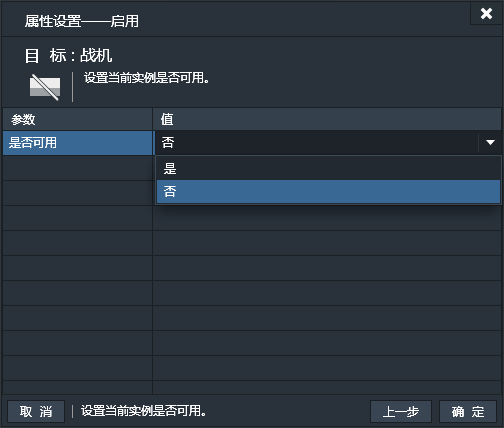
### 大小与位置
#### 朝指定角度移动：
朝向指定角度，以指定速度移动。
配合持续性触发条件， 每次条件触发，实例都会按指定角度移动速度指定距离。
配合一次性触发条件，则实例只会做一次朝向指定角度的移动，距离等于指定速度。
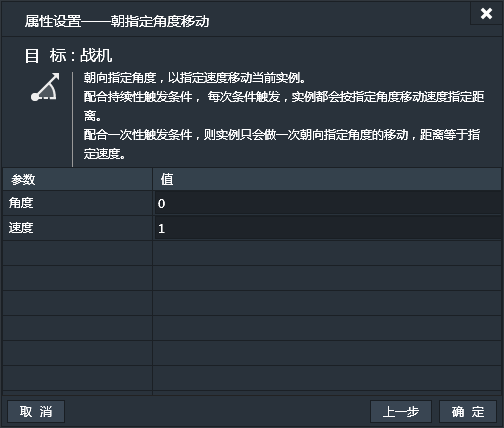
#### 朝自身方向移动：
朝向当前实例自身方向，以指定速度移动。
配合持续性触发条件， 每次条件触发，实例都会朝自身方向移动与指定速度相等的距离。
配合一次性触发条件，则实例只会做一次朝向自身方向的移动，距离等于指定速度。
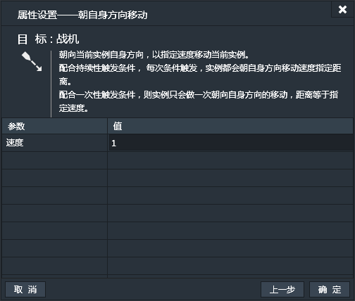
#### 坐标：
设置当前实例的坐标值。
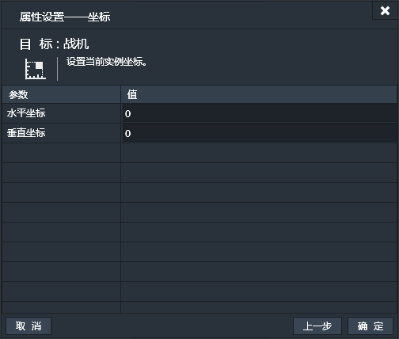
#### 相对其它实例坐标：
设置当前实例相对其他实例的坐标值。
也就是按照选取的实例设置当前实例的相对位置。

#### 缩放：
设置当前实例的整体缩放比例。
默认为1，也就是100%。如果要放大就设置大于1的数值，如果要缩小就设置小于1并且大于0的数值。
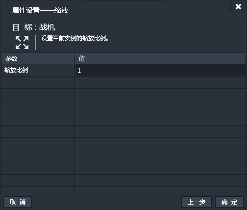
#### 水平缩放：
单独设置当前实例的水平缩放比例。
默认为1，也就是100%。如果要放大就设置大于1的数值，如果要缩小就设置小于1并且大于0的数值。
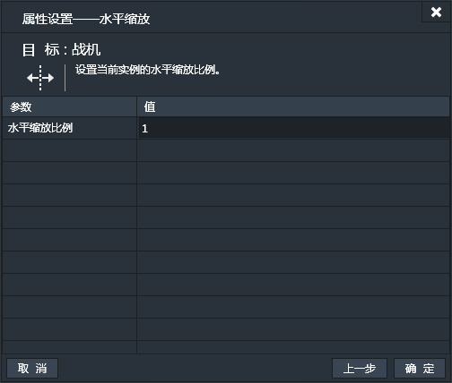
#### 垂直缩放：
当独设置当前实例的垂直缩放比例。
默认为1，也就是100%。如果要放大就设置大于1的数值，如果要缩小就设置小于1并且大于0的数值。
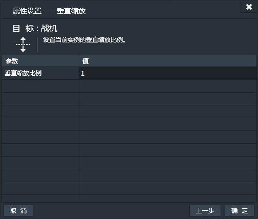
#### 大小：
设置当前实例的宽和高。
如果只想单独设置宽或高。比如，实例名叫“战机”，想设置宽为100。那么宽的输入框输入“100”，高的输入框输入“战机.height”。同理要保持宽不变的话，在宽输入框里输入“战机.width”。
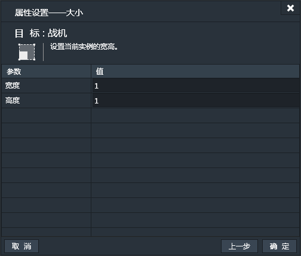
#### 水平坐标：
单独设置当前实例的水平坐标。
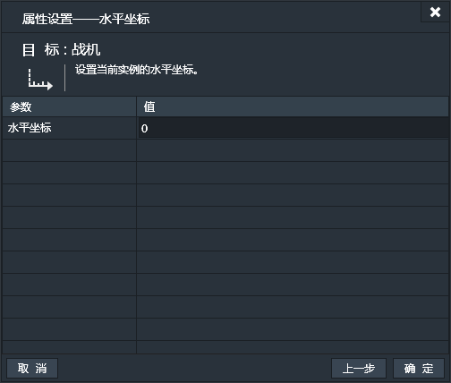
#### 垂直坐标：
单独设置当前实例的垂直坐标。
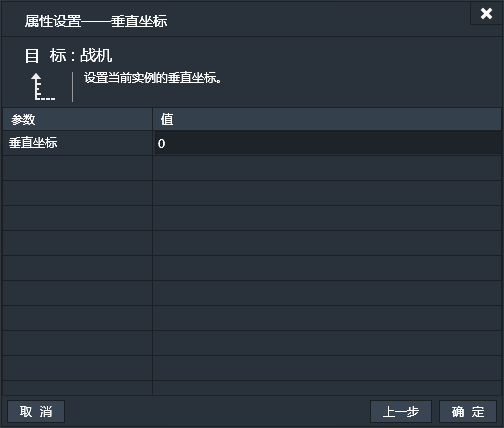
### 外观
#### 镜像：
设置当前实例是否镜像和镜像方向。可选项有：
 - 水平镜像
 - 垂直镜像
 - 水平垂直镜像
 - 关闭镜像
 
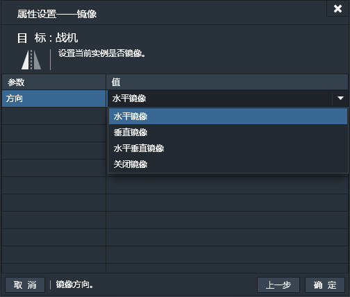
#### 显隐：
设置当前实例为显示或隐藏。

#### 透明度：
设置当前实例的透明度。可设置有效值为0到1之间。默认为1，表示100%，这是完全不透明。最小值可以设置0，表示完全透明。
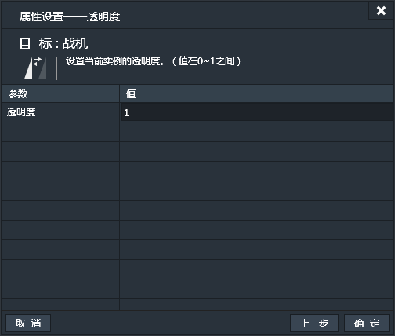
### 实例自定义变量运算
#### 加法：
选取当前实例的某个自定义变量进行加法运算。（如果不指定自定义变量，游戏运行可能会出现错误）
动作每执行一次，指定的自定义变量加上指定的值一次。

#### 减法：
选取当前实例的某个自定义变量进行减法运算。（如果不指定自定义变量，游戏运行可能会出现错误）
动作每执行一次，指定的自定义变量减去指定的值一次。
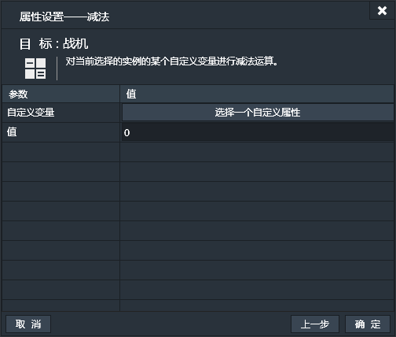
#### 设置值：
设置当前实例中指定的自定义变量为指定值。
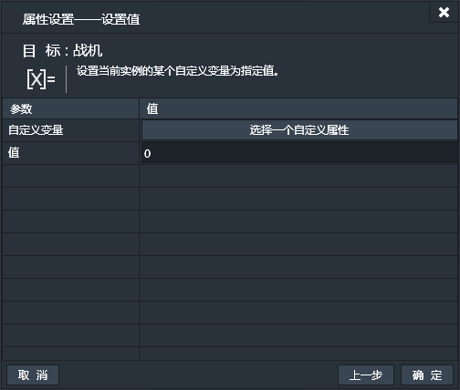
#### True/False：
设置当前实例中的某个布尔型自定义变量的值为真或假。

#### 切换：
切换当前实例的某个布尔型自定义变量的值。
（若原值为True则切换为False，反之亦然)
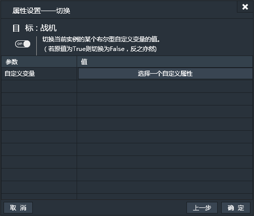