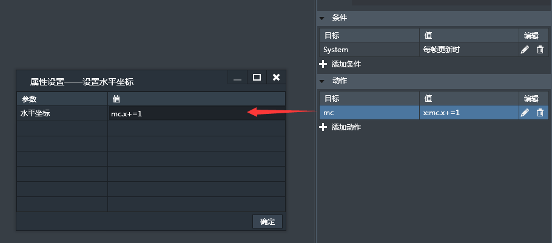
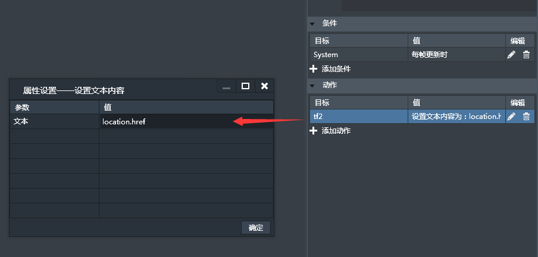
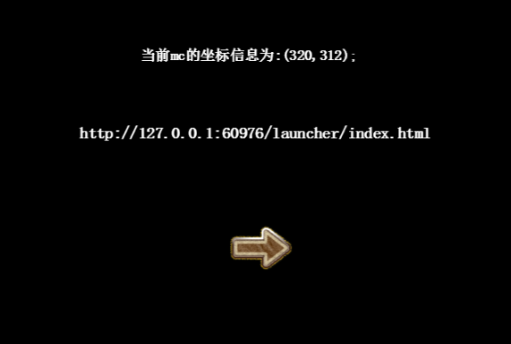

## Lakeshore 表达式

什么是表达式？

表达式，是由数字、[算符](http://baike.baidu.com/view/271856.htm)、数字分组符号（括号）、自由变量和约束变量等以能求得数值的有意义排列方法所得的组合。约束变量在表达式中已被指定数值，而自由变量则可以在表达式之外另行指定数值。表达式的运用可以最大限度的增强逻辑的运算，常用的表达式分为算术表达式与逻辑表达式。

* 算术表达式

算术表达式是最常用的表达式，又称为[数值表达式](http://baike.baidu.com/view/703179.htm)。它是通过算术运算符来进行运算的数学公式，常用的算术运算包括以下表格内容：


| 运算符 | 描述 |
| --- | --- |
| +	| 加法 |  
| -	| 减法 | 
| *	| 乘法 | 
| /	| 除法 | 
| %	| 求余数 (保留整数) | 
| ++ | 累加 | 
| -- | 递减 | 

在lakeshore里，支持上述表达式，例如，让对象mc以1像素/帧的速度水平向右移动，可作以下设置：



也可以写成mc.x+1，完整的意思是：mc.x=mc.x+1;即每帧对mc的水平坐标加1像素。这样mc就形成动画朝右运动。细心的读者会注意到这里用到了.x这表示mc的水平坐标属性，对于精灵来讲，提供了非常多的属性

精灵提供的公开属性列表如下：

| 属性 |	描述 |	引用形式 |	示例（设定mc2为另1个对象） |
| --- | --- |
| x |	水平坐标 |	mc.x|	mc.x+1(完整形式：mc.x=mc.x+1) |
| y |	垂直坐标 |	mc.y|	mc.y-1(完整形式：mc.y=mc.y+1) |
| width |	宽 |	mc.width|	mc2.width*2(完整形式：mc.y=mc2.wdith*2) |
| height |	高 |	mc.height|	mc2.height*0.5(完整形式：mc.height=mc2.height*0.5) |
| angle |	角度（0~360）之间|	mc.angle|	mc.angle+=1(完整形式：mc.angle=mc.angle+1) |
| alpha |	透明度（0~1）之间|	mc.alpha|	mc.alpha-1(完整形式：mc.alpha=mc.alpha-1) |
| visible |	是否隐藏（true/false)|	mc.visible|	mc2.visible(完整形式：mc.visible=mc2.visible) |
| scale |	缩放比例 |	mc.scale|	mc.scale*=1.1(完整形式：mc.scale=mc.scale*1.1) |
| scaleX |	水平缩放比例 |	mc.scaleX|	mc.scaleX*=1.1(完整形式：mc.scaleX=mc.scaleX*1.1) |
| scaleY |	垂直缩放比例 |	mc.scaleY|	mc.scaleY*=1.1(完整形式：mc.scaleY=mc.scaleY*1.1) |
| anchorX |	水平锚点 |	mc.anchorX|	mc.anchorX |
| anchorY |	垂直锚点 |	mc.anchorY|	mc.anchorY |
| name |	实例名称 |	mc.name|	mc.name |
| dt |	下一帧与上一帧的时间差（单位：毫秒) |	mc.dt|	mc.dt |


**按纽组件提供的公开属性列表如下(假如按纽组件名称为btn)：**


|属性|	描述|	引用形式|	示例（设定mc2为另1个对象）|
| --- | --- |
|x|	水平坐标|	btn.x|	btn.x+1(完整形式：btn.x=btn.x+1)|
|y|	垂直坐标|	btn.y|	btn.y-1(完整形式：btn.y=btn.y+1)|
|width|	宽|	btn.width|	mc2.width*2(完整形式：btn.y=mc2.wdith*2)|
|height|	高|	btn.height|	mc2.height*0.5(完整形式：btn.height=mc2.height*0.5)|
|angle|	角度（0~360）之间|	btn.angle|	btn.angle+=1(完整形式：btn.angle=btn.angle+1)|
|alpha|	透明度（0~1）之间|	btn.alpha|	btn.alpha-1(完整形式：btn.alpha=btn.alpha-1)|
|visible|	是否隐藏（true/false)|	btn.visible|	mc2.visible(完整形式：btn.visible=mc2.visible)|
|scale|	缩放比例|	btn.scale|	btn.scale*=1.1(完整形式：btn.scale=btn.scale*1.1)|
|scaleX|	水平缩放比例|	btn.scaleX|	btn.scaleX*=1.1(完整形式：btn.scaleX=btn.scaleX*1.1)|
|scaleY|	垂直缩放比例|	btn.scaleY|	btn.scaleY*=1.1(完整形式：btn.scaleY=btn.scaleY*1.1)|
|anchorX|	水平锚点|	btn.anchorX|	btn.anchorX|
|anchorY|	垂直锚点|	btn.anchorY|	btn.anchorY|
|name|	实例名称|	btn.name|	btn.name|
|dt|	下一帧与上一帧的时间差（单位：毫秒)|	btn.dt|	btn.dt|
|enabled|	按纽是否可用|	btn.enabled|	btn.enabled|
|touchX|	点击按纽时相对于按纽的水平坐标|	btn.touchX|	btn.touchX|
|touchY|	点击按纽时相对于按纽的垂直坐标|	btn.touchY|	btn.touchY|
|touchStageX|	点击按纽时相对于舞台的水平坐标|	btn.touchStageX|	btn.touchStageX|
|touchStageY|	点击按纽时相对于舞台的垂直坐标|	btn.touchStageY|	btn.touchStageY|
|touchPointID|	点击按纽时分配给按纽的唯一标识符|	btn.touchPointID|	btn.touchPointID|
|text|	按纽的文本内容|	btn.text|	btn.text|

**文本组件提供的公开属性列表如下（假如文本组件名称为tf):**

|属性|	描述|	引用形式| 示例（设定mc2为另1个对象）|
| --- | --- |
|x|	水平坐标|	tf.x|	tf.x+1(完整形式：tf.x=tf.x+1)|
|y|	垂直坐标|	tf.y|	tf.y-1(完整形式：tf.y=tf.y+1)|
|width|	宽|	tf.width|	mc2.width*2(完整形式：tf.y=mc2.wdith*2)|
|height|	高|	tf.height|	mc2.height*0.5(完整形式：tf.height=mc2.height*0.5)|
|angle|	角度（0~360）之间|	tf.angle|	tf.angle+=1(完整形式：tf.angle=tf.angle+1)|
|alpha|	透明度（0~1）之间|	tf.alpha|	tf.alpha-1(完整形式：tf.alpha=tf.alpha-1)|
|visible|	是否隐藏|（true/false)|	tf.visible	mc2.visible(完整形式：tf.visible=mc2.visible)|
|scale|	缩放比例|	tf.scale|	tf.scale*=1.1(完整形式：tf.scale=tf.scale*1.1)|
|scaleX|	水平缩放比例|	tf.scaleX|	tf.scaleX*=1.1(完整形式：tf.scaleX=tf.scaleX*1.1)|
|scaleY|	垂直缩放比例|	tf.scaleY|	tf.scaleY*=1.1(完整形式：tf.scaleY=tf.scaleY*1.1)|
|anchorX|	水平锚点|	tf.anchorX|	tf.anchorX|
|anchorY|	垂直锚点|	tf.anchorY|	tf.anchorY|
|name|	实例名称|	btn.name|	tf.name|
|dt|	下一帧与上一帧的时间差（单位：毫秒)|	tf.dt|	tf.dt|
|textField|	文本组件文本渲染类的引用 |tf.textField|	一般情况下不引用这个，而是基于这个来引用文本各种属性|
|type|	显示文本是动态类型的还是可输入的类型|	tf.textField.type|	btn.touchX|
|text|	显示文本的文本内容|	tf.textField.text|	btn.touchY|
|bold|	显示文本是否是粗体形式|	tf.textField.bold|	btn.touchStageX|
|fontFamily|	显示文本的字体|	tf.textField.fontFamily|	btn.touchStageY|
|textColor|	显示文本的颜色|	tf.textField.textColor|	btn.touchPointID|
|size|	显示文本的大小|	tf.textField.size|	btn.text|
|textAlign|	显示文本的水平对齐方式|	tf.textField.textAlign|	tf.textField.textAlign|
|verticalAlign|	显示文本的垂直对齐方式|	tf.textField.verticalAlign|	tf.textField.verticalAlign|
|italic|	显示文本是否为斜体|	tf.textField.italic|	tf.textField.italic|
|border|	显示文本是否有边框|	tf.textField.border|	tf.textField.border|
|borderColor|	显示文本的边框颜色|	tf.textField.borderColor|	tf.textField.borderColor|
|background|	显示文本是否有背景|	tf.textField.background|	tf.textField.background|
|backgourndColor|	显示文本的背景颜色|	tf.textField.backgourndColor|	tf.textField.backgourndColor|
|maxChars|	显示文本最大输入多少个字符|	tf.textField.maxChars|	tf.textField.maxChars|
|displayAsPassword|	显示文本是否显示为密码形式|	tf.textField.displayAsPassword|	tf.textField.displayAsPassword|

上面所讲的都是一种简单的表达式，有时候，我们可能需要加入一些字符，比如为了显示mc的动态坐标信息，我们通过以下方向来定义：


最终显示结果为：


对于上述表达式，既包含非动态信息，也包含动态信息，为了正确的显示，我们需要将非动态信息用单引号来引起来，比如：'当前mc的坐标信息为:('为非动态信息，而动态信息，可直接引用，例如mc.x，也可以用eval(mc.x)来引用，中间用+作为链接符。有更复杂的表达式，例如，微信分享的表达式如下：

```
'我总共消灭了'+eval(gameover.tank1+gameover.tank2+gameover.tank3+gameover.tank4)+'个坦克，'+'击败了全球'+eval(((gameover.tank1+gameover.tank2+gameover.tank3+gameover.tank4)/91*100).toFixed(1))+'%的玩家，不服来战！！'
```

细心的读者可能发现上面还有个toFixed函数，其实这本身是JS的内置的取指定小数点位数的数字，这里表示对（gameover.tank1+gameover.tank2+gameover.tank3+gameover.tank4)/91*100的结果取1位小数点的数字。为了更灵活的运用表达式来满足游戏的需求，这里还支持javascript提供的常用函数API，比如数学类函数，具体可参考W3CSchool网站提供的教程：[http://www.w3school.com.cn/jsref/jsref_obj_math.asp](http://www.w3school.com.cn/jsref/jsref_obj_math.asp)。

还比如获取当前网站的地址：



预览效果为：



还有更多javascript语法的支持，请参考Javascript语法，这里不再赘述。