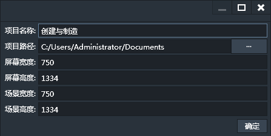
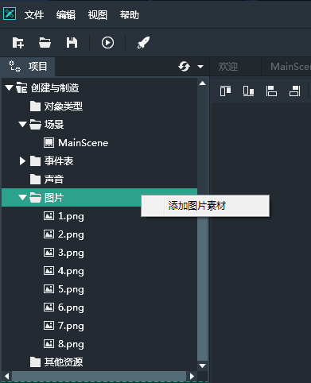

好的，各位小伙伴们，我们来一起创建一个Lakeshore的项目吧！！
首先启动Lakeshore后，在左上角的菜单中点选“新建项目”按钮。

在打开的新建项目对话框，我们给项目起个名字，屏幕尺寸和场景尺寸任意，这里我们就都设置成750x1334，一个标准的iPhone 6尺寸。

至于屏幕尺寸和场景尺寸有什么区别，我来简单解释一下。
> - 屏幕尺寸就是你游戏的可视区域，屏幕上可见的区域大小。
- 场景尺寸是指游戏中角色，物体能都活动的区域大小。

> 一般情况下，场景尺寸都是要大于或等于屏幕尺寸的。
例如超级玛丽的场景尺寸就大于屏幕尺寸，坦克大战的场景尺寸就等于屏幕尺寸。

项目创建好后，我们来添加素材文件。右键单击图片目录，选择“添加图片素材”选项，然后选择要添加的图片素材文件。

好了，作为一个简单的项目，新建的过程就是这样。