## Lakeshore微信分享教程 

Lakeshore 目前支持微信分享，提供了以下几个功能的微信分享功能，如下：

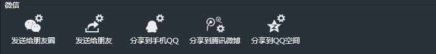

要做微信分享功能，对于新人来说可能有太多的坑，而你可能还得写服务器代码，比如php、C#、或者Java来提供生成微信分享所需要的签名信息，而这个签名信息的生成微信提供了详细的开发文档，具体可参考微信官方平台：[微信JS-SDK说明文档](http://mp.weixin.qq.com/wiki/7/aaa137b55fb2e0456bf8dd9148dd613f.html)

该文档提供了一步步编程来生成微信签名信息。虽然该文档提供了详细的说明，但对于很多用户尤其是不懂后端语言的用户来讲，可能就是一个恶梦，而且里面有太多的坑，其中用户会遇到的最大的坑就在手机页面会弹出`invalid signature(签名错误)`，导致这个签名错误的原因有太多太多，而lakeshore又是一个面向非编程用户的H5游戏开发软件，因此，lakeshore提供了不需要编程就可以支持微信分享的功能，下边我们分三大步骤来介绍：

1. [申请微信服务号并配置](http://edn.egret.com/cn/docs/page/549#申请微信服务号并配置)

1. [申请域名空间](http://edn.egret.com/cn/docs/page/549#申请域名空间)

1. [使用Lakeshore的微信分享功能](http://edn.egret.com/cn/docs/page/549#使用Lakeshore的微信分享功能)

### 申请微信服务号并配置

如果你要微信分享，首先你得有个服务号，微信提供了三种类型的号：服务号、订阅号、企业号。个人微信用户可以申请订阅号，但订阅号不提供微信分享的支持，服务号与企业号才提供，而服务号与企业号只有企业才能申请，因此，这给个人开发者带来了一定的门槛。

下面我们先来申请服务号，打开微信主页：[https://mp.weixin.qq.com/](https://mp.weixin.qq.com/)

点击页面右上角的“立即注册”，如图所示：

打开注册页面，输入注册信息，如图：

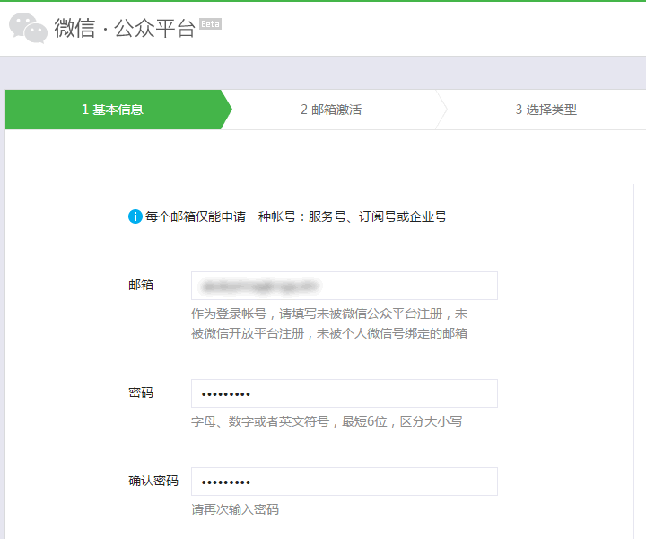

填写正确信息后，点击“注册”，会打开“邮箱激活”页面，如图：

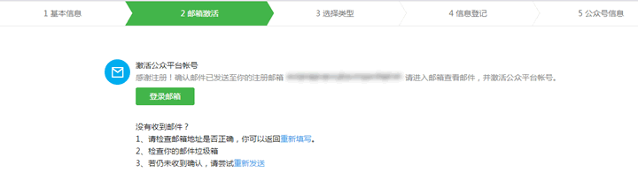

这里登录填写的邮箱，进行激活，激活后，会打开“选择类型”页面，如图：

这里选择服务号，记住，细看上面文字可以发现“一旦成功建立账号，类型不可更改”，这也就意味着你以后不可更改账号类型，即如果你现在选的是订阅号，那么，申请完毕之后，不能更改为服务号。这点特别注意！！

点击“服务号”选项，也会有个警告提示对话框，选择“确定”，打开“信息登记”页面，如图：

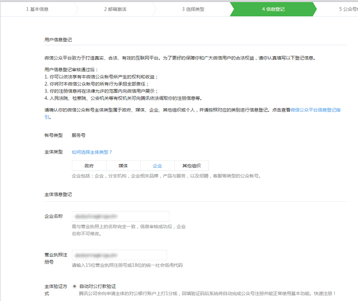

我们选择“企业”类型，填写企业的相关信息，填写完毕之后，点击“继续”，会打开申请好的“公众号信息”页面，那个页面就是你刚才申请好的公众号信息页面，如图：

上图左边表示公众号菜单栏，其中要想支持微信分享，最重要的就是“设置”与“开发者中心”两个菜单栏。点击“开发者中心”，如图：

从上图中可以看到`开发者ID`的一些信息，这里包括：AppID与AppSecret，这里的信息对微信分享十分重要，到时候会用到。

然后点击左边菜单栏的“微信认证”，我们需要，打开页面如图：

这里需要通过微信认证。如果是“订阅号”，是无法开通微信认证的。这点要注意。

认证完毕之后，点击左边菜单栏的“开发者中心”，查看当前分享接口是否获得，如图：

分享接口一定得获得，否则是不能进行微信分享的。

## 申请域名空间

现在很多平台都提供了域名空间的申请，这里以新浪云的申请为例。

打开新浪云官方网址：[http://sinacloud.com/](http://sinacloud.com/)，打开页面如图：

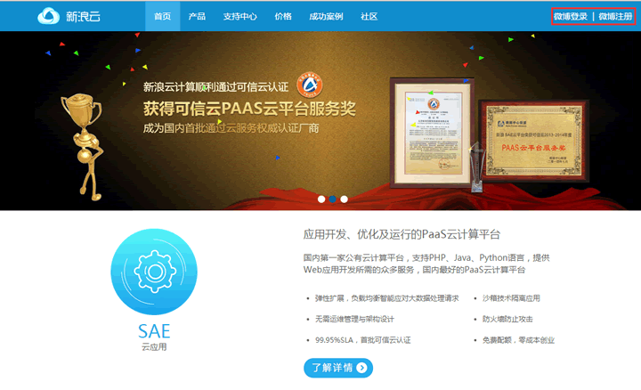

如果你有新浪微博账号，你可以直接登录，没有的话，可以申请1个新浪微博账号，申请的流程这里不再赘述，申请完毕之后，我们登录，登录页面如图：

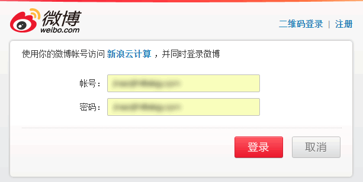

登录之后，会进入新浪云的控制台页面，如图：

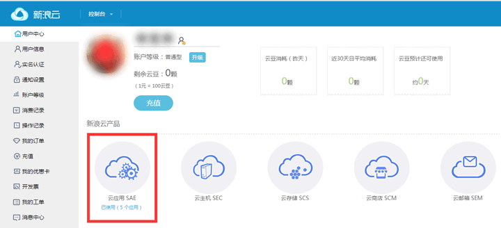

上图中标注的“云应用SAE”等会儿我们会用到。

对于新申请的新浪云账号，是没有实名认证的，我们需要进行实名认证才可以进行微信分享，点击左侧菜单栏的“实名认证”，会提示要输入姓名与身份证信息进行认证，如图：

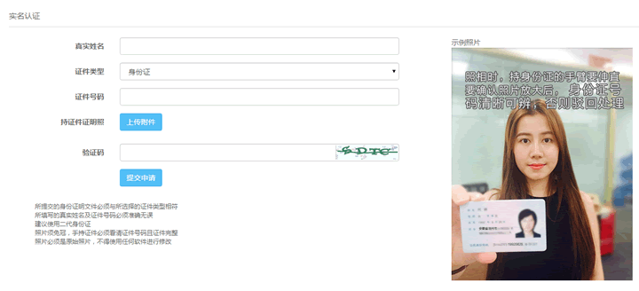

**注意：上传的照片一定得按照上面的说明进行，否则可能无法通过认证。**

下面我这边已经通过认证的截图如下：

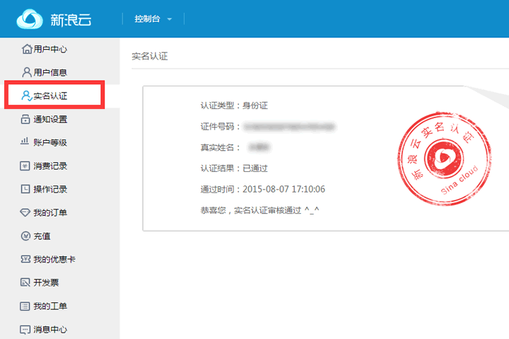

通常情况下，进行实名认证需要几天时间，认证通过之后，我们就可以在新浪云平台上建立自己的子域名了。

下面鼠标移到页面左上角的“控制台”上，弹出下拉框，选择“云应用SAE”，如图所示： 

此时，会进入“云应用SAE”页面，如图：

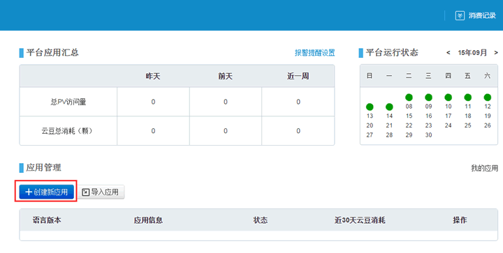

上图是我的新浪云的控制台下，免费最多可以建立5个应用 ，默认“应用管理”列表中应用数目为零，因此，我们需要创建新的应用，点击“创建新应用”，弹出页面如图：

如果你的账号未进行实名认证，会弹出如图所示对话框：

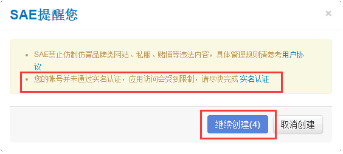

提示要尽快进行实名认证，点击确定，进入域名控制台设置，如图：

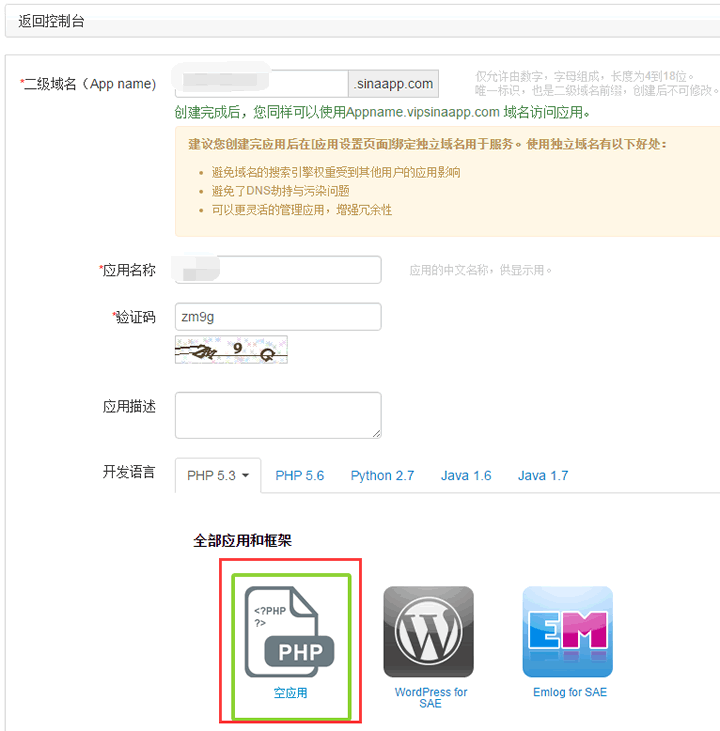

这个域名属于二级域名，因此，如果注册的用户过多，会提示已经注册，因此，可以用自己的手机号来填写，这样可以保证唯一性。其它的“应用名称”可以随便写，“验证码”填写后，选择开发语言为空应用即可，然后点击页面下方的“创建应用”即可创建自己的域名空间，创建完毕之后，会切换到页面如图：

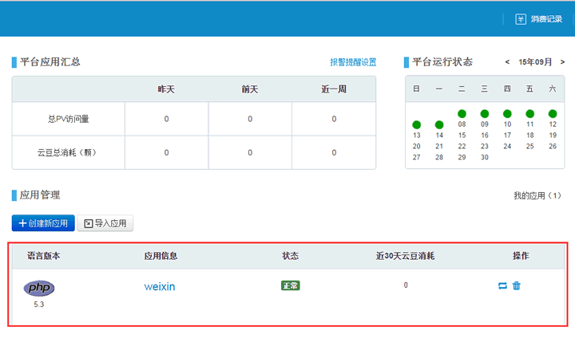

此时，我们会发现“应用管理”列表已经有1个刚才我们创建的应用了。点击应用信息“weixin”栏，可以进入应用的详细列表信息页面，如图： 

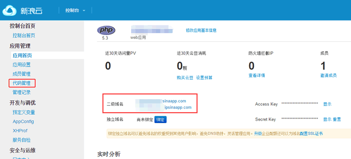

上图我们可以看到此应用的二级域名信息。然后点击页面左侧菜单栏的“代码管理”标签，切换到“代码管理”标签页，如图：

因为，浪浪云提供了版本管理功能，因此，创建版本的时候需要输入1个版本号，默认为1，点击“确定”，如图：

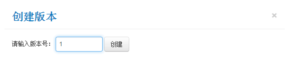

创建完毕之后，会提示输入“安全登录”操作，这个时候，再次输入刚才申请的账号密码即可，如图：

“安全验证”完毕之后，页面会切换到当前已经创建的版本信息页，如图：

点击“操作”按纽，在弹出的列表中选择“上传代码包”，如图：

弹出“代码上传”页面，如图：

支持三种格式的代码包，这里我们提供PHP版的微信分享代码包 [weixinShare_php.zip](http://sedn.egret.com/ueditor/20150908/55ee44b90ab24.zip)，上传完毕之后，点击“编辑代码”按纽，如图：

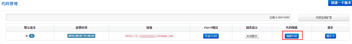

弹出代码编辑页面，如图：

你会发现多了四个文件，打开文件weixin.class.php，填写AppID与AppSecret,如图：

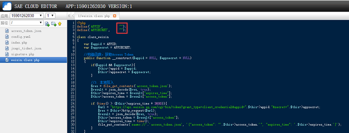

还记得我们之前说过的，微信页面的开发者ID，如图：

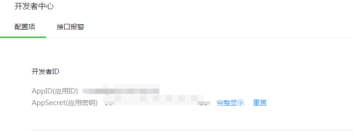

将AppID与AppSecret填入进去，然后保存weixin.class.php文件，再回到SAE控制台页面，就可以获取微信签名地址了，如图：

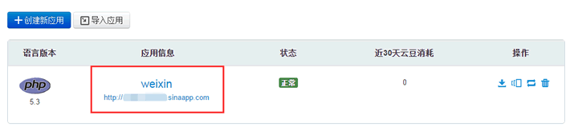

标记住为你的域名地址，那么签名信息地址在这个域名地址基础上http://你的域名.sinaap.com/signature.php,例如：我这边申请的签名信息地址为：http://cy3502398.sinaapp.com/signature.php，进行完这步之后，回到微信页面，我们需要绑定“JS接口安全域名”，点击左边菜单栏的“公众号设置”，打开如图页面：

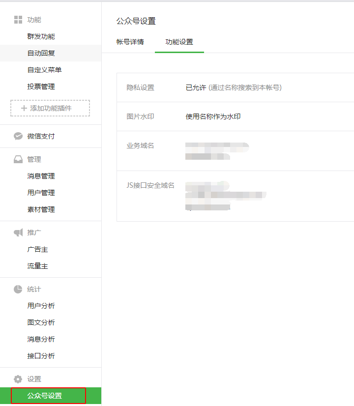

设置“JS接口安全域名”，点击“设置”，弹出设置页面。

**（注意：这里所设置的域名一定得通过备案，不通过备案的域名是无法进行微信分享的，上面我们申请的新浪云域名只需要通过认证即可，如果是自己在域名空间，那么必须要备案！！）**

域名写法类似qq.com一样，比如我这边填写的是：

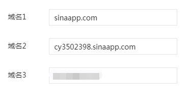

你这边填写你刚才申请的新浪云域名。

此时，所有的前期准备工作已经完毕，此时我们就可以利用Lakeshore进行微信分享开发了。

### 使用Lakeshore的微信分享功能

打开Lakeshore 1.1，创建项目，取名项目名称为“weixinShare”，如图所示：

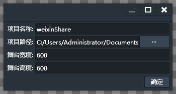

然后选择Lakeshore左下侧的“组件”栏，将“微信”组件拖拽到场景中，填写微信的相关信息，如图：

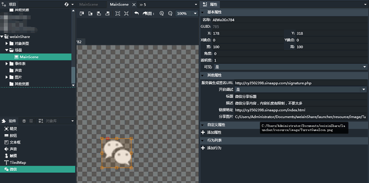

服务器端生成的签名地址：这个地址是我们刚才得到的签名信息地址。

开启调试：如果选择“是”，那么，表示在手机端预览微信分享的时候，会有微信签名是否有效，以及分享时的图片信息地址等以弹出对话框表示，一般调试通过之后，可以设为“否”将此关闭。

* 标题：微信分享时所需要展示的分享标题。

* 描述：微信分享时所需要展示的分享内容。

* 链接地址：微信分享后点击分享的内容后会跳转的地址。

* 分享图片：微信分享后展示的图标信息。

信息填写完毕之后，我们点击“发布”按纽进行发布，发布完毕之后，选择所有的文件将其打包，如图：

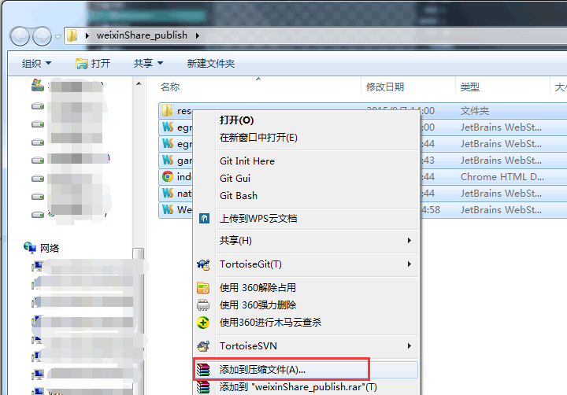

点击“添加到压缩文件（A)...”，弹出打包，选择“zip”格式，如图：

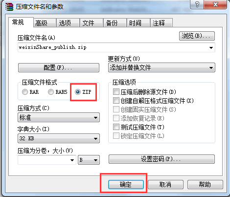

点击“确定”打包完毕，将打包好的文件上传到新浪云，打开之前的新浪云控制台，选择“代码管理”，点击“操作”，选择“上传代码包”，上传刚才打包好的“weixinShare_publish.zip”文件，如图：

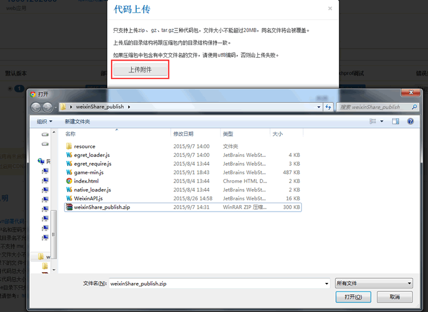

上传完毕之后，点击“编辑代码”按纽，在弹出的页面中发现刚才我们打包的文件都已经上传到新浪云上去了，如图：

此时，微信分享功能已经做完毕，最终我们将我们的游戏地址拷贝到微信中，发送给好友即可，游戏地址如图：

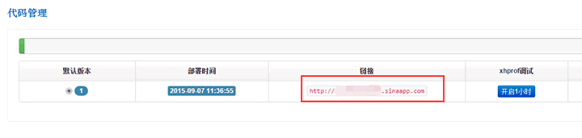

地址为在链接的基础上加上/index.html，最终形式为：[http://xxx.sinaapp.com/index.html](http://xxx.sinaapp.com/index.html)

**注意：下面一点对于新浪云的用户来讲，如果不开通就无法通过微信分享认证**，回到新浪云控制台，在左侧的菜单中找到“存储与CDN服务”-“Memcache”,如图所示：

点击“Memcache”,打开Memcache页面如图：

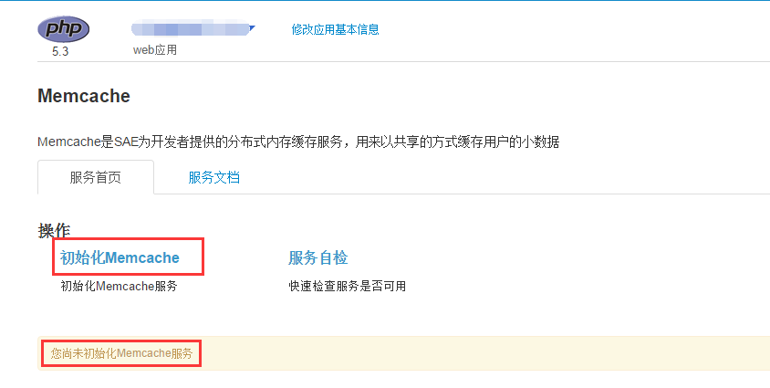

从图中可以看出我们尚未初始化Memcache服务，如果不做这一步，实际上是不能向新浪云写数据的，而微信这块需要动态向服务器写数据，因此，我们需要初始化Memcache,新浪云提供了20M以下的免费空间，否则，就需要云豆，不过20M已经足够用了，点击“初始化Memcache”,弹出页面：

输入20，点击确定，出现页面：

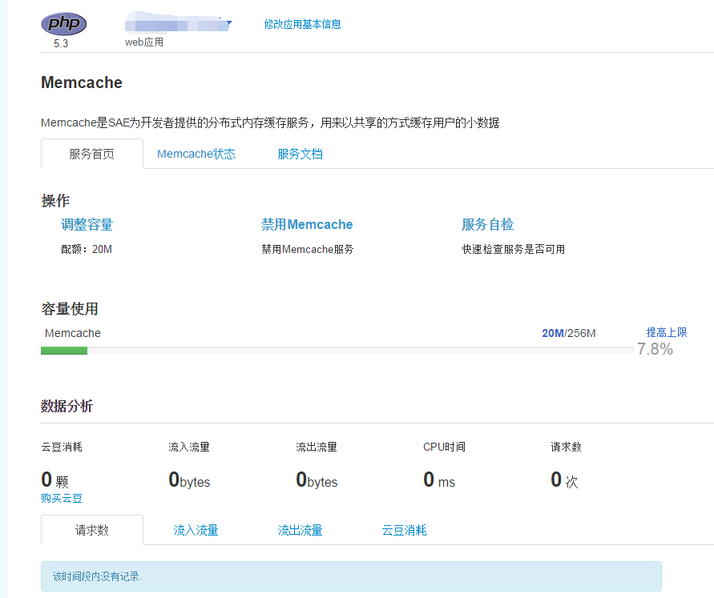

此时，所有的工作已经完毕~~~

最终在微信中打开此地址，即可预览此游戏，当然，目前在游戏测试中我们没有为游戏加入任何其它内容，只是添加了微信分享功能，所以打开页面后会显示全黑，没有任何内容，如果在Lakeshore中开启了微信的调试模式，那么，最终打开页面的时候会弹出很多提示对话框，最终如果弹出如下提示对话框，表示微信分享功能已经没有任何问题了，如图：

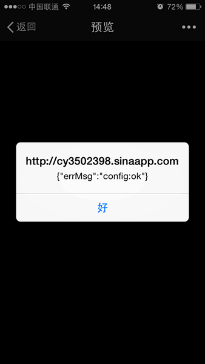

点击“好”之后，点击手机右上角“...”按纽，弹出如图所示页面：

点击“发送给朋友”，弹出如图所示页面：

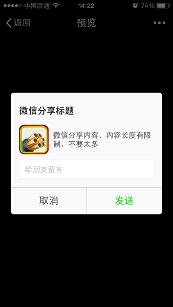

从标题上我们看出之前填的内容已经出现在对话框上了。同样，“分享到朋友圈”、“分享到手机QQ”、“分享到QQ空间”都会呈现在Lakeshore里编辑的信息。

至止，整个利用Lakeshore制作的微信分享流程完毕，这是Lakeshore为微信分享提供的基本功能，“发送给朋友”、“分享到朋友圈”、“分享到手机QQ”、“分享到QQ空间”这几项标题、描述、链接地址、分享图片Icon都是一样的，但有时候希望能够分别为这几项定制不同的分享内容，因此，Lakeshore提供了通过添加事件，并在事件里添加条件与动作来动态更新，如图：

另外，还提供了对微信分享过程中的一些状态的回调，如图：

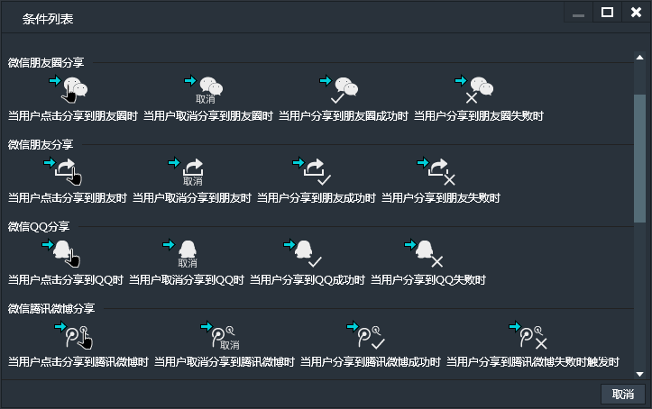

通过这些条件回调可以做一些有趣的事，比如希望当用将游戏地址分享到朋友圈后，才会给予一定的奖励或者才能通过下一游戏关卡。更多的功能等待大家去发现。

