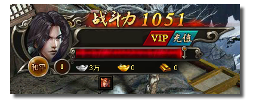
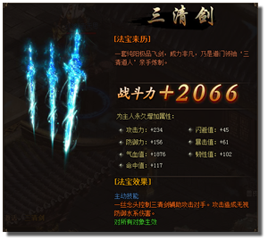
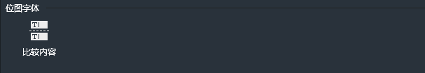
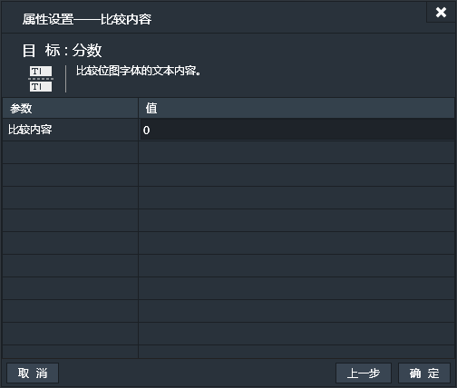
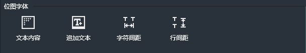
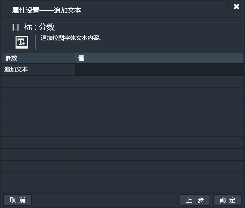
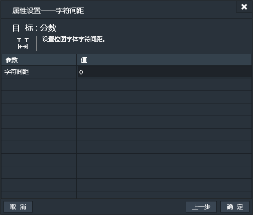

位图字体的英文名称是Bitmap Font,在游戏制作中十分常用。
游戏制作中，为了美观和配合游戏的整体风格，常需要使用到一些特殊字体或艺术字体。如下图中的战斗力数值便为位图字体实现的：

如果直接将特殊字体或艺术字体的字体库内置在游戏中会使游戏加载和运行的速度变慢，使用位图字体便可以很好的解决这个问题。位图字体的做法是将会使用到的每个文字对应的字体做成位图，生成文字内容和位图的映射，游戏中动态的调用显示位图。这样即在游戏中呈现了漂亮的字体，又节省了资源。
Laskshore中使用的位图字体是由一张png的图片集和一个fnt配置文件组成的。其中png图片集中包括了所有会使用到的位图，fnt配置文件里描述了这些位图应该怎么从png图片集中切分出来。
建议使用Egret TextureMerger来制作Lakeshore使用的位图字体。请参照TextureMerger使用教程的Bitmap font章节：[TextureMerger使用教程](http://bbs.egret.com/thread-1653-1-1.html)

------------

### 特有属性

- 纹理图片：指定位图字体的PNG图片。
- 配置文件：指定位图字体的fnt配置文件。
- 默认文本：默认显示的文本内容。
- 字符间距：位图字体的字符间距。默认值为0。
- 行间距：位图字体的行间距。默认值为0。

------------

### 位图字体条件

#### 比较内容
用位图字体的文本内容和指定内容比较，如果相同则条件成立。【持续性触发】

------------

### 位图字体动作

#### 文本内容
设置位图字体显示的内容。

#### 追加文本
在位图字体已有内容的后边追加文本。

#### 字符间距
设置位图字体的字符间距。

#### 行间距
设置位图字体的行间距。

