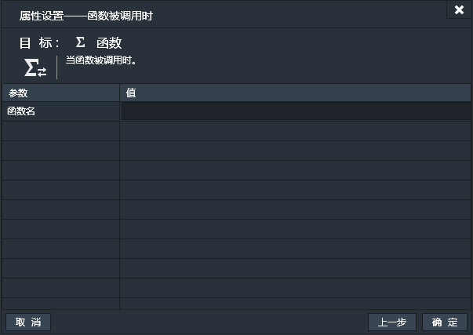
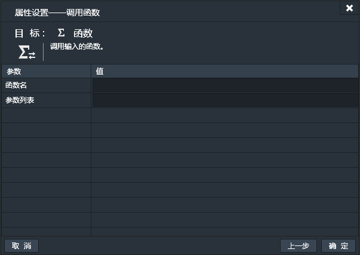

添加函数组件后，可以将多个动作放置在函数内，当调用函数的时候，相当于调用函数内的多个动作。当多个动作在事件表中需要反复调用时，函数的使用就能极大的提高效率。
*注：函数组件除“名称”和“全局”外，不支持其他基本属性。不支持碰撞。函数组件添加后并不会在游戏运行场景中产生可见实例。

### 特有属性
函数组件无特有属性。

------------

### 函数条件

#### 比较函数参数
当函数被调用时可以传递一个参数列表，列表中是一系列参数。当前条件用于比价这些参数值。
- 索引：参数列表中参数的索引。0表示第一个参数，1表示第二个参数，以此类推。
- 比较值：用于比较的数值。

#### 函数被调用时
当函数被调用时触发。
此条件表示创建一个函数。指定函数名，表示给创建的函数起名。
以此为条件的事件中的一系列动作便为调用函数时要执行的动作。

------------

### 函数动作

#### 调用函数
调用执行指定函数。
- 函数名：要调用的函数的名字。
- 参数列表：调用的同时，传递的参数列表。以“,”分隔各个参数。

