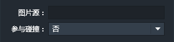

精灵是英文Spirte的直译，在游戏开发中Spirte是最基本的可操控对象。
精灵可以理解为图片的容器，如果需要在游戏场景中插入一个静态图片，那么就需要把图片放置在一个精灵内来呈现。

### 特有属性

- 图片源：指定精灵内插入的图片的地址。
- 参与碰撞：设置精灵是否参与碰撞。默认值为“否”。

------------

### 精灵条件
精灵组件无特有条件，适用所有通用条件。参见：[通用条件](http://edn.egret.com/cn/index.php/portal/article/index/id/707)

------------

### 精灵动作
精灵组件无特有动作，适用所有通用动作。参见：[通用动作](http://edn.egret.com/cn/index.php/portal/article/index/id/708)
