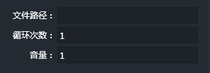
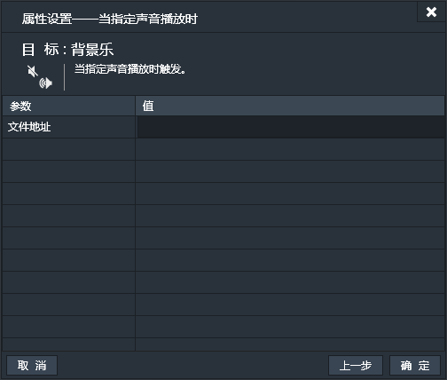
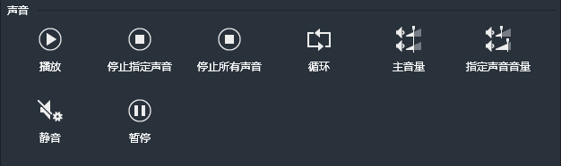
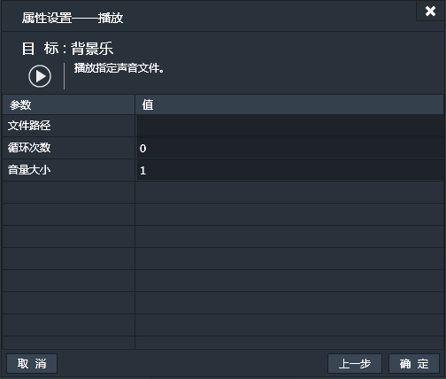
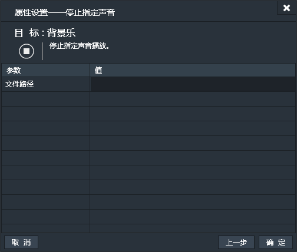
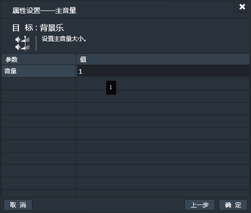
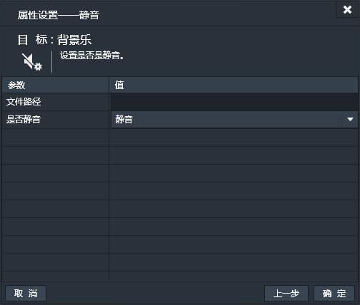
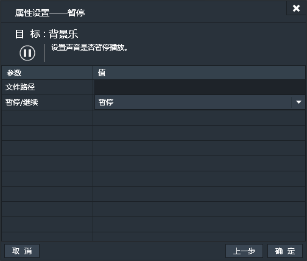

声音组件用来给游戏中添加声音效果。

### 特有属性

- 文件路径：指定声音文件所在位置。
- 循环次数：设置声音的循环次数。默认为1次。设置为0的话表示无限次循环。
- 音量：设置声音音量。默认为1，表示100%。

*注：声音组件除“名称”外，不支持基本属性，不支持碰撞，添加后也不会在游戏运行场景中产生可见实例。

------------

### 声音条件
声音组件只支持其特有条件，不支持通用条件。

#### 当静音时
当处于静音状态时。【持续性触发】
此条件无属性设置窗口。
#### 当有声音播放
当有任意声音处于播放状态时。【持续性触发】
此条件无属性设置窗口。
#### 当指定声音播放时
当指定的声音正在播放时。【持续性触发】
在文件地址输入框设置指定声音的位置。

#### 当声音放完
当声音播放完毕时。【一次性触发】
此条件无属性设置窗口。

------------

### 声音动作
声音组件只支持其特有动作，不支持通用动作。

#### 播放
播放指定声音。
- 文件路径：指定要播放的文件的路径。
- 循环次数：设置循环次数。默认为0，表示无限次循环。
- 音量大小：设置音量大小。默认为1，表示100%。

#### 停止指定声音
停止指定声音的播放。

#### 停止所有声音
停止所有声音的播放。
此动作无属性设置窗口。
#### 循环
设置指定声音是否循环播放。

#### 主音量
设置整体音量。

#### 指定声音音量
设置指定声音的音量。

#### 静音
设置指定声音为静音。

#### 暂停
暂停播放指定声音。
   

