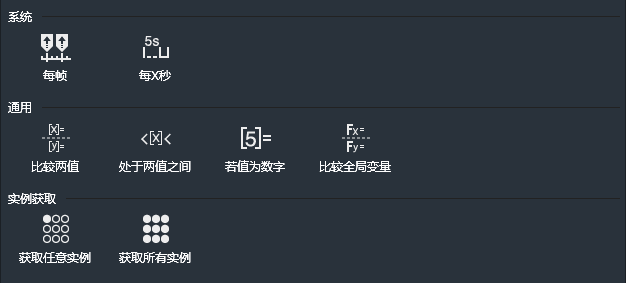
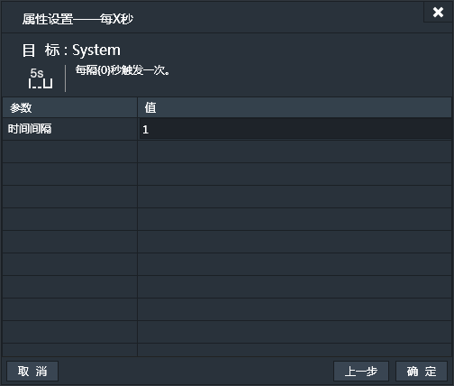
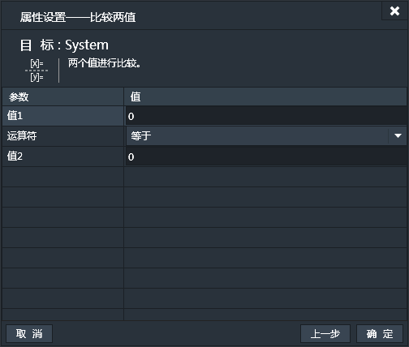
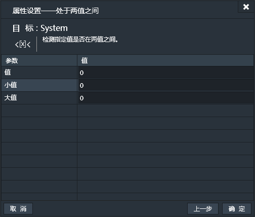
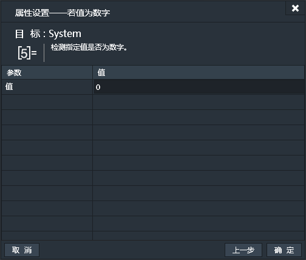
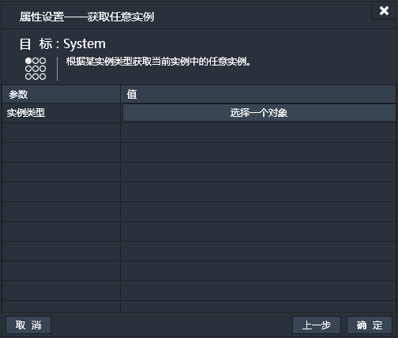
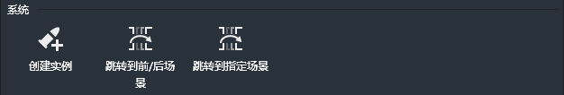
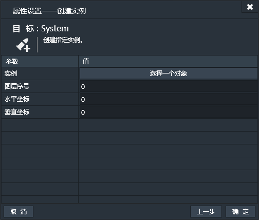

System为项目固有的组件，无需添加也不能删除。System用来实现一些系统级别的条件与动作。

#### 快速链接
|System 条件||
| ------: | :------ |
|系统|[每帧](#每帧：)，[每X秒](#每X秒：)|
|通用|[比较两值](#比较两值：)，[处于两值之间](#处于两值之间：)，[若值为数字](#若值为数字：)，[比较全局变量](#比较全局变量：)|
|实例获取|[获取任意实例](#获取任意实例：)，[获取所有实例](#获取所有实例：)|

|System 动作||
| ------: | :------ |
|系统|[创建实例](#创建实例：)，[跳转到前/后场景](#跳转到前/后场景：)，[跳转到指定场景](#跳转到指定场景：)|

------------

### System条件：

#### 每帧：
当游戏每帧更新时触发。【持续性触发】
Lakeshore游戏默认为60fps，也就是每秒60帧，也就是每秒触发60次。只要游戏运行此条件便为真。
此条件无属性设置窗口。

#### 每X秒：
每经过X秒，触发一次。【持续性触发】
从游戏运行开始，每经过X秒便触发一次。

#### 比较两值：
比较两个数值的大小，当比较结果为真时触发。【持续性触发】
填写值或表达式，然后选择比较运算符。一般用来比较变量。比如，实例boss.x（实例boss的X轴坐标的表达式）和hero.x（实例hero的X轴坐标的表达式）的比较。如果boss.x大于hero.x时触发。

#### 处于两值之间：
如果指定值处在指定的大值和小值之间，条件为真，触发。【持续性触发】
分别填写指定值，小值和大值，判断指定值是否在大小值之间。

#### 若值为数字：
如果指定的数值为数字，条件为真则触发。【持续性触发】
可以填写数值，变量名或表达式，用于判断输入的内容的值是不是数字。

#### 比较全局变量：
选取一个全局变量和指定值比较，若条件为真则触发。【持续性触发】

#### 获取任意实例：
从指定的实例类型中任意选取同类型实例中的一个，取到了为真则触发。【持续性触发】
基于此条件执行的动作只对取到的实例有效。比如，同一个实例类型有10个，动作只对其中之一进行操作。

#### 获取所有实例：
获取指定实例类型的全体，取到了为真则触发。【持续性触发】
基于此条件执行的动作对实例类型的全体有效。比如，同一实例类型有10个，动作对10个实例都进行操作。

------------

### System动作：

#### 创建实例：
由系统创建产生指定实例。创建产生的实例与制定的实例为同类型实例。
 - 实例：选择要创建的实例。
 - 图层序号：设置创建产生的实例所在的图层，由图层序号指定。
 - 水平坐标：此坐标为基于场景的水平坐标。
 - 垂直坐标：此坐标为基于场景的垂直坐标。

简单的解释，创建就像凭空产生，无中生有。
比如打飞机中不停的有敌机从屏幕的上边缘飞入，这些敌机便是由system通过创建动作产生的。他们是同一实例类型。
与通用动作“制造”的区别是，“创建”是system发出的，是system特有的动作。
而“制造”是由某个实例发出的，是实例的通用动作，比如飞机打子弹，那么飞机便是发出“制造”动作的实例，而子弹便是“制造”产生的实例。

#### 跳转到前/后场景：
游戏中跳转到上一个或下一个场景。
无需指定前/后场景名，会根据游戏自身的场景顺序跳转。

#### 跳转到指定场景：
游戏中跳转到指定场景。需指定要跳转的场景名。
如果指定为当前场景，跳转功能相当于重置当前场景。
