文本组件用来显示文字。可以显示静态文本和动态文本，并且可以设置为可输入文本框。
- 静态文本为内容固定的文本，内容不会在游戏中改变，比如剧情介绍等。
- 动态文本的内容会根据游戏进展而改变，比如得分，血量等。
- 可输入文本框指的是在游戏中提供给玩家输入内容的文字框。

### 特有属性

- 默认文本：设置文本框默认显示的文本。（只支持静态文本，不支持表达式。若要实现动态文本显示，需要在文本动作中设置。）
- 字体：设置文本的默认字体。默认为“宋体”。
- 字体大小：设置文本的字体大小。默认大小为12。
- 字体颜色：设置文本的颜色。默认值为白色。
- 粗体：设置文本是否为粗体。默认为“是”。
- 允许输入：设置是否为可输入文本框。默认为“否”。
- 水平布局：设置文本的水平对齐方式。默认为“水平居中”，可选项有：
 - 左对齐
 - 右对齐
 - 水平居中
- 垂直布局：设置文本的垂直对齐方式。默认为“垂直居中”，可选项有：
 - 上对齐
 - 下对齐
 - 垂直居中
- 字数上限：设置文本框中显示字符数的上限。默认值为100。
- 斜体：设置文本是否为斜体。默认为“否”。
- 密码显示：设置是否按密码形式显示。默认为“否”。
- 支持换行：设置是否支持换行。默认为“否”。

*注：文本不支持碰撞。

------------

### 文本条件
文本组件除特有条件外，也适用部分通用条件（文本不支持“碰撞”相关条件）。参见：[通用条件](http://edn.egret.com/cn/index.php/portal/article/index/id/707)

#### 比较文本内容
如果文本框的文本内容和指定文本内容相同时。【持续性触发】
比较文本内容，若相同，条件为真，会一直触发动作。

------------

### 文本动作
文本组件除特有动作外，也适用部分通用动作（文本不支持“碰撞”相关动作）。参见：[通用动作](http://edn.egret.com/cn/index.php/portal/article/index/id/708)

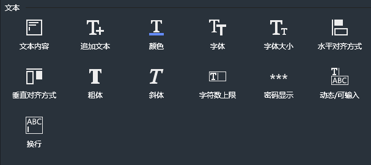
#### 文本内容
设置文本显示内容。可以使用表达式，以设置动态文本。

#### 追加文本
在已有文本内容后面追加新的文本内容。
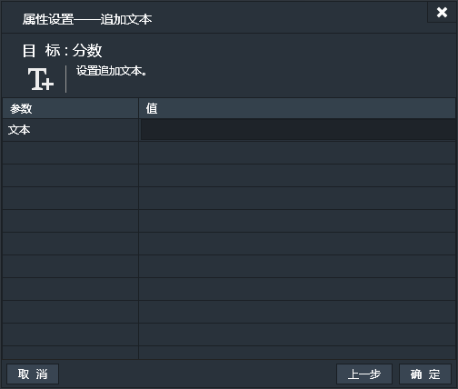
#### 颜色
设置文本的颜色。默认为“黑色”。
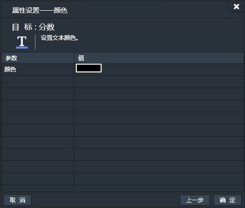
#### 字体
设置文本的字体。默认为“宋体”。

#### 字体大小
设置文本的字体大小。默认大小为12。
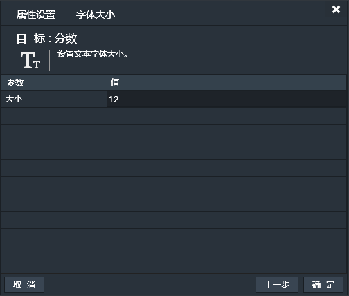
#### 水平对齐方式
设置文本的对齐方式。默认为“水平居中”。
可选项有：
- 左对齐
- 右对齐
- 水平居中

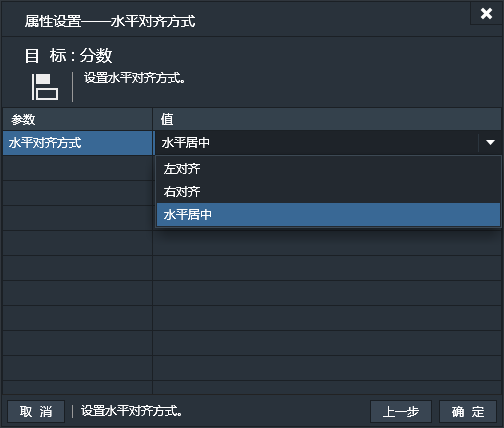
#### 垂直对齐方式
设置文本的垂直对齐方式。默认为“垂直居中”。
可选项有：
- 上对齐
- 下对齐
- 垂直居中

#### 粗体
设置文本是否为粗体。默认为“粗体”。
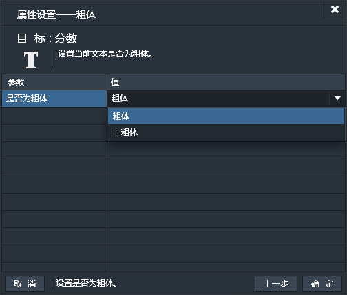
#### 斜体
设置文本是否为斜体。默认为“斜体”。
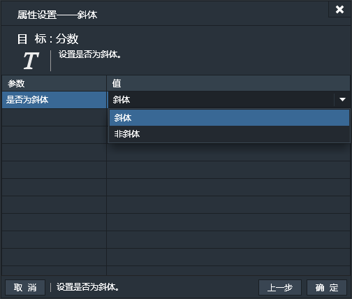
#### 字符数上限
设置文本框内的字符数上限。默认值为100。
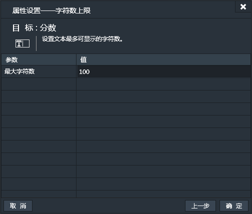
#### 密码显示
设置是否以密码形式显示文本。默认为“密码”。
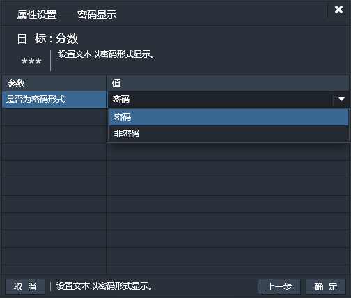
#### 动态/可输入
设置是动态文本还是可输入文本。默认为“动态”。
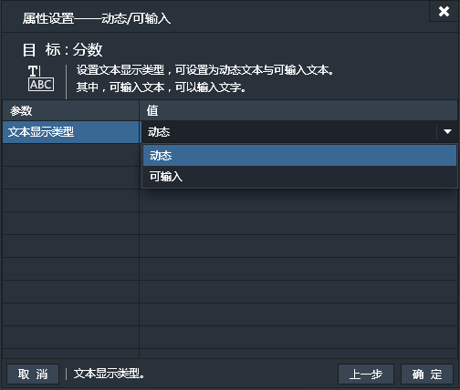
#### 换行
设置文本是否支持换行。默认为“支持”。
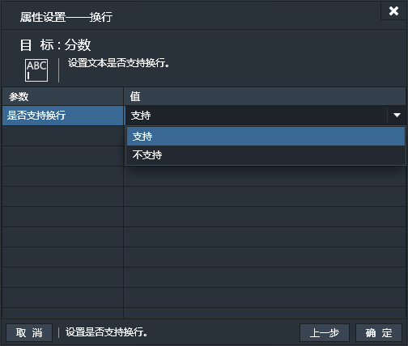

