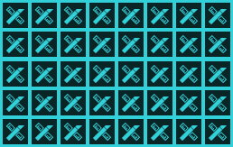

瓦片平铺组件可以在组件设置宽高内平铺显示指定的图片，平铺显示即是在横纵两个方向上重复显示。平铺效果如下图所示。

相对于用精灵组件创建实例组成相同的效果，使用瓦片背景更加节省资源，游戏执行的效率也更高更快。所以当需要平铺一个图片时，建议使用瓦片平铺组件来实现。在游戏中，瓦片平铺常用来制作重复的背景，墙面，地面等。

### 特有属性

- 图片源：指定平铺中需要重复显示的图片的地址。

------------

### 瓦片平铺条件
瓦片平铺组件无特有条件，适用所有通用条件。参见：[通用条件](http://edn.egret.com/cn/index.php/portal/article/index/id/707)

------------

### 瓦片平铺动作
瓦片平铺组件无特有动作，适用所有通用动作。参见：[通用动作](http://edn.egret.com/cn/index.php/portal/article/index/id/708)