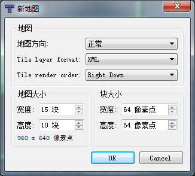
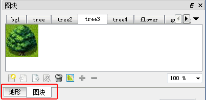
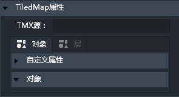
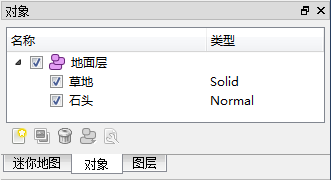
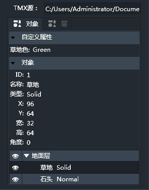
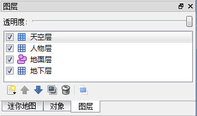
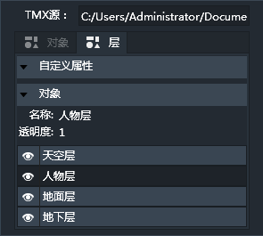

Tiled组件是用来添加和使用Tiled Map Editor编辑的游戏地图文件的。
Lakeshore当前只能够调用解析Tiled Map Editor制作的tmx地图文件，不提供对tmx地图文件的编辑功能。

Tiled Map Editor官方地址：[http://www.mapeditor.org/](http://www.mapeditor.org/) 

Tiled Map Editor是基于Java/Qt的开源区块地图编辑器，Tiled支持2D和2.5D地图及多种区块类型，它将地图保存成一个xml文件，借助xml的特性使地图可通用于各种游戏平台，目前Lakeshore暂时只支持地图方向为正常模式的所编辑的地图（正常模式为90度），如下图设置：

另外，目前Lakeshore只支持图块数据的显示，还不支持地形数据的显示，如下图：

------------

### TiledMap属性

添加TiledMap组件后，点击TiledMap属性面板的"TMX源:"输入框，在弹出的文件查找窗口找到并指定要加载的tmx文件，便可加载TiledMap地图。如下图：

*注1：建议将Tiled软件编辑完的tmx文件与其所用到的图片文件都保存到当前项目工程文件夹下的other文件夹中，否则可能会因为安全域的原因导致地图无法显示。

*注2：Tiled组件不支持碰撞。

导入tmx文件之后，TiledMap属性栏的对象面板将显示Tiled Map Editor中对象层的内容，如下图：

同样，Tiled Map Editor中的图层内容也会呈现在层面板中,层面板中可以设置相应图层的显示和隐藏。如下图：

------------

### Tiled条件
Tiled组件不支持任何条件。

------------

### Tiled动作
TIled组件不支持任何动作。
