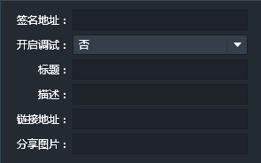
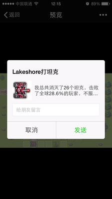
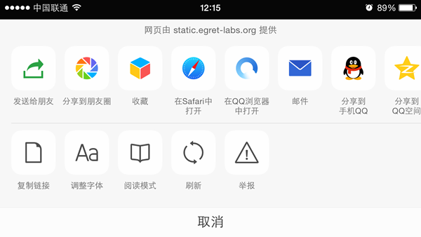
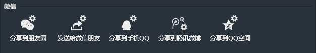
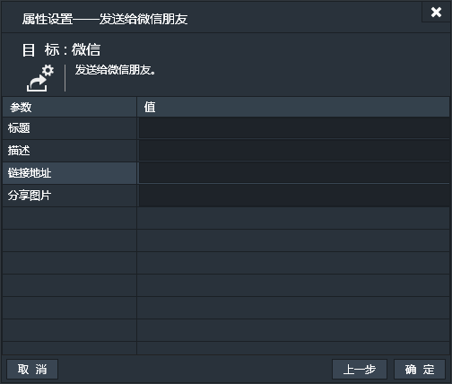
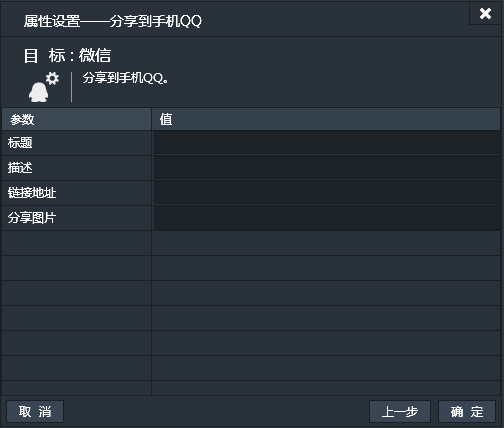
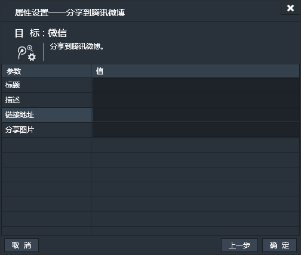
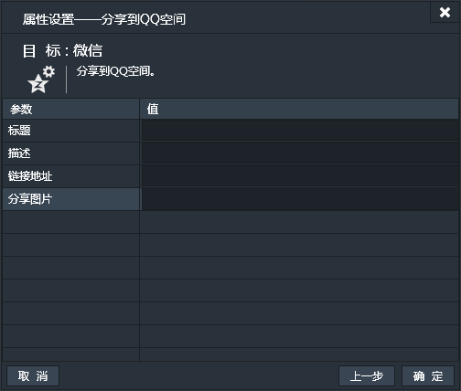

添加微信组件后，游戏便可以实现微信分享功能。
*注：微信组件除“名称”外，不支持其他基本属性。不支持碰撞。微信组件添加后并不会在游戏运行场景中产生可见实例。

### 特有属性

- 签名地址：服务器端生成的签名地址的URL。这个地址是通过服务端生成的签名信息Json数据地址，Json数据内容类似下面表示方式：

```
{"appId":"wx13c6ec9ac5ca884e","timestamp":1441508912,"nonceStr":"bljssdk","signature":"5256549a4aeca9187dc52f119d65ef622e21353e"}
```

具体生成信息可参考微信官方文档：[微信JS-SDK说明文档](http://mp.weixin.qq.com/wiki/7/aaa137b55fb2e0456bf8dd9148dd613f.html)
- 开启调试：默认值为“否”。如果选择“是”，那么，表示在手机端预览微信分享的时候，会有微信签名是否有效，以及分享时的图片信息地址等以弹出对话框表示，一般调试通过之后，便设为“否”，关闭调试。
- 标题：微信分享时所需要展示的分享标题。
- 描述：微信分享时所需要展示的分享内容。
- 链接地址：微信分享后点击分享的内容后会跳转的地址。
- 分享图片：微信分享后展示的图标文件。

下边为游戏微信分享在移动端的显示效果：

上图中
- “Lakeshore打坦克”对应特有属性中的“标题”。
- “我总共消灭了26个坦克……”对应特有属性中的“描述”。这部分内容除了在特有属性面板填写固定的静态内容外，还可以在微信的特有动作中填写表达式，实现动态内容。请参看下边的微信动作介绍。
- 坦克的图标对应特有属性中的“分享图片”。

------------


### 微信条件
微信组件除了特有条件和“当实例创建时”条件外，不支持其他通用条件。

微信条件对应着用户操作微信分享时的一些反馈信息。

上图中，当用户点击“发送给朋友”的时候，会触发“分享给朋友”这一条件，同样点击“分享到朋友圈”时，会触发“分享到朋友圈”这一条件，其它类似。
通过这些条件，你可以更加灵活的做一些微信分享的逻辑，比如：我们可以在通过lakeshore做好的关卡游戏中加入只有微信分享后才能进入下一关卡等功能，或者微信分享后发送一些奖励等功能。


**以下条件均无属性设置窗口。**
**以下条件均为【一次性触发】**
**因微信条件比较类似，名称已说明功能，故不作具体说明。**
- 分享到微信朋友圈
 - 分享到朋友圈
 - 取消朋友圈分享
 - 朋友圈分享成功
 - 朋友圈分享失败
- 分享给微信朋友
 - 分享给朋友
 - 取消朋友分享
 - 分享给朋友成功
 - 分享给朋友失败
- 分享给QQ朋友
 - 分享给QQ朋友
 - 取消QQ分享
 - QQ分享成功
 - QQ分享失败
- 分享到腾讯微博
 - 分享到腾讯微博
 - 取消腾讯微博分享
 - 腾讯微博分享成功
 - 腾讯微博分享失败

------------


### 微信动作
微信组件除特有动作外，不支持任何通用动作。

微信动作中，“标题”与“描述”支持表达式。这样可以将游戏中的动态信息分享到移动端。比如，“描述”信息可以写成如下内容：

```
'我总共消灭了'+eval(gameover.tank1+gameover.tank2+gameover.tank3+gameover.tank4)+'个坦克，'+'击败了全球'+eval(((gameover.tank1+gameover.tank2+gameover.tank3+gameover.tank4)/91*100).toFixed(1))+'%的玩家，不服来战！！'
```

这样分享出去的信息就可以显示游戏的成绩了。
*注：Lakeshore中提供的表达式如果只是单纯的表达式，比如1+2+3，可以不用通过eval来表示，而如果混合了字符，例如上面的‘我总共消灭了’等，就需要用eval来表示。

#### 分享到朋友圈
- 标题：微信分享时所需要展示的分享标题。
- 链接地址：微信分享后点击分享的内容后会跳转的地址。
- 分享图片：微信分享时展示的图标文件


#### 发送给微信朋友
- 标题：微信分享时所需要展示的分享标题。
- 描述：微信分享时所需要展示的分享内容。
- 链接地址：微信分享后点击分享的内容后会跳转的地址。
- 分享图片：微信分享后展示的图标文件。


#### 分享到手机QQ
- 标题：微信分享时所需要展示的分享标题。
- 描述：微信分享时所需要展示的分享内容。
- 链接地址：微信分享后点击分享的内容后会跳转的地址。
- 分享图片：微信分享后展示的图标文件。


#### 分享到腾讯微博
- 标题：微信分享时所需要展示的分享标题。
- 描述：微信分享时所需要展示的分享内容。
- 链接地址：微信分享后点击分享的内容后会跳转的地址。
- 分享图片：微信分享后展示的图标文件。


#### 分享到QQ空间
- 标题：微信分享时所需要展示的分享标题。
- 描述：微信分享时所需要展示的分享内容。
- 链接地址：微信分享后点击分享的内容后会跳转的地址。
- 分享图片：微信分享后展示的图标文件。




