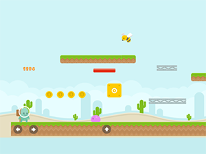
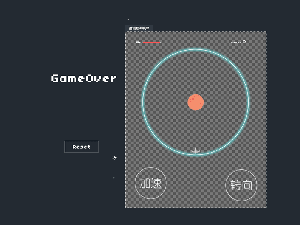
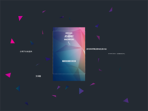
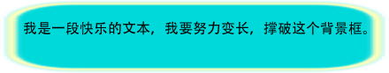
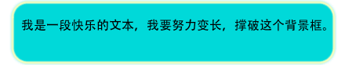
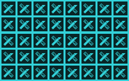
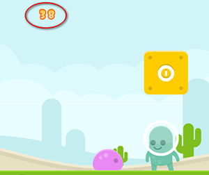
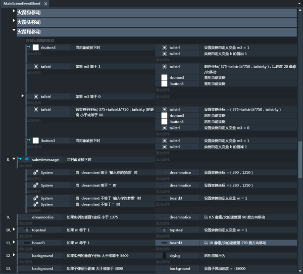
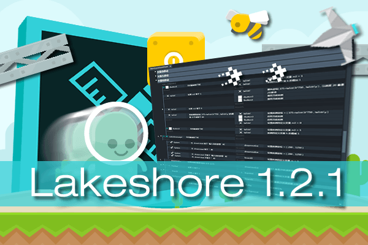

**Lakeshore 1.2.1 正式版已经发布了！**
在这个版本中，我们新增，优化了非常多的功能，并对事件表做了大幅度的升级。
除了可以制作更多类型的游戏外，lakeshore也可以用来制作营销页面了~
接下来将从模板，组件，行为，事件表四个大方面来介绍1.2.1的新功能。

### 新增模板：
《歪星人》- 横轴跑酷类游戏模板

《异形往哪儿跑》 - 特殊的打飞机类游戏模板

《邀请函》 - 营销页面模板

### 新增组件：

- 动画
- 九宫格
- 瓦片平铺
- 位图字体
- 函数
- 数组

#### 动画：
Lakeshore 1.2.1 开始支持序列帧动画。
小伙伴们终于可以在制作的游戏中使用动画了~~
选中添加后的动画组件，序列帧面板便可以操作了。

添加序列帧图片到面板中，可以预览动画播放效果，也可以调整帧率等参数。在浏览器中预览游戏时，便可以看到动画效果了。同时对应动画组件，在事件表中也添加了相应的条件和动作，可以灵活控制动画的播放和切换。

详细说明：[http://edn.egret.com/cn/docs/page/757](http://edn.egret.com/cn/docs/page/757)

#### 九宫格：
使用九宫格可以实现特定图片的无损拉伸
未使用九宫格：

使用九宫格：

详细说明：[http://edn.egret.com/cn/docs/page/715](http://edn.egret.com/cn/docs/page/715)

#### 瓦片平铺：
瓦片平铺可以在指定范围内重复平铺图片。如下图：

游戏中一些重复出现的贴图，比如，背景，墙壁等，使用瓦片平铺比精灵更节省资源，效率跟高。

详细说明：[http://edn.egret.com/cn/docs/page/723](http://edn.egret.com/cn/docs/page/723)

#### 位图字体：
位图字体的英文名称是Bitmap Font。在游戏制作中，为了美观和配合游戏的整体风格，常需要使用到一些特殊字体或艺术字体。而且这些文字内容是动态的，比如得分，血量等。如果把字体内置在游戏中，游戏体积就会变得很大。使用位图字体就可以高效又节省资源的轻松实现。
如下图左上角的分数就是用位图字体实现的。

详细说明：[http://edn.egret.com/cn/docs/page/742](http://edn.egret.com/cn/docs/page/742)

#### 函数：
Lakeshore 中的函数类似于程序开发中的函数，但要简单的多。
简单讲，就是把一组动作编为一个函数，然后可以在不同条件下反复调用，大大的节省了事件表的编写时间。

详细说明：[http://edn.egret.com/cn/docs/page/811](http://edn.egret.com/cn/docs/page/811)

#### 数组：
数组用来以一定的顺序存储相同数据类型的元素。可以用来开发和实现比较复杂的游戏逻辑。

详细说明：编写中。

### 新增行为：
- 别针
- 计时器
- 淡入淡出
- 闪烁
- 曲线
- 横轴跑酷
- 刚体
- 跳穿
- 摄影机
- 边界限制

#### 别针：
将一个实例A固定在另一个实例B上，固定模式可以选。固定后A会基于固定模式跟随B的运动而运动。
看起来简单，但其实很实用的功能。
这样当几个实例要一定运动时，只要用事件控制一个实例运动，其他实例“别针”到它上边就好了。
因为还未实现精确碰撞，所以如果一个实例的碰撞区域过大，那么“别针”一个透明的精灵在它上边，任意设置精灵的大小，然后用精灵去实现碰撞，就达到了自定义碰撞区域大小的目的。
在《歪星人》和《异形往哪儿跑》模板里都有应用到别针行为。
别针可用的方法还很多，大家可以自由发挥~

详细说明：[http://edn.egret.com/cn/docs/page/685](http://edn.egret.com/cn/docs/page/685)

#### 计时器：
就像秒表那样，你可以设定什么时候按下开始计时，达到计时设定后做什么动作。
比如，最直观的，做一个定时炸弹，但碰触炸弹后2秒，炸弹爆炸。就可以使用计时器来实现。

详细说明：[http://edn.egret.com/cn/docs/page/687](http://edn.egret.com/cn/docs/page/687)

#### 淡入淡出：
可以实现图片淡入淡出的效果。

详细说明：[http://edn.egret.com/cn/docs/page/688](http://edn.egret.com/cn/docs/page/688)

#### 闪烁：
可是实现图片闪烁的效果。

详细说明：[http://edn.egret.com/cn/docs/page/695](http://edn.egret.com/cn/docs/page/695)

#### 曲线：
可以设置实例依照sin等曲线做指定的往复运动，比如左右晃动，大小变化和透明度变化等。

详细说明：[http://edn.egret.com/cn/docs/page/696](http://edn.egret.com/cn/docs/page/696)

#### 横轴跑酷：
横轴跑酷游戏，就是像超级玛丽那样的游戏。添加了横轴跑酷行为后，实例就可以接受键盘的控制，左右移动，跳。

详细说明：编写中。

#### 刚体：
添加了刚体行为的实例，就像超级玛丽中顶不破的砖块儿，主角还可以站立在上边的游戏元素。

详细说明：编写中。

#### 跳穿：
添加了跳穿行为的实例，就像超级玛丽中，可以从下方跳穿，跳穿后，主角还可以站立在上边的游戏元素。

详细说明：编写中。

#### 摄影机：
添加了摄影机行为后，游戏屏幕视野就会跟随被添加实例，它运动到哪儿，视野就往哪个方向滚动，保证该实例一直可见。
选中层面板的图层分组后，还可以设置图层视差值，配合摄影机功能可以实现伪3D的视觉差效果。

详细说明：编写中。

#### 边界限制：
设置实例可运动的范围，就像超级玛丽游戏中，每关的起点和终点是走不出去的。

详细说明：[http://edn.egret.com/cn/docs/page/689](http://edn.egret.com/cn/docs/page/689)

### 全新的事件表:
这次事件表做了特别大的优化和改造。以前的版本中，事件表中只能看到事件的名字，选中事件后，才能看到条件和动作是什么，而动作多了还可能显示不全。
新的事件表直接的把每个事件的条件和动作内容直观的显示在主区域。
条件的目标对象，条件内容，动作的目标对象，动作内容都一目了然。
同时事件表中可以添加全局变量，可以实现跨场景的参数保留和调用。

事件结构上添加了子事件，事件组，注释。
事件，条件，动作都支持复制，剪切，粘贴，删除操作。
多条件间且或混合运算机制，持续性条件可以取反，条件和动作目标可以更改替换，持续性条件可以设置为一次性触发等多个高级功能。

### 其他

- 新增屏幕适配选项。
- 新增For循环条件。
- 新增了WebSocket与Ajax高级功能，可以与后台服务器建立通信。
- 新增WebStorage和Browser。
- 新增手机端预览功能。在浏览器预览游戏时，扫描左上角二维码可以直接在手机端预览游戏。

此外我们还做了界面和窗口的多处优化：

- 优化了“对象库”，按实例种类分类，使得查找对象更加容易。
- 优化了添加条件或动作的“选择目标”窗口，实例按类型分类，查找更容易。

下载地址：
[http://www.egret.com/lakeshore](http://www.egret.com/lakeshore)
也可以通过EgretEngine下载安装。

用户手册：
[http://edn.egret.com/cn/docs/page/477](http://edn.egret.com/cn/docs/page/477)

产品白皮书：
[http://edn.egret.com/cn/docs/page/476](http://edn.egret.com/cn/docs/page/476)

欢迎各界新手，老手，高手使用Lakeshore制作游戏，制作营销页面。
大力提倡做好了游戏放出来跟大家显摆显摆的精神！！！
你不放出来显摆，我们怎么知道你想上天呢？

