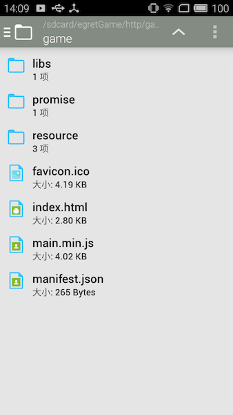

## 当前文件缓存策略

游戏运行过程中下载的文件会缓存在本地，参考“原生缓存策略”。

打包应用时可以将游戏资源放在包内，launcher创建的原生工程会自动将egret工程发布到assets目录下，如果需要更新可以重新打包，或者手动替换资源。

Native中可以通过config.preloadPath指定预加载目录，runtime加载资源时优先从这个目录查找文件，找不到再去assets目录下查找或者从服务器下载。

查找资源的优先级：预加载目录>本地资源(assets下的资源)>缓存目录(游戏运行过程中动态下载的资源)

## API说明

通过修改config.preloadPath来指定预加载目录，开发者需要自行维护这个目录下的内容。

```
Android:
//MainActivity.java
nativeAndroid.config.preloadPath = "指定目录";

iOS:
//AppDelegate.mm
_native.config.preloadPath = "指定目录";
```

需要以"/"开始和结束的绝对路径，如 "/sdcard/egretGame/"

可以简单地理解为，将游戏部署到了手机上的某个目录下，然后打开这个目录下的游戏。需要更新某个资源时，只需要更新这个目录上对应的资源即可。

## 文件存放位置

文件存放位置和文件的url对应，如 "http://game.com/game/index.html" 对应的本地文件路径应该是 config.preloadPath+"http/game.com/game/index.html"。

如果全部资源都放在本地，游戏地址可以不是真实存在的地址。

获得根目录（index.html所在目录）路径参考方法：

```java
String getFileDirByUrl(String urlString /*"http://game.com/game/index.html"*/) {
    int lastSlash = urlString.lastIndexOf('/');
    String server = urlString.substring(0, lastSlash + 1);
    return server.replaceFirst("://", "/").replace(":", "#0A");
}
```

## 注意事项
1. Android上预加载目录设置为sd卡上的目录时注意申请文件读写权限
2. iOS Hybrid方案打包的工程，请参考“如何使用Hybrid”中的更新策略和demo
3. 加载预加载的资源时会忽略地址后面的query（游戏地址中带的query能在游戏中读到，但是不能通过query进行版本控制）

## 示例工程说明
示例工程展示了如何下载游戏资源到预加载目录，和从预加载目录启动游戏。

游戏地址：http://game.com/game/index.html （不真实存在的地址，供游戏逻辑使用）

游戏资源地址：http://tool.egret-labs.org/Weiduan/game/game2.zip （一个HelloWold工程）

以Android为例，解压完成后 /sdcard/egretGame/http/game.com/game/ 下的内容如下：



游戏资源解压完成后，设置config.preloadPath指定预加载目录，启动游戏后runtime会优先从这个目录加载资源。

### 下载示例工程

[Android](http://tool.egret-labs.org/DocZip/native/demo_android_preload.zip)

[iOS](http://tool.egret-labs.org/DocZip/native/demo_ios_hotupdate.zip)

示例工程仅展示了基础的预加载游戏资源的方法，没有处理下载失败等异常事件。
