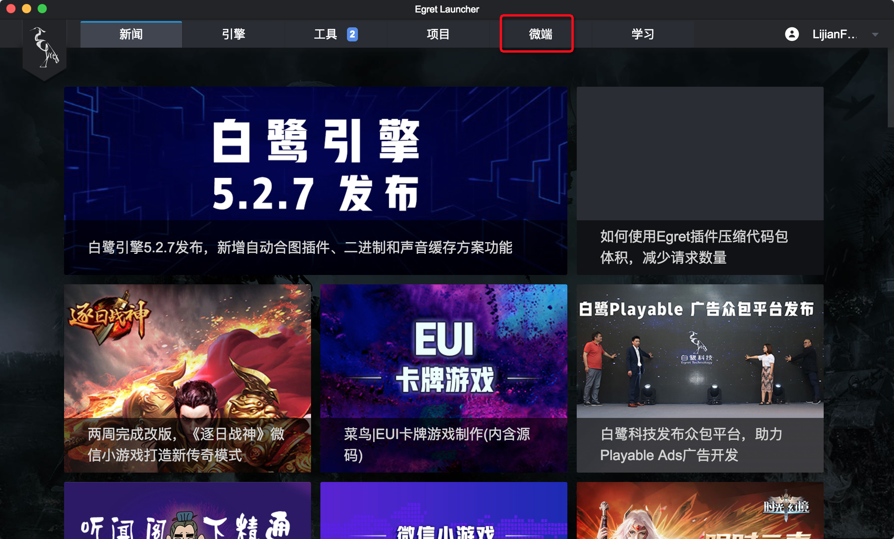
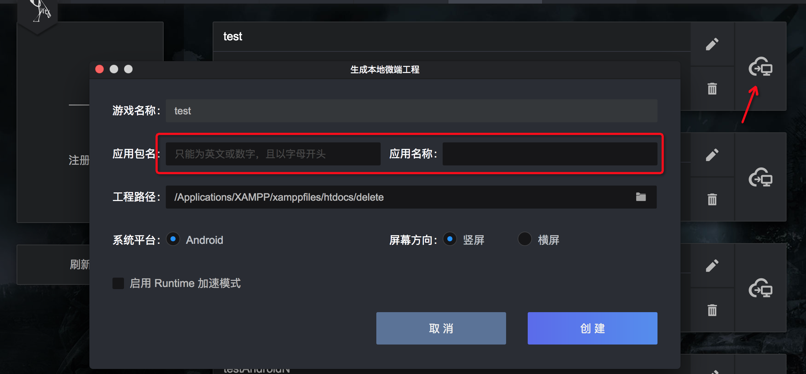
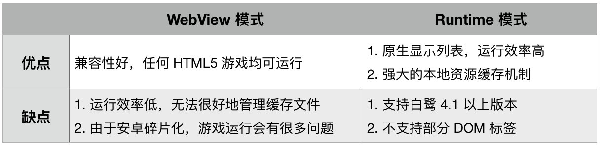

## 什么是微端

白鹭微端是 Egret 团队为了解决原生 APP 包体过大而推出的打包解决方案。

通过动态加载技术，白鹭微端可保证打包发布的原生 APP 包体极小，以便节省游戏推广成本，提高游戏用户留存率。

白鹭微端内置两种运行模式，Runtime 模式下可大幅度提升基于 Egret 引擎所研发的游戏性能，而 Webview 模式可以最大化保证兼容性，支持其他不同游戏引擎所开发的 HTML5 游戏。

**微端仅支持发布Android工程。**

## 创建微端工程

- 进入微端界面



- 注册游戏，填写游戏名称和地址


- 创建Android工程，填写应用报名和应用名称



- 根据需求选择是否使用Runtime加速，如果没有勾选，将通过WebView加载游戏，两种模式的优缺点如下：



## 使用本地资源

微端使用的资源默认从网络加载，从 v0.0.13 版本开始，可以将资源打包在 app 中。

使用本地资源或想要把H5游戏打包到微端里，只需将h5发布的项目直接拷贝到 assets/game 目录，如没有这个目录请创建。


## JS与Java通信

逻辑和Android Native相同，只是原生工程的API不同。

注册接收消息的方法：

```java
launcher.setExternalInterface("sendToNative", new INativePlayer.INativeInterface() {
    @Override
    public void callback(String s) {
        Log.d("Egret Launcher", s);
    }
});
```

发送消息：

```java
launcher.callExternalInterface("sendToJS", "message from microclient");
```

## 启动页

### 手动关闭启动页的方法

当打开游戏页面以后，微端默认自动关闭启动页。但此时您的页面里加载的js文件或者其他文件很多的时候，因为需要从网络或本地缓存里读取这些文件，会存在一段黑屏时间。对玩家来说用户体验不好。

所以我们也提供了一种手动关闭启动页的方法。这种模式下，启动页会一直存在，直到调用了关闭启动页的代码。

- 设置安卓工程

安卓工程的 MainActivity 里

```
//1 是自动关闭  0 是手动关闭
launcher.closeLoadingViewAutomatically = 1;
```

将代码里的 **=1** 改为 **=0** 

- 修改游戏代码

当你的游戏初始化完成，可以关闭启动页时，调用下面这段代码

```
if (window['closeLoadingView']) {
    window['closeLoadingView']();
}
```

- 优化建议

黑屏等待的时间和加载文件的数量是成正比的，即便使用手动关闭启动页，也会让玩家等待很长时间。所以建议合并js数量，比如使用 egret publish 后的版本，可以把数百个js文件合并成一个，这样启动速度就会很快了。

### 禁用启动页的方法

微端0.1.8添加。禁用后将不再弹出启动页。

```
launcher.disableLaunchPage();
```

### 修改启动页地址的方法

微端0.1.8添加。

```
launcher.launchPageUrl = "启动页地址";
```

## 在微端中使用启动图

在应用启动之前，为了解决白屏体验不好的问题，一般会先显示一张图片，等应用启动后再关掉这个图片。微端中也有这个方法。

### [示例demo下载地址](http://tool.egret-labs.org/microclient/doc/zip/launchimageAndroidV1.2.zip)

### 启动图的意义

启动图可以减少用户看到的黑屏、白屏或者花屏的可能性，是 APP 的启动流程更加的自然，给用户带来更好的体验。

### 启动图的使用方法

通过 NativeLauncher 类的 initViews 方法启用启动图功能，函数原型如下：


```
public void initViews(FrameLayout layout, int imageResId, int duration);
```

其中，layout 表示 View 的根节点，imageResId 表示启动图的图片资源 id，duration 表示启动图展示的时间，单位为毫秒。如果该时间等于 0，则表示启动图启动图会在游戏启动后自行关闭，如果大于 0，则表示启动图会在到达该时间之后关闭。

举例来说，假设 res 文件夹下面的 drawable 目录下有一个名为 background.jpg 的图片，该图片被用于启动图并且启动图的展示时间为 2 秒，那么示例代码如下：


```
launcher.initViews(rootLayout, R.drawable.background, 2000);
```

其中，launcher 来自于 NativeLauncher 类，rootLayout 是 View 的根节点，R.drawable.background 指向前面的 background.jpg 图片，2000 表示展示时间为 2 秒。

## 其它工程设置

### 是否每次启动都重新下载游戏

使用这个功能是为了方便调试。默认值为0，设置为1后每次启动前都会清空下载缓存。

```java
launcher.clearGameCache = 0;
```

### 加载index的超时时间

设置加载index的超时时间。默认值为-1，不设置超时。

```java
launcher.loadingTimeout = -1;
```

### 设置预加载路径

详见“热更新方案说明”

```java
launcher.preloadPath = "";
```

### 禁用原生渲染加速

如果引擎的版本合适，runtime会自动开启原生渲染加速。如果您不想使用该功能，可以在工程中关闭。

```java
launcher.disableNativeRender();
```

### 设置webview透明

在 setExternalInterfaces(); 下面增加一行代码：

```java
launcher.setWebViewBackgroundTransparent(true);
```
