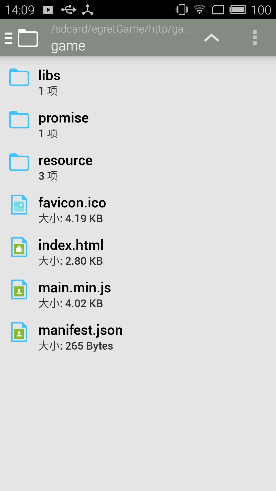

## 当前文件缓存策略

游戏运行过程中下载的文件会缓存在本地，参考“原生缓存策略”。

打包apk时可以将游戏资源放在包内，参考“使用本地资源”。

Native中可以通过config.preloadPath指定预加载目录，runtime加载资源时优先从这个目录查找文件，找不到再去assets目录下查找或者从服务器下载。

查找资源的优先级：预加载目录>本地资源>缓存目录

## API
config.preloadPath

需要以"/"开始和结束，如 "/sdcard/egretGame/"

### 文件存放位置

文件存放位置和文件的url对应，如 "http://game.com/game/index.html" 对应的本地文件路径应该是 config.preloadPath+"http/game.com/game/index.html"。

如果全部资源都放在本地，游戏地址可以不是真实存在的地址。

获得根目录（index.html所在目录）路径参考方法：

```java
String getFileDirByUrl(String urlString /*"http://game.com/game/index.html"*/) {
    int lastSlash = urlString.lastIndexOf('/');
    String server = urlString.substring(0, lastSlash + 1);
    return server.replaceFirst("://", "/").replace(":", "#0A");
}
```

### 注意事项
1. Android上预加载目录设置为sd卡上的目录时注意申请文件读写权限
2. 加载预加载的资源时会忽略地址后面的query（游戏地址中带的query能在游戏中读到，但是不能通过query进行版本控制）

### 示例工程说明
游戏地址：http://game.com/game/index.html （不真实存在的地址，供游戏逻辑使用）

游戏资源地址：http://tool.egret-labs.org/Weiduan/game/game2.zip

预加载目录：/sdcard/egretGame/

**流程：**

1. 下载zip到对应目录（/sdcard/egretGame/http/game.com/game/）
2. 解压并删除zip，解压完成后 /sdcard/egretGame/http/game.com/game/ 下的内容如下：


3. 修改config.preloadPath，启动游戏

### [下载示例工程](http://tool.egret-labs.org/DocZip/native/demo_android_preload.zip)

示例工程仅展示了基础的预加载游戏资源的方法，没有处理下载失败等异常事件。
