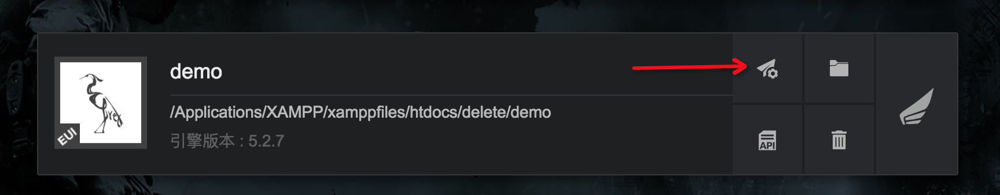

## 发布工程

### 发布设置前的准备工作

- Hybrid 方案目前仅支持 iOS 系统
- 安装最新版本的launcher
- 安装Xcode
    - 最低版本: 9.0
    - 后续需要在Xcode中完成发布项目的修改和功能接入

### 发布项目
- 在launcher的项目面板找到需要发布iOS工程的Egret项目，点击发布设置



- 点击左侧的iOS按钮，在右侧页面中，输入应用名称、应用包名，点击确定。**勾选使用Hybrid方案**


### 注意

- 双击xcworkspace文件打开工程
- 创建的工程默认打开示例游戏，需要自行修改游戏地址

## 工程模版说明

默认工程是从本地启动游戏。

### 启动流程

- 初始化EgretWebViewLib

```
[EgretWebViewLib initialize:@"/egretGame/preload/"];
// "/egretGame/preload/"是缓存目录，在应用的document目录下。
```
- 检查游戏资源是否已经部署到本地服务器

```
[EgretWebViewLib checkLoaded:zipFilePath Host:host]
// zipFilePath是游戏资源zip的绝对路径
// host是游戏映射到哪个url下，如host为"https://egret.com/game/"，对应的游戏url为"https://egret.com/game/index.html"
```
- 将游戏资源部署到本地服务器

```
ZipFileLoader* loader = [EgretWebViewLib createZipFileLoader:zipFilePath Host:host Delegate:self];
[loader start];
```
- 启动游戏

```
[EgretWebViewLib startLocalServer]; // 启动本地服务器
[EgretWebViewLib startGame:gameUrl SuperView:self.view]; // 启动游戏
```

## 另外三种启动方式

### 直接启动游戏

```objective-c
[EgretWebViewLib startGame:gameUrl SuperView:self.view];
// gameUrl是游戏的url地址
```

### 从Resources目录启动游戏

0.1.11版本添加

```objective-c
[EgretWebViewLib startLocalServerFromResource];
[EgretWebViewLib startGame:indexFilePath SuperView:self.view];
// indexFilePath是游戏的index.html文件相对于Resources的路径
```

如下图所示，indexFilePath为"game/index.html"。需要确认游戏资源目录已经添加到"Copy Bundle Resources"中。


### 下载游戏资源到本地，从本地启动游戏

- 检查本地游戏资源版本（根据文件名判断是否加载过）

```objective-c
[EgretWebViewLib checkLoaded:];
```

- 下载游戏资源

```objective-c
ZipFileLoader* loader = [EgretWebViewLib createZipFileLoader: Delegate:];
[loader start];
```

- 启动本地服务器和游戏

```objective-c
[EgretWebViewLib startLocalServer];
[EgretWebViewLib startGame: SuperView:];
```

## JS与OC通信

逻辑和Android Native相同，只是原生工程的API不同。

注册接收消息的方法：

```objective-c
[EgretWebViewLib setExternalInterface:@"sendToNative" Callback:^(NSString* msg) {
    NSLog(@"message: %@", msg);
}];
```

发送消息：

```objective-c
[EgretWebViewLib callExternalInterface:@"sendToJS" Value:@"message from OC"];
```

## 资源管理策略

0.1.12版本添加

### 本地放部分资源

0.1.12开始支持在本地放部分资源，本地不存在的资源会到服务器上下载。

需要在启动游戏时设置index.html对应的的服务器上的目录，以'/'结束，如"http://tool.egret-labs.org/Weiduan/game/"。

```
+ (void)startGame:(NSString*)gameUrl Host:(NSString*)host SuperView:(UIView*)superView;
```

### 查找资源的顺序

动态下载目录下的资源 > 本地资源 > 服务器上的资源

动态下载目录下的资源：根据启动游戏时传入的host生成的目录，本地不存在的资源会下载到这里。可以通过`+(NSString*)getPreloadPathByGameUrl:(NSString*)gameUrl;`获得这个目录的绝对路径，参数是服务器上的index.html地址，如"http://tool.egret-labs.org/Weiduan/game/index.html"。

本地资源：通过zip方式启动游戏后解压出来的资源，或者直接放在Resource目录下的资源。

### 更新策略

动态下载的资源或者本地资源不会再去服务器上下载，需要手动进行更新。

两种参考更新方案：

- 通过ZipFileLoader下载资源到本地。ZipFileLoader会自动覆盖旧的资源，并且能够获得当前版本。
- 手动下载更新后的资源到动态下载目录。

## App Store审核常见问题

### 和浏览器体验没有区别

> Your app provides a limited user experience as it is not sufficiently different from a mobile browsing experience. As such, the experience it provides is similar to the general experience of using Safari. Including iOS features such as push notifications, Core Location, and sharing do not provide a robust enough experience to be appropriate for the App Store.

解决方案：添加一些原生功能，让应用体验和Safari有区别。

若只添加了一些不明显的原生功能，如通过ExternalInterface调用原生SDK进行登录，可能不会通过人工审核。

### 应用启动时需要解压资源

> Your app did not include sufficient content in the binary for the app to function at launch, and we were required to download or unpack additional resources before we could use it.

解决方案：

1. 修改启动的逻辑，打开应用后显示其他界面，无感知下载和解压游戏资源。

2. 审核时采用*直接启动游戏*或者*从Resources目录启动游戏*的启动方式。

## 注意

### Web存储

如果采用从本地服务器启动游戏的方案，可能会出现“Web存储失效”的问题，如 localStorage 不能获得上次启动保存的数据。原因是每次启动本地服务器占用的端口号是不固定的（固定端口号可能会审核被拒），按照浏览器缓存策略这部分数据不能共享。

解决方案：通过ExternalInterface调用原生代码存储数据。

## 示例工程

[下载地址](http://tool.egret-labs.org/DocZip/native/demo_ios_hybrid.zip)
