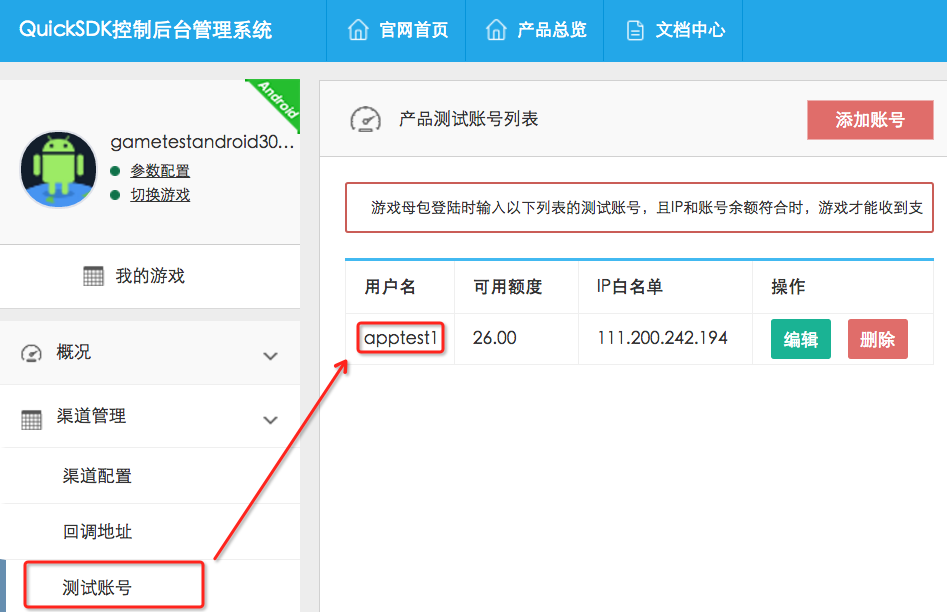
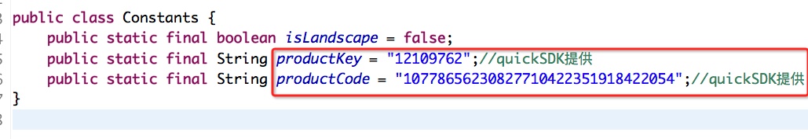

注意，本文档介绍的是接入中间件的内容，在接入成功的基础上才能结合QuickSDK的打包工具接入具体的渠道。

## 一、准备工作
**step1** 到quicksdk官网申请后台账号，创建测试应用，测试账号并获取必要的 **productKey**和**productCode**待用




**step2** 将`node` 和 `npm`(安装node时已包含)安装到本地，确保最新
	
**step3** 将`android sdk`安装到本地
	
**step4** 下载[refactor-for-nest分支](https://github.com/egret-labs/egret-android-support/tree/refactor-for-nest)的android_support工程

**step5** 安装新命令行工具 `egret-cli`

```
npm install -g egret-cli 
```
安装完成后确保执行一下`egret-cli`看是否有帮助信息输出
如果有如下信息则表示安装成功

```
localhost:~ yourmacname$ egret-cli

  Usage: egret-cli [options] [command]


  Commands:

    native [name]      deploy one or more packages
    config [name]      get config
    nest [subcommand]  create/set/run a nest egret project
    publish            publish
    resource           resource
    libraries          lib
    help [cmd]         display help for [cmd]

  Options:

    -h, --help     output usage information
    -V, --version  output the version number
```

## 二、配置工作

创建android工程前需要首先设置全局变量 

**step1** 利用 `config set` 命令配置 `android sdk` 位置

```		
egret-cli config set --key android-sdk --value <准备工作step3中的目录位置>
```
**step2** 利用 `config set` 命令配置 `android support` 位置

```
egret-cli config set --key android_support --value <准备工作step4中的目录位置>
```

注:利用 `config get` 命令查看配置是否正确
若正确配置，你应该会看到刚刚配置的路径

```
localhost:~ yourmacname$ egret-cli config get --key android-sdk
/Applications/sdk
localhost:~ yourmacname$ egret-cli config get --key android_support
/Users/yourmacname/Egret-Android/egret-android-support
```
**step3** 进入H5游戏项目目录，创建文件 `egret.config`

手动配置以下参数,以下给出范例：

```
{
	//相对于egret工程的相对路径
	"androidProjectPath":"../TESTQUICKV112",
	
	//要生成的android工程包名
	"packageName":"com.jack.testquickv112",
	
	//可选的sdk种类 目前仅支持国内渠道的quicksdk和apus
	"sdk":"quicksdk"
}
```
> 注:这些参数也可以在命令行中输入,区别在于后者每次部署都需要输入一遍参数,如下

```
localhost:~ jackyanjiaqi$ egret-cli native help create

  Usage: egret-cli native create <egretH5path> [options]

  Options:

    -h, --help                              output usage information
    -p, --androidProjectPath <projectName>  androidProjectName
    -n, --packageName <packageName>         packageName
    -s, --sdk <quicksdk|sdk>                sdk
```
## 三、创建QuickSDK工程并导入Eclipse
创建接入QuickSDK的AndroidNest工程

```
egret-cli native create <配置了egret.config的H5游戏目录>
```
使用`egret-cli native create`命令，如在本例中使用的参数，则在上一章节第三步用于配置egret.config的H5游戏目录的同级目录下生成TESTQUICKV112和TESTQUICKV112.quicksdk两个android项目目录。

将两个项目同时导入到Eclipse中，未有quicksdk后缀的目录为标准android support游戏项目(以下简称 `游戏AndroidSupport工程` )，已默认作为带有quicksdk后缀的目录项目（以下简称 `QuickSDK工程` ）的<b style="color:red">引用库</b>，若去掉作为库项目的配置时则可以单独运行，与QuickSDK接入相关的参数都在带有后缀的quicksdk的项目中配置。

## 四、配置QuickSDK工程

### 1.白鹭开放平台配置

白鹭开放平台提供的游戏ID设置到 `游戏AndroidSupport工程` 下`主Activity`内的`getGameOptions`方法内，如图：


向白鹭开放平台索要渠道号和appkey并配置到 `QuickSDK工程` 下`主Activity`内的`getGameOptions`方法内，如图：


### 2.QuickSDK配置

将第一章节“准备工作”step1的productKey和productCode配置到 `QuickSDK工程` 下`Constants.java`类下，如图：




## 五、部署h5游戏资源
此时工程内尚未包含h5游戏，请使用 `egret-cli native deploy`命令并指定拷贝h5项目的游戏到android工程中，使得h5端的游戏改动能够在android端同步。

```
egret-cli native deploy <配置了egret.config的H5游戏目录>
```
此时将在android目标工程的assets目录下出现egret游戏
此种方法在android端运行适用于本地调试，正式上线时应用线上地址的配置方式用户自动下载和热更新。

运行QuickSDK工程将看到第七节的接入效果，则接入完成。否则返回至第二节查看配置是否正确。

## 六、快速创建一个H5的Nest工程
注意以上用于创建QuickSDK的Android工程的源H5工程必须接入Nest第三方库，若未接入，可以使用 `egret-cli` 提供的 `nest` 子命令快速创建并运行一个Nest工程范例，该范例工程以默认的参数配置于根目录下egretProperties.json的nest字段下

> 注:该命令依赖于旧版 `egret` 命令

### Web版Nest示例工程创建指南

#### 1 create 创建命令

```
egret-cli nest create [relativePathToCwd] | -p <absolutePath>
```
参数说明:
    [relativePathToCwd]       要创建项目的相对路径(相对于当前执行目录)
    -p, --path <absolutePath> 要创建的项目的绝对路径(必须指定-p 否则会当做相对路径处理)

#### 2 run 运行命令(web端)

```
egret-cli nest run [relativePathToCwd | -p <absolutePath>] [-a]
```

用法示例:

```
egret-cli nest run
egret-cli nest run -a
egret-cli nest run test -a
egret-cli nest run -p /Users/testuser/test -a 
```

可选参数说明:
    relativePathToCwd         要执行项目的相对路径
    -p, --path <absolutePath> 要执行的项目的绝对路径(必须指定-p)
    -a, --autoBuild           打开自动编译

#### 3 set 设置运行参数

在当前目录执行，默认运行参数为测试参数,具体游戏参数需要向开放平台申请 详询 http://open.egret.com/Wiki

```
egret-cli nest set [options]
```
可选参数说明:
    --appId <appId>               游戏id,必传 原始值88888
    --channelId <channelId>       渠道id,必传 原始值9166
    --platInfo [platInfo]         平台信息,可选 默认值为open`<appId>`<channelId>
    --spId [spId]                 spId,可选 默认值为<channelId>
    --sdkDomain [sdkDomain]       可选,默认值为 http://api.egret-labs.org/v2
    --serverDomain [serverDomain] 可选,默认值为 http://api.egret-labs.org/v2

## 七、接入效果和后续渠道接入

到此，一个通用的QuickSDK工程完成了，若由使用了`egret-cli nest create`命令创建的H5工程创建的QuickSDK工程，依次点击 app -> user -> login 将会弹出一个模拟的登陆框 使用我们在QuickSDK后台配置的账号登陆并手动点击成功则会弹出浮动窗，用于显示测试信息，点击 back -> back -> iap -> pay 唤起支付界面，手动输入支付金额并点击按钮模拟成功。此时到QuickSDK后台查看金额，若有相应的金额减少，则登陆和支付至此调通。

后续接入具体渠道需要与QuickSDK建立联调机制。