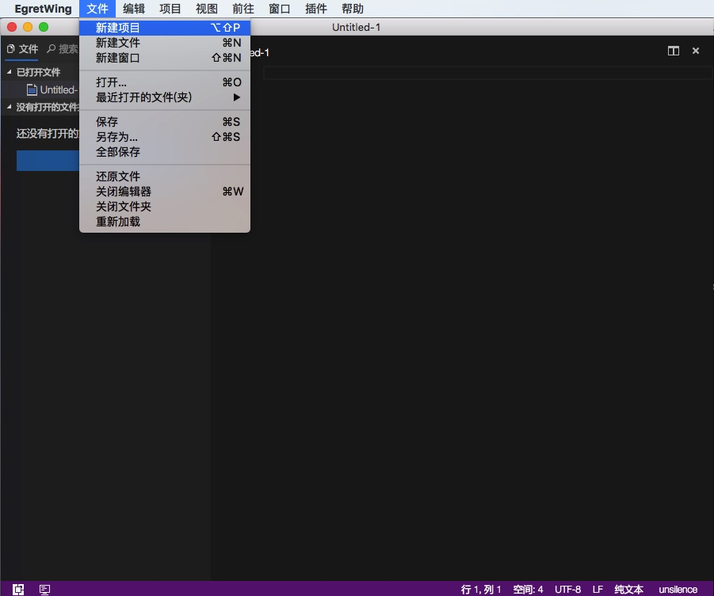
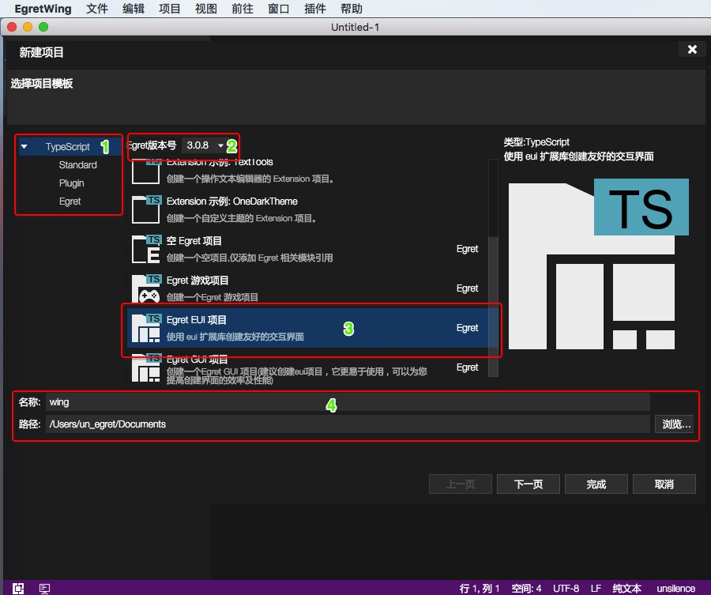
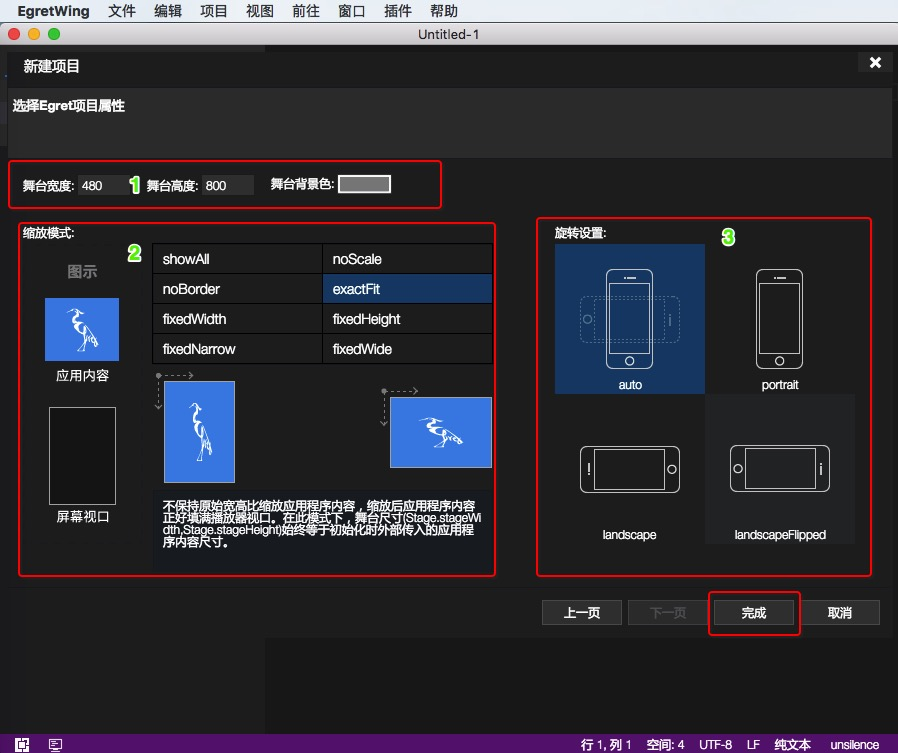
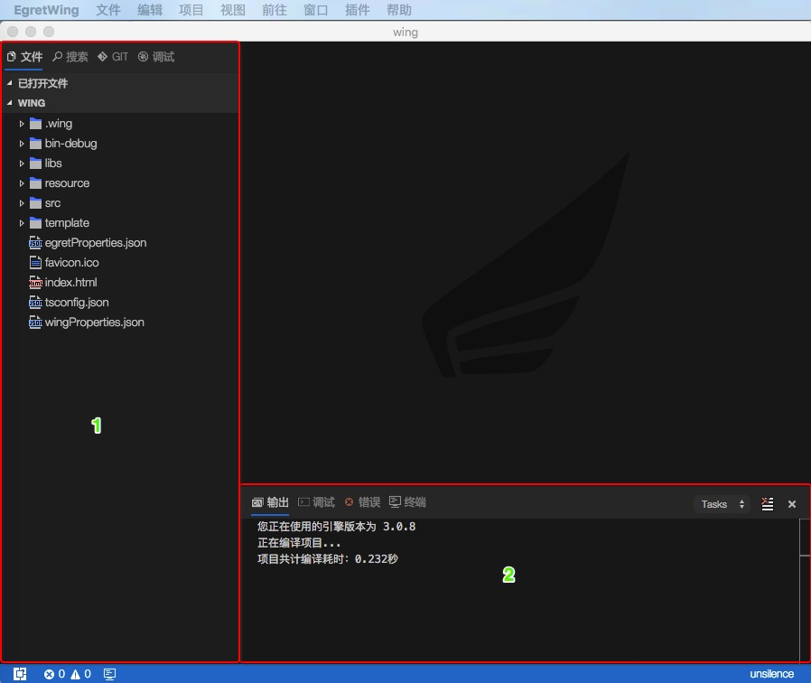
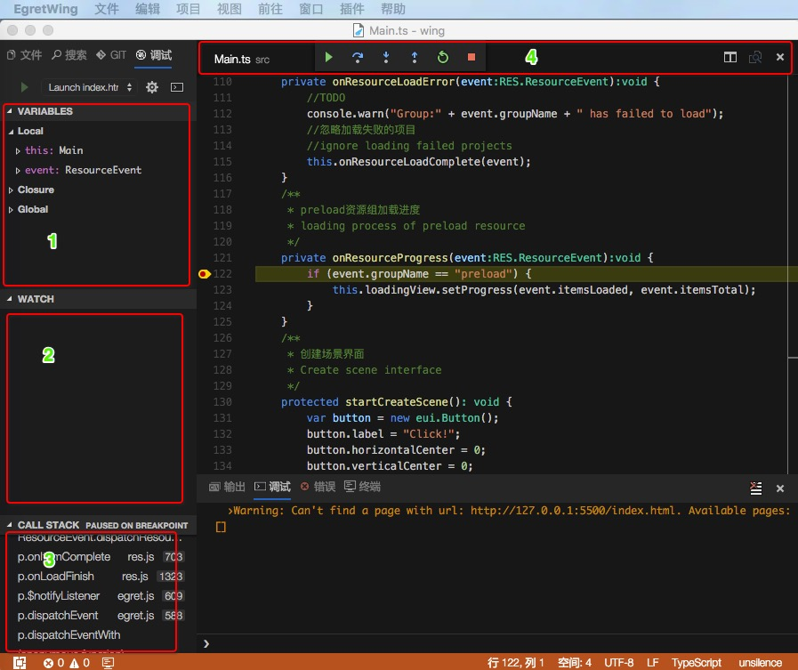
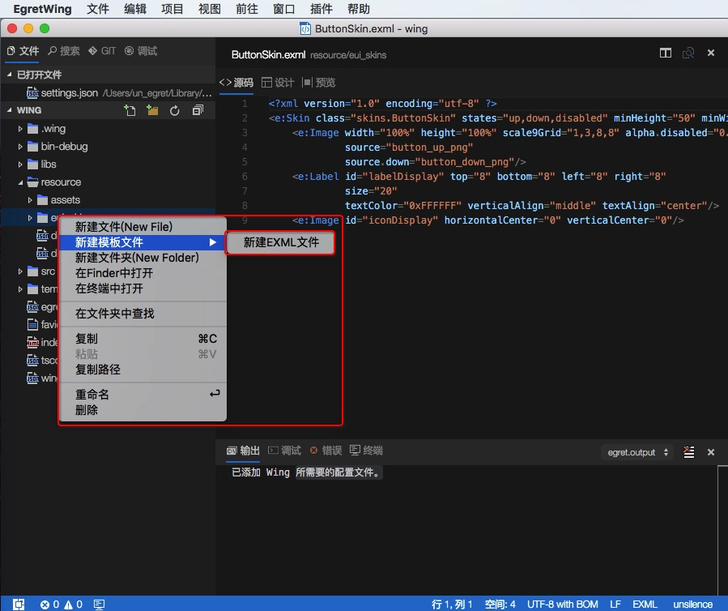
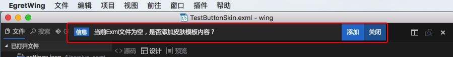
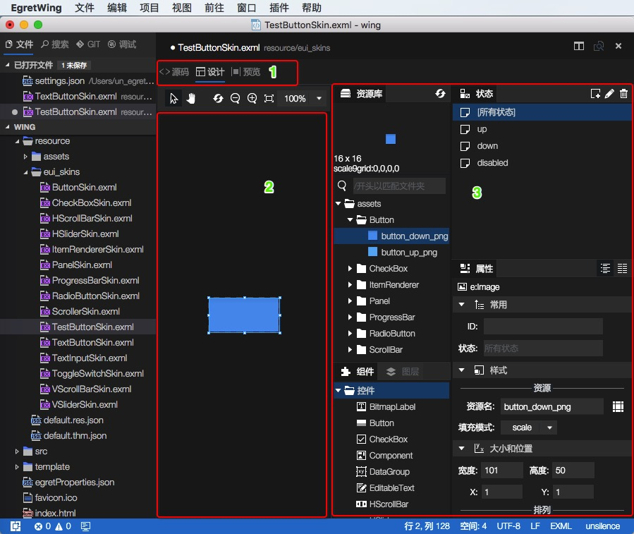
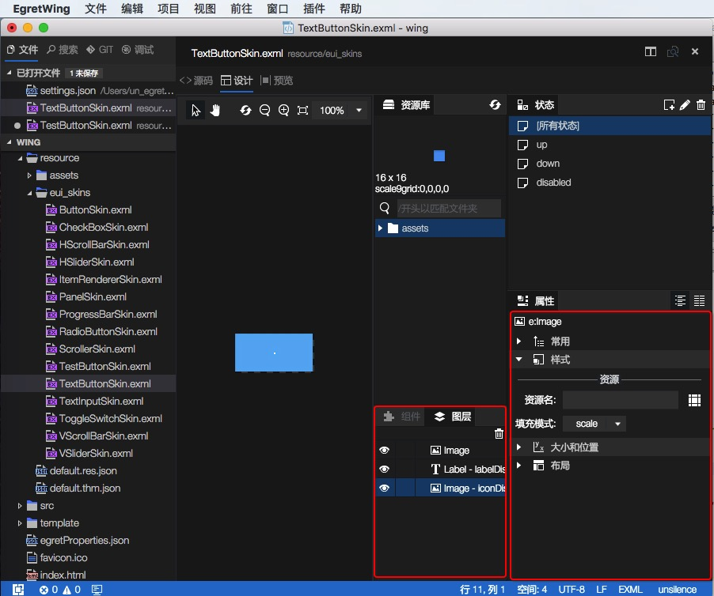

## 项目创建
- 点击导航栏“`文件`”->“`新建项目`”，弹出“`新建项目`”面板,选择`TypeScript`项目类型：“`Standard`”、“`Plugin`”、“`Egret`”。可选使用EgretEngine版本，设置`项目名称`、`项目路径`。

	** 如下图：**
	
	

	** 如下图1：**

	

- 1区域：选择项目类型：`standard`、`Plugin`、`Egret`。

- 2区域：选择Egret项目时可以选择Egret Engine 的版本号（本机安装的Engret Engine,Egret Engine安装详见---）。

- 3区域：当前需要创建项目的模板，例如：创建Egret EUI项目 ，wing会把编辑EUI的库、模板给加载进来，便于用户操作等。

- 4区域：项目名字,如图显示`wing`；项目路径，`/Users/un_egret/Documents`，点击`浏览`按钮选择项目存放位置。

- 点击‘下一步’按钮 。

	**如下图2：**

   

- 1区域：设置舞台的`宽度`、`高度`、`舞台背景色`。

- 2区域：设置屏幕的`放缩模式`。

- 3区域：设置`旋转模式`。

- 点击`完成`按钮。

	**如下图3：**
	
	
- 1区域：代码树
   
- 2区域：项目输出日志信息
	

## 项目菜单
	
- ### 构建
	- 编译当前项目  

- ### 清理
	- 清理项目，清理bin-debug中所有文件，然后生成js

- ### 调试\F5
  ** 如下图6：**
  
  
   - 点击项目->调试 
   - 1区域：变量
   - 2区域：观察表达式
   - 3区域：调用栈
   - 4区域：调试操作，`继续`、`单步跳过`、`单步跳入`、`单步跳出`、`重启`、`结束`

- ### launch.json
		{
			"version": "0.2.0",
			"configurations": [
				{
					"name": "Launch index.html",
					"type": "chrome",
					"request": "launch",
					"file": "index.html",
					"runtimeExecutable": "${execPath}",
					"useBuildInServer": true,
					"sourceMaps": true,
					"webRoot": "${workspaceRoot}",
					"preLaunchTask": "build",
					"port": 5500
				}
			]
		}
		
 - **name**  配置名称; 显示在启动配置的下拉列表。`Wing 内置播放器调试` 、`使用本机 Chrome 调试` 、`附加到 Chrome 进程`。
 - **type** EgretWing配置类型，`chrome`、`node`、`extensionHost`。
 - **request** 配置的Request类型。 有效值为 `"launch"` 或者 `"attach"`。
 - **file** debug 入口文件,在浏览器打开的html文件。
 - **runtimeExecutable** 可执行文件的绝对路径。默认值是 PATH 上的运行时可执行文件。改成您的 Chrome 安装路径 例如 `C:\Program Files (x86)\Google\Chrome\Application\chrome.exe 或 /Applications/Google Chrome.app/Contents/MacOS/Google Chrome`。
 - **useBuildInServer** 当为true, EgretWing 将启动一个内建的web server。
 - **sourceMaps** 是否使用 JavaScript 源映射(如果存在)。
 - **webRoot** Web服务的根目录。
 - **preLaunchTask** 执行任务之前运行的任务。
 - **port** web服务器指定的端口号。

[点击调试详情](../debug/inspector/README.md) 		

## Egret Support 插件菜单

- 初始化 egret 项目  
    - 配置 Egret 项目需要的编译和调试参数
- 启动Egret项目
	- 启动项目 等于在命令窗口输入egret startserver 
- 编译引擎
	- 编译当前项目引用的引擎，适用于自己修改了引擎代码
- 发布Egret项目
	- 将当前项目发布成正式版本，同时压缩项目代码

## 目录结构介绍
- wing项目目录	
		- .wing
			- launch.json
			- tasks.json
		- bin-debug
		- libs
			- modules
				- egret
				- eui
				- res
				exml.e.d.ts
		- resource
			- assets
			- eui_skins
			- default.res.json
			- default.thm.json
		- src
		- templete
		- egretProperties.json
		- favicon.ico
		- index.html
		- tsconfig.json
		- wingProperties.json
		
+ .wing 目录中存放项目的设置信息。

+ libs 中存放项目使用类库，exml.e.d.ts文件项目使用exml（在resource/eui_skins文件夹中）编译出来的文件。

+ resource 项目使用的资源文件。

	- assets 项目使用的图片、视频等资源。
	
	- eui_skins 项目使用的exml。
	
	- default.res.json 项目使用的资源配置（图片、声音、pngsheet、font）等。
	
	- default.thm.json 项目exml的路径配置 。

## EUI 相关信息

### 新建 EXML
+ 右键点击eui_skins

	**如下图7：**

	
+ 点击`设计`页签。

  **如下图8：**

	
+ 点击`添加`
		<?xml version="1.0" encoding="utf-8"?> <e:Skin width="400" height="300" xmlns:e="http://ns.egret.com/eui" > </e:Skin>- 如下图9：	
	
	- 1区域：eui的编辑模式 ，`源码`，`设计`，`预览` 三种模式。
	
	- 2区域：设置的预览、源码编辑、设计区域。
	
	- 3区域：<h3>EXML的编辑面板简介</h3>		- 资源库：在default.res.json中配置的资源。
		
		- 状态：自定义状态，例如：TestButtonSkin.exml 中有三个状态up、down、disabled，可以单独设置TestButtonSkin单独某个状态的皮肤。
		
		- 组件：系统控件(Button、CheckBox、CheckBox等组件)、布局组件(Group、Panel、Scroller、ViewStack)、自定义组件。
		
		- 图层：TestButtonSkin包含图层。
		
		- 属性：包含常用、样式、大小和位置、布局。
		
  **如下图10：**

	
		
		

- 详细内容 [EXML可视化编辑](../editor/exml/README.md) 

### 资源管理 [点击详情](../editor/resdepot/README.md) 

