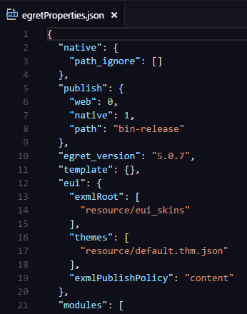

项目中有一个`egretProperties.json`文件，这个文件描述了当前项目的一些信息。如图：

点击`项目---构建`或者`Ctrl+Shift+B`,也可以命令行输入`egret build`，之后会根据这个文件构建项目,之后根据`tsconfig.json`编译ts文件。例如：

####build 命令

用法:
    egret build [project_name] [-e] [--runtime native]

描述:
    构建指定项目,编译指定项目的 TypeScript 文件

参数说明:
-    -project_name   项目名称，按照操作系统的命名规范命名
-    -e             编译指定项目的同时拷贝引擎代码
-    --runtime      如果有native工程，则会将文件拷贝到工程里