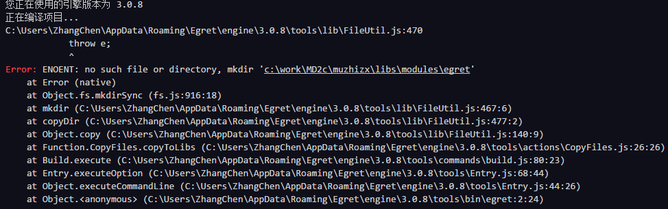
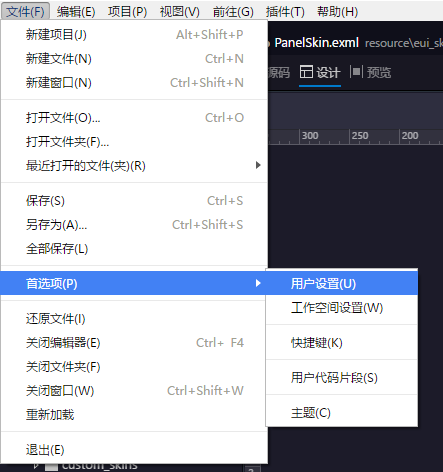
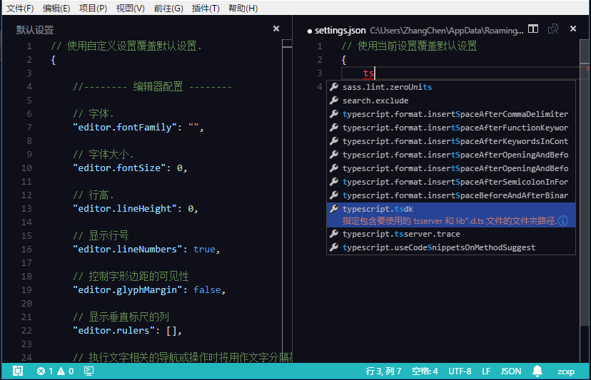
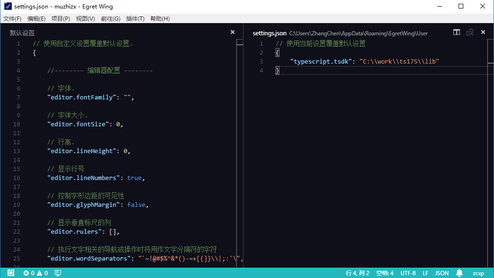
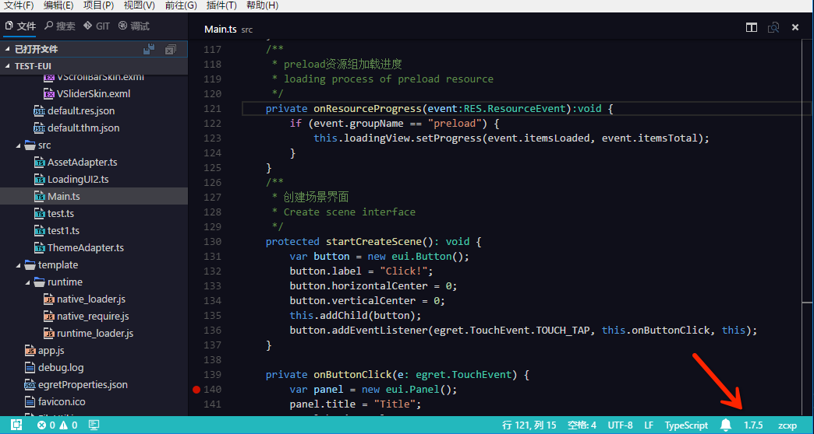

从 Wing 3.0.6 我们合并 vscode 新代码之后，开发者反应经常出现编译报错的问题：

经过仔细排查，最后终于定位到是 Wing 新版本中内置的 TS 1.8.10 的 File Watcher 有一定几率会锁文件，导致 egret build 命令无法写入。

根本的解决方法要等引擎的下个版本更新，这里先说一下临时的解决办法：暂时使用 TS 1.7.5

## 下载 TS 1.7.5 
[点此下载 TS 1.7.5](http://tool.egret-labs.org/EgretWing/resources/20160603fix/ts175.zip "点此下载 TS 1.7.5")

下载后解压到某个目录，这里以 "C:\work\为例"

## 修改 Wing 3.0 的TS配置

通过菜单"文件\首选项\用户设置" 打开 Wing 全局设置

会打开两个并排编辑器：

其中左侧是一个只读的编辑器，显示了 Wing 各种默认设置。右侧是用户的全局设置，它是一个 JSON 格式，用户可以重新设置各个设置的值，来覆盖默认设置。

TS 插件提供了很多设置项，比如我们现在要用的设置 TS 版本，比如格式化的时候花括号要不要换行等等。

这里我们添加`typescript.tsdk`这个设置项，你可以直接输入 tsdk 通过代码提示完成输入。

将`typescript.tsdk`制定到刚刚下载的 ts175 的目录下的 lib 目录，例如

保存并重新启动Wing。

## 确认修改成功

打开一个 egret 项目，打开一个 ts 文件。确认右下角出现 1.7.5 表明修改已经生效。

## 还原默认 tssdk

重新打开用户设置，将 `typescript.tsdk` 这个设置删掉，重启 wing 即可
