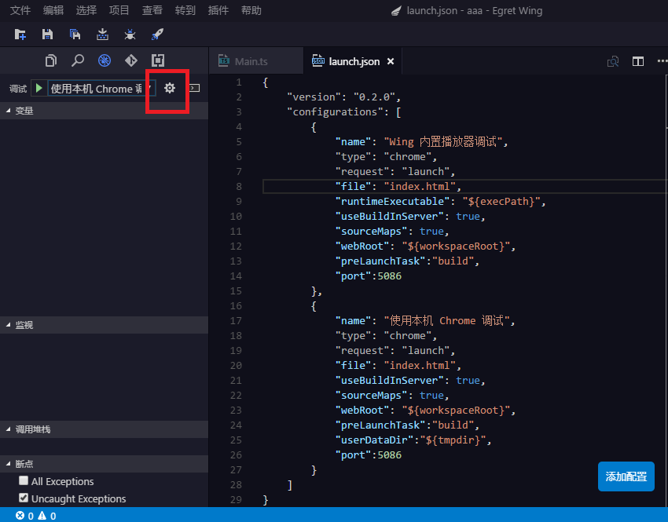

EgretWing支持对JavaScript代码的调试在Chrome浏览器，或者支持Chome调试协议的程序。

## 开始
EgretWing默认支持两种调试模式，`播放器调试` 、`Chrome`，可以在launch.json中手动添加 。

## launch

创建项目完成，在.wing文件夹下launch.json配置debug信息。

如上图:

	{
    	"version": "0.2.0",
    	"configurations": [
    		{
    			"name": "Wing 内置播放器调试",
    			"type": "chrome",
    			"request": "launch",
    			"file": "index.html",
    			"runtimeExecutable": "${execPath}",
    			"useBuildInServer": true,
    			"sourceMaps": true,
    			"webRoot": "${workspaceRoot}",
    			"preLaunchTask":"build",
    			"port":5086
    		},
    		{
    			"name": "使用本机 Chrome 调试",
    			"type": "chrome",
    			"request": "launch",
    			"file": "index.html",
    			"useBuildInServer": true,
    			"sourceMaps": true,
    			"webRoot": "${workspaceRoot}",
    			"preLaunchTask":"build",
    			"userDataDir":"${tmpdir}",
    			"port":5086
    		}
    	]
    }

- launch.json 介绍
	- **name**  配置名称; 显示在启动配置的下拉列表。`Wing 内置播放器调试` 、`使用本机 Chrome 调试` 。
	- **type** EgretWing配置类型，`chrome`、`node`、`extensionHost`。
	- **request** 配置的Request类型。 有效值为 `"launch"` 或者 `"attach"`。
	- **file** debug 入口文件,在浏览器打开的html文件。
	- **runtimeExecutable** 可执行文件的绝对路径。默认值是 PATH 上的运行时可执行文件。改成您的 Chrome 安装路径 例如 `C:\Program Files (x86)\Google\Chrome\Application\chrome.exe 或 /Applications/Google Chrome.app/Contents/MacOS/Google Chrome`。
	- **useBuildInServer** 当为true, EgretWing 将启动一个内建的web server。
	- **sourceMaps** 是否使用 JavaScript 源映射(如果存在)。
	- **webRoot** Web服务的根目录。
	- **preLaunchTask** 执行任务之前运行的任务。
	- **port** web服务器指定的端口号。
	
- 操作演示如下：
