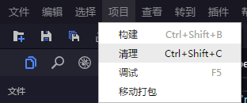

描述：清除libs文件夹内的引擎代码，然后再重新拷贝引擎，编译指定项目。

点击`项目清理`，或者`Ctrl+Shift+C`，或者命令行输入`egret clean`

#### clean 命令

用法:
    egret clean [project_name]

描述:
    清除libs文件夹内的引擎代码，然后再重新拷贝，编译指定项目

参数说明:
    project_name   项目名称，如果是在项目文件夹下执行命令，可以不加项目名称
