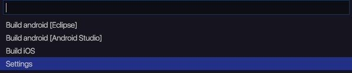
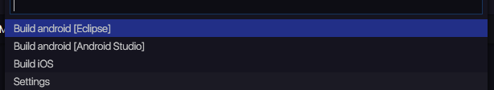
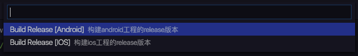
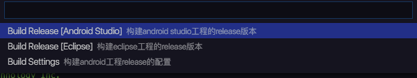
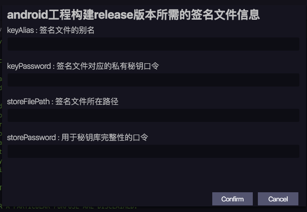
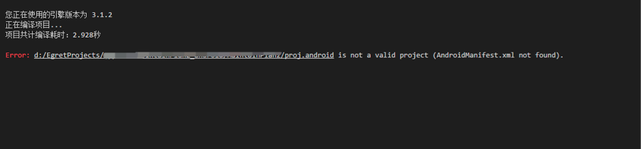
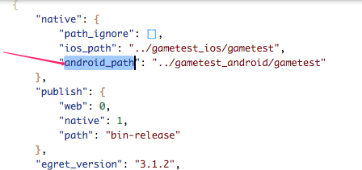

此版本适用于 Wing 3.2.1 及以下版本。

## 功能简介：
- 该插件可以快速方便地在对应移动平台下进行工程<font color=red>打包</font>
- 是对Egret EDN中[iOS APP打包方案](../../../Engine2D/publish/publishIOS/README.md), [Android APP打包](../../../Engine2D/publish/publishAndroid/README.md)中打包过程的集成
- 可导出<font color=red>测试包</font>和<font color=red>发行包</font>，前提是用户提供<font color=red>签名文件</font>。
- <font color=red>需先进行测试，验证无误后才能导出发行包。不经过测试直接导出发行包会被默认拒绝。</font>
- Debug打包：
  - 将egret项目转化成android／ios对应的native项目
  - 对native项目进行构建
   - android项目会得到.apk文件
   - ios项目会得到可在模拟器中运行的.app文件
  - android打包完成后会<font color=red>自动</font>去查找可连接的设备,多台设备会以列表形式排列，<font color=red>点击即可安装</font>
  - ios会自动启动<font color=red>模拟器</font>，在模拟器中运行。
- Release打包:
 - 会在Debug打包基础上，<font color=red>重新打包并签名</font>。

  
 
 


## 依赖条件：
### Android
#### 必需：
* 1.最新版egret engine [点击下载](http://www.egret.com/products/engine.html) 
* 2.android sdk [mac版下载](http://pan.baidu.com/s/1dD8WUL7) [windows版下载](http://pan.baidu.com/s/1gdsDRn9)
* 3.java sdk [mac版下载](http://www.oracle.com/technetwork/java/javase/downloads/jdk8-downloads-2133151.html) [windows版下载](http://www.oracle.com/technetwork/java/javase/downloads/jdk8-downloads-2133151.html)

#### 以下两种方式任选其一：
* #### eclipse打包方式
* 1.ant [点击下载](http://ant.apache.org/bindownload.cgi)
* 2.eclipse版的egret-android-support [点击下载](http://www.egret.com/products/products-others.html#egret-support)
* #### android studio打包方式
* 1.gradle [点击下载](https://services.gradle.org/distributions)
* 2.android studio版本的egret-android-support

### iOS
* 1.egret engine [点击下载](http://www.egret.com/products/engine.html) 
* 2.egret-ios-support [点击下载](http://www.egret.com/products/products-others.html#egret-support)
* 3.xcode

## 使用流程:
# Debug模式
* 1.设置项目构建所依赖工具的路径 [<font color=red>settings</font>]
 - android studio工程需要设置Gradle、Android Sdk、android stuido版本的support
 - eclipse工程需要设置 Android Sdk、Ant、eclipse版本的support
* 
* 
* 
* 
* 2.选择对应的版本构建选项 [<font color=red>eclipse</font>] or [<font color=red>android studio</font>]
* 
* 3.生成<font color=red>debug</font>版本后测试


## 注意：
- 强烈建议在配置环境时不使用带有中文字符或带有空格的路径。
- 由于不同版本之间存在诸如api level匹配之类的问题，如出现不匹配时请自行设置。
- 使用<font color=red>wing</font>创建egret游戏后，执行命令会在<font color=red>同目录下</font>生成对应的android和ios项目(<font color=red>请在创建之前确认没有重名文件夹</font>)，目录结构如下：
 - --helloworld
 - --helloworld_android
   - android_studio
     - helloworld
   - eclipse
     - helloworld
 - --helloworld_ios
 - - helloworld


#### android
- android调试请<font color=red>打开usb调试</font>功能，否则电脑无法正确发现android设备并完成安装（某些android设备连接电脑时还需要在手机上确认哦）。
- android调试，工程编译完成后会<font color=red>自动</font>去检索设备，并在你选择的设备上自动安装app。你只需选择需要安装的设备即可。
  - 
  
#### ios
- 由于ios开发的特殊性，为了避免大家纠结在开发者证书，策略文件等的配置上，插件在Debug模式下只生成可以在模拟器中运行的app文件（此文件不可在真机安装，因为没有签名）。
- 插件生成app文件后会自动启动模拟器加载app文件（请确保安装模拟器）。
   
# Release模式
- 在Debug模式下通过测试，没问题之后才能执行Release
- 根据需要，选择不同的Release目标。
 - 
##### android
 - android有两种模板：eclipse和android studio，请选择对应的发布模板。
 - 
 - 
##### ios
 - 请在装有Xcode的Mac电脑上使用该功能
 - 
 ##### 说明:
  - signingIdentity:为开发者证书标识，
  ##### 获取方式:
   - Keychain Access->Certificates->选中证书后右键弹出菜单->Get Info->Common Name。
  类似于 iPhone Distribution:Company name Co.Ltd (xxxxxxxxxx)。<font color=red>包括括号里面那串字符</font>
  - provisonProfile:为策略文件的identifier。
  ##### 获取方式:
   - Xcode->Preferences->选中申请开发者证书的Apple ID->选中开发者证书->View Details->选中所需的mobileprovision文件
   ->右键菜单->Show in Finder->找到该文件后，除了该文件后缀名的字符串就是所需的identifier。
   - 在终端里执行以下命令，也可以查看其identifier。
   ```
   // -i后面是你自己的文件路径
   echo `/usr/libexec/PlistBuddy -c "Print UUID" /dev/stdin <<< $(/usr/bin/security cms -D -i /Users/helloca/Documents/iOS_Team_Provisioning_Profile_.mobileprovision)`
   ```
   
# Q&A
#### 在使用过程中，如果遇到问题，请到论坛发帖或联系相关人员(QQ：815612516)
## 下面是有同学遇到了的问题：
- 
  - 这可能是因为手动删除了项目，导致IDE在按照已有记录的路径去查找项目时失败。
    #### 解决方法：
      - 打开源项目，找到egretProperties.json文件，查看里面native字段下是否有android_path／ios_path
      - 如果有,将对应行删除掉，保存，然后重新按照流程导出即可。
        - 
      - 也有可能是环境配置没有配好。请新建一个测试项目，按照流程走一次，看能否成功导出。
  - 有同学说：我并没有删除项目。
    #### 解决办法:
      - 请重启电脑再试着导出一下。（极特殊情况下，重启电脑之后就好了。）

- 
  - 这是因为java环境变量配置不对引起的
    #### 解决方法：
    - 正确配置java环境变量，可参考博文:[http://jingyan.baidu.com/article/f96699bb8b38e0894e3c1bef.html](http://jingyan.baidu.com/article/f96699bb8b38e0894e3c1bef.html)


 
 


