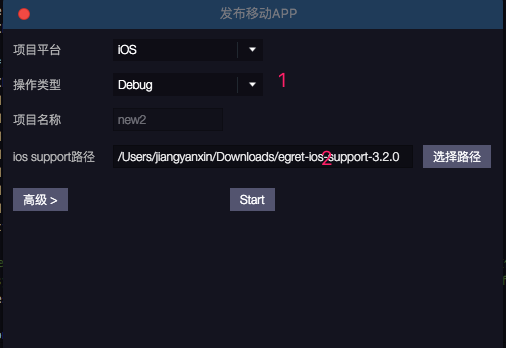

本文档适用于 Wing 3.2.2 及以上版本。

## 如何打开

## 使用说明
 
 
 * 1.选择目标平台，android（android studio、eclipse）和 ios
 	> ios 只能在 Mac 下才可以选择。
 * 2.选择操作类型，debug 和 release，其中仅提供android版本的release，ios在debug和release时请在执行完后在xcode中进行后续的操作
 * 3.对应的项目名称
 * 4.android sdk路径，设置到sdk即可。例：/Users/helloca/Documents/androidSDK/adt-bundle-mac-x86_64-20140702/sdk
 * 5.gradle路径，设置到bin即可。例：/Users/helloca/Documents/gradle-2.12/bin
	> 注：eclipse平台对应的是设置ant路径，设置到bin即可。例：/Users/helloca/Documents/apache-ant-1.9.7/bin
 * 6.android studio版本的support路径。例：/Users/helloca/Documents/egret-android-support-as
	> 注：eclipse平台对应的是eclipse版本的support路径
 * 7.签名文件所在路径，android发布时使用。
 * 8.签名文件的别名，android发布时使用。
 * 9.签名文件的key password，android发布时使用。
 * 10.签名文件的store password，android发布时使用。
 * 11.zipalign工具的路径，只需指明到其父路径即可，android发布时使用。例：/Users/helloca/Documents/androidSDK/adt-bundle-mac-x86_64-20140702/sdk/build-tools/22.0.1
 * 12.开始按钮，点击后开始执行相应的debug或者release操作
 * android工程debug时，会在构建完后自动查找连接的设备。如果查找到会自动安装apk文件。请确认设备是否连接并打开了usb调试功能，如果没有请在构建完成后手动安装。

 * 1.选择对应的操作，debug、release
 * 2.ios版本的support路径
 
#### 注：
   * 路径中不能含有中文或者空格。
   * windows系统不建议将各项依赖放置在系统盘下。
   * ios构建完成后请使用xcode打开ios的项目，然后在xcode里点击测试或正式发布。
   * xcode测试建议直接连接真机测试。现在真机测试是免费的，不需要购买苹果开发者账号。
   * xcode正式发布时需提供正式的开发者账号和证书，请自行购买。

## 更新
- 新增强制覆盖选项

### 注:
* 当把项目拷贝到其他的电脑或者位置时，想继续进行打包测试。旧版本需要手动删除已有的项目记录，新增功能可自动删除已有记录，然后重新生成对应的工程。
* 导出时请关闭所有对native工程目录和文件的访问，以防止出现因占用而无法写入或者无法删除的情况，特别是windows下。
* 强制覆盖会将文件夹连同文件夹下内容全部删除，请慎重使用该功能。

## 更新[2016.11.15]

- 新增设置导出项目路径和导出项目名

### 注：

* 自行设置native项目的导出路径和导出名
> 导出前请确认指定目录下是否已有同名资源或者项目，以免引起资源误删
* 新增查看帮助文档按钮
> 说明:点击之后会在浏览器中打开帮助文档的链接

   
## 依赖条件：
### Android
#### 必需：
* 1.最新版egret engine [点击下载](http://www.egret.com/products/engine.html) 
* 2.android sdk [mac版下载](http://pan.baidu.com/s/1dD8WUL7) [windows版下载](http://pan.baidu.com/s/1gdsDRn9)
* 3.java sdk [mac版下载](http://www.oracle.com/technetwork/java/javase/downloads/jdk8-downloads-2133151.html) [windows版下载](http://www.oracle.com/technetwork/java/javase/downloads/jdk8-downloads-2133151.html)

#### 以下两种方式任选其一：
* eclipse打包方式
	* 1.ant [点击下载](http://ant.apache.org/bindownload.cgi)
	
	* 2.eclipse版的egret-android-support [点击下载](http://www.egret.com/products/products-others.html#egret-support)
	
	
* android studio打包方式
	* 1.gradle [点击下载](https://services.gradle.org/distributions)
	
	* 2.android studio版本的egret-android-support [点击下载](http://www.egret.com/products/products-others.html#egret-support)

### iOS
* 1.egret engine [点击下载](http://www.egret.com/products/engine.html) 
* 2.egret-ios-support [点击下载](http://www.egret.com/products/products-others.html#egret-support)
* 3.xcode