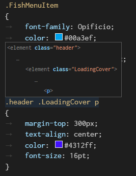
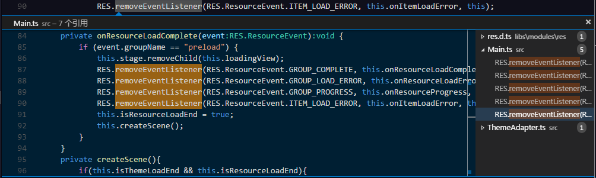
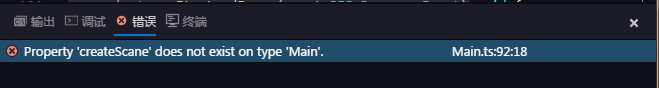

## 多编辑器 ##

EgretWing允许最多同时打开三个编辑器，并排在编辑器显示。

如果已经打开了一个编辑器，有多种方式在编辑器的右侧打开一个新的编辑器：

- 在文件选项卡的中按住`Ctrl`键(Mac下为`Cmd`键)，并点击要打开的文件
- 在当前激活的编辑器中使用快捷键 `Ctrl+\` 将把当前编辑器一分为二
- 在文件夹选项卡的右键菜单上选择 **在新编辑器中打开**

## 智能提示 ##

EgretWing支持多种语言的自动补全功能，如: JavaScript, JSON, HTML, CSS, Less, Sass, C# and TypeScript。

## 参数提示 ##

在 JavaScript，TypeScript中，输入方法的参数时能看到当前输入参数的类型和注释说明。如果是重载方法，可以通过 `上箭头` 和 `下箭头` 快捷键选择需要参数。

## 悬浮提示 ##

当鼠标移动到文字上时，如果该字符是一个变量或者下面例子中的css选择器，将出现一个悬浮提示框。

## 跳转到定义 ##

如果语言支持,可以按下快捷键`F12`跳转到光标所在位置的变量或者方法的定义。

也可以按下 `Ctrl` 键鼠标移动到变量或者方法上，将显示方法定义细节。

> 你还可以使用 `Ctrl+Click` 调整到定义，或者使用 `Ctrl+Alt+Click` 在新编辑器中打开定义。如果打开了一个新编辑器窗口，你能够使用 `Ctrl+Alt+Left` 返回到之前的编辑器。

## 快速大纲 ##

使用快捷键 `Ctrl+Shift+O` 能够打开快速大纲面板(在之前的EgretWing2.5版本中这个快捷键是`Ctrl+O`)显示当前文件中定义的所有类，方法和变量。

## 查找引用 ##

可以通过执行**查找所有引用**(快捷键`Shift+F12`)命令找到当前变量或者方法被引用的所有位置。

## 重命名变量 ##

一些语言(如TypeScript)支持全局重命名变量。使用快捷键`F2`输入变量的新名称并按下`Enter`，项目中所有使用该变量的位置将被重命名。

## 错误和警告 ##

当文件出现语法错误或者警告时，将提示错误，使用快捷键 `Ctrl+Shift+M` 查看所有的错误

也可以在错误面板中查看出现的错误

## 多选 ##

EgretWing支持多个光标，可以快速编辑相似的文本。 可以使用 `Alt+Click` 快捷键添加多个光标，每一个光标都是独立的。 也可以使用 `Ctrl+Alt+Down` 或者 `Ctrl+Alt+Up` 在下面或者上面插入光标。

## 跨行选择 ##

按住 `Shift+Alt` 移动光标可以选择多行文本。

## 代码折叠 ##

你可以使用在行号右边的折叠图标来折叠代码。

也可以使用快捷键折叠和展开代码：

- 折叠 (`Ctrl+Shift+[`)
- 展开 (`Ctrl+Shift+]`)
- 折叠所有 (`Ctrl+K Ctrl+O`)
- 展开 (`Ctrl+K Ctrl+J`)

## 常用快捷键 ##

在EgretWing3中编辑器中有很多实用功能的快捷键：

- 切换到上一个编辑器 (`Ctrl+Tab`)
- 切换到上一个编辑位置 (`Alt+Left`)
- 格式化代码 (`Shift+Alt+F`)，EgretWing2.5下为`Ctrl+I`
- 删除当前行 (`Ctrl+Shift+k`)，EgretWing2.5下为`Ctrl+D`