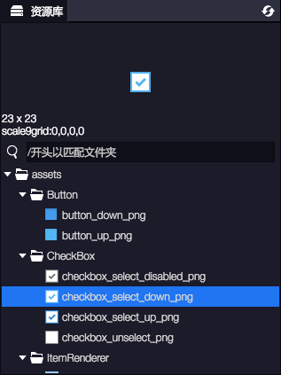
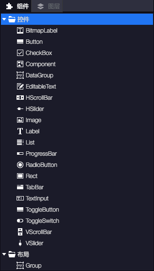
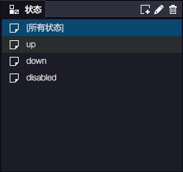

## 简介
Egret Wing 3.x中的Exml可视化编辑器，为针对EUI项目中的Exml皮肤进行代码编辑、可视化编辑、皮肤预览三个功能于一体的混合编辑器。

该编辑器可以通过可视化的方式更加方便快捷的对Eui的Exml皮肤进行编辑，编辑方式包括但不限于托拉拽等。可视化编辑器由一下两个主要部分组成：
* 编辑文档区
* 编辑相关面板

## 前置条件
如果想使用Exml可视化编辑器，你的项目需要满足如下几个条件：
* 必须为Egret项目
* 项目所使用的UI库必须为Eui
* 确保wingProperties.json内关于资源和主题的配置是正确的。
* 你打开的文件必须为Exml

## 如何打开
如果满足了上述的前置条件即可以对Exml皮肤进行可视化编辑了。下面是Eui示例项目中的PanelSkin.exml文件的打开截图：

* 视图模式 文档区中针对Exml的显示方式。其中有“源代码”、“设计”和“预览”。
* 视图模式—源代码 指文档区中对某一个Exml皮肤进行文本查看的视图模式。
* 视图模式—设计 指文档区中对某一个Exml皮肤进行可视化操作和编辑的视图模式。
* 视图模式—预览 指文档区中对某一个Exml皮肤进行预览的视图模式，在此模式下所有皮肤组件均有交互效果。

## 资源库面板

资源库面板中展示当前项目中所有可以被加载的资源，资源库中的资源依赖于项目使用的资源插件。 您也可以通过拖拽的方式将资源库面板中的资源拖拽到文档区的设计视图模式中以创建该Image。
## 组件

组件面板包含当前项目中所有可以使用的组件列表，其种类为“控件”，“布局”，“自定义”。您可以通过拖拽的方式把在文档区的设计视图中创建组件。

## 图层

该面板展示出当前文档区正在编辑的Exml皮肤文件中所有组件的层级结构。您可以通过该面板快速选中在文档区中与之对应的组件。 您也可以通过该面板更直观的调节文档区中组件之间的层级结构。

## 状态

通过“状态”面板可以方便查看Exml皮肤在不同状态下的呈现效果。同时可以切换到不同状态对Exml皮肤进行编辑。如：按钮的normal, over, down, disabled四个状态。

需要注意一点的是，“[所有状态]”并非是Egret程序中可以看到的，是方便用户使用Wing预览状态而设定，所以他并不会被编译进程序里。在Egret程序中可以看到的是除了“[所有状态]”以外的状态。所以您在编辑的时候注意当前选中的状态。

## 属性

您可以通过“属性”面板直接操作当前被选中组件的属性。