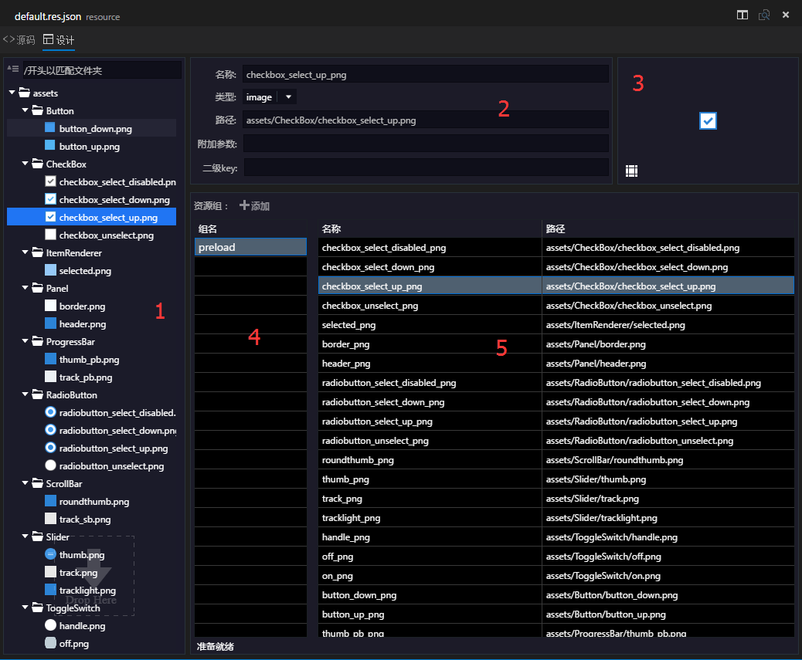
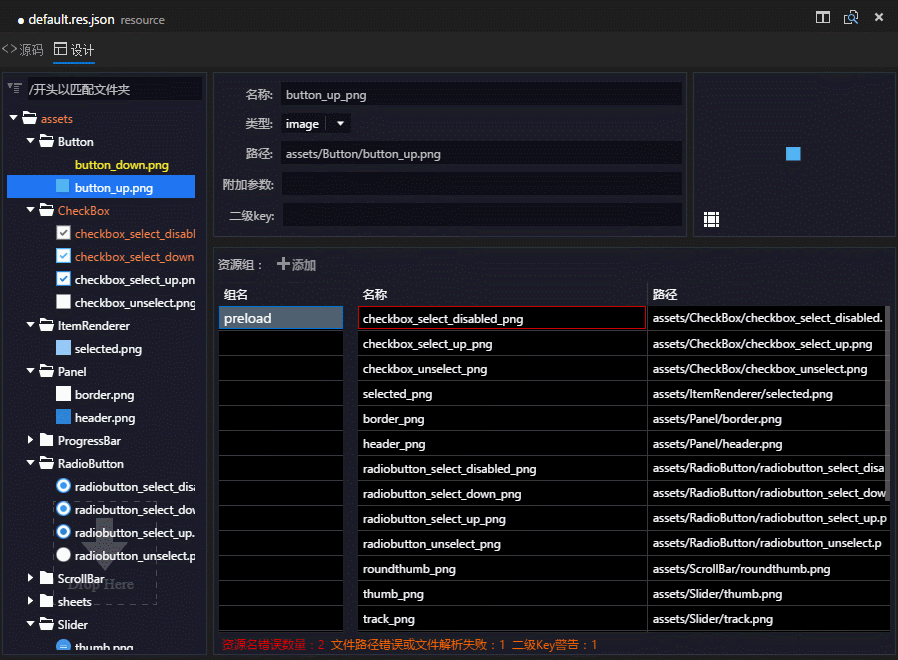
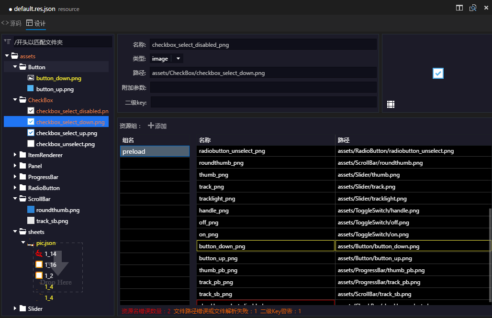

## 简介
egret项目中所用的[资源配置文件](../../../extension/RES/loadConfig/README.md)是json格式的文件。资源配置文件可以用任何文本编辑器编辑，在wing里则提供了可视化的编辑方式，可视化的编辑提供了更加简便的操作，自动检查配置文件的中错误，批量操作等功能。

## 功能介绍
打开default.res.json，显示如下界面：

上面是设计视图界面，可以点源码切换到文本编辑界面。
设计界面大致分为以下几个区，与上图数字对应：
* 1资源树区
* 2资源信息区
* 3资源预览区
* 4组信息
* 5组内资源

### **1.资源树区域**
这里以树的形式展示了资源文件的内容。树的左上角有折叠/展开树的功能按钮，和搜索框（采用了模糊匹配），搜索效果如下：

选中一项会在信息区和预览区显示所选资源。
右键可以删除资源。
可以批量删除资源，同时按住ctrl/command/shift键即可选择多项。 
可以删除文件夹。
删除资源的同时会从相关的组里自动删除。
可以从本地文件系统中拖入图片等资源到资源树中，拖入的文件自动添加到资源配置中。
支持拖入文件/文件夹的方式。
如果拖入的资源文件不在当前项目资源目录下，则会自动拷贝到当前项目资源目录的assets目录下。
### **2.信息区**
这里显示了所选资源的详细内容，主要有‘资源名’，‘资源类型’，‘在配置中的相对资源路径’，‘附加参数（9切信息）’，‘二级key（sheet文件的subkeys）’等。
资源名可以在这里编辑修改。
可以修改资源项的类型。
可以刷新二级key。

### **3.预览区**
这里是各种资源的预览效果，image类型的展示为图片，sheet文件展示为整张图，位图字体显示位图字。
对于image类型的资源，预览区左下角有一个9切编辑按钮，可以打开9切编辑界面：

编辑后将在资源文件中写入该资源的9切数据。
### **4.资源组**
这里显示的是资源文件中groups分组情况。
点‘添加’按钮可以添加新的资源组。
右键菜单里可以选择删除组。
可以多选。
可以批量删除。
### **5.组内资源**
这里显示了当前所选组里的资源。选择一项将会在信息区预览区显示该资源详细内容，并在资源树里定位到该资源。
右键菜单里可以选择删除项。
可以多选。
可以批量删除。
双击名字可以改名。
可以从本地文件系统拖入资源到当前区域。支持拖入文件/文件夹的方式。
如果拖入的资源不在当前项目的资源目录下，则自动拷贝到当前项目资源目录下的assets下。
可以从资源树拖拽资源到当前区，将自动添加到当前组。

## 资源冲突
如果资源文件中有重名的资源项，或者资源对应的文件不存在等错误，则会自动检测出来，并通过标记红框或黄框的形式提醒。在界面底部也会有提示性文字。

上图展示了三种错误：
* button_down.png文件刚被我删掉，该项资源对应的文件不存在，显示为黄色。
* checkbox里checkbox_select_down.png的资源名被我改为了checkbox_select_disabled_png，与checkbox_select_disabled.png的资源名产生了冲突，资源重名显示为红色。
* 表单文件pic.json里的subkey则有一项重名，显示为黄色。
## 其他
编辑资源后需要ctrl+s保存一下。

资源编辑器基于wing项目，需要从项目的配置文件wingProperties.json中读取资源配置。打开wingProperties.json，在resourcePlugin->configs下加入自己的资源文件：

