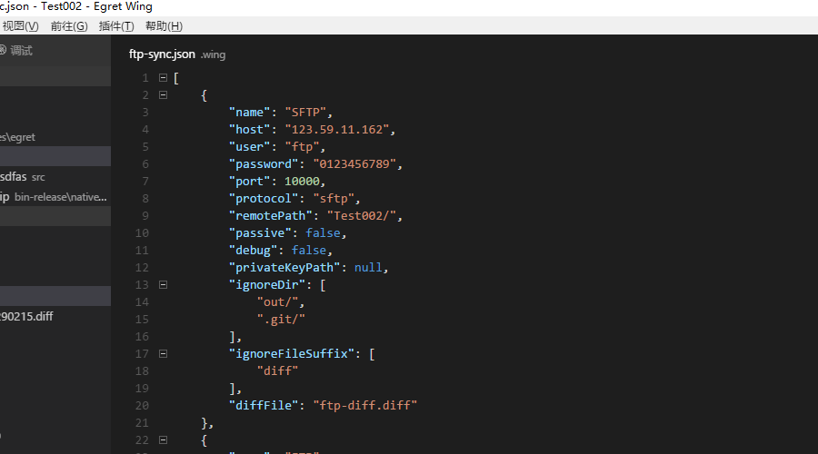
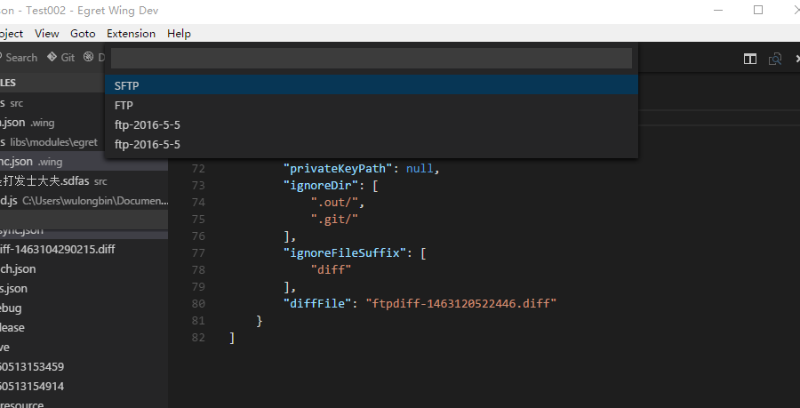
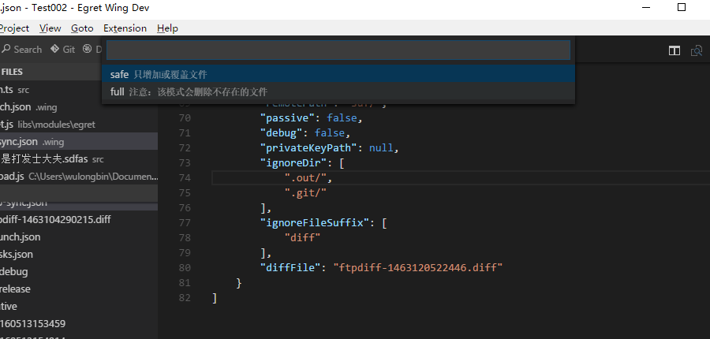
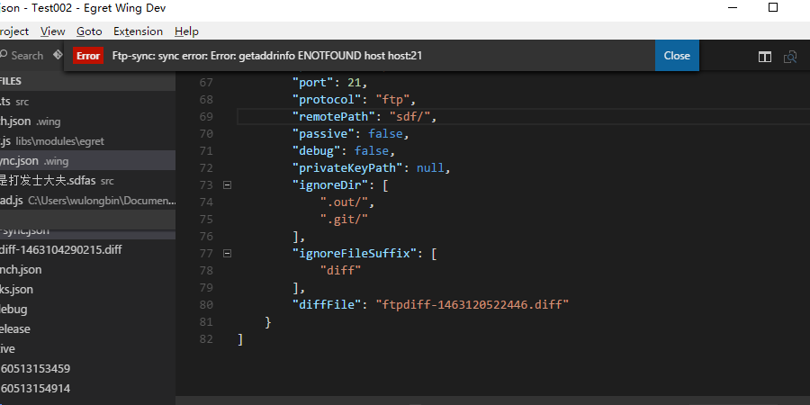

## 支持以下功能

- 支持ftp以及sftp协议上传项目文件
- 支持配置不同的ftp配置，按需上传
- 支持手动选择文件目录上传文件
- 支持差异上传文件，减少不必要的上传

## 添加ftp配置实用介绍
- 首先打开一个项目文件（若当工作空间没有项目，则无法使用ftp功能）
- 选择菜单->插件->Ftp Upload-> 添加FTP服务器配置,在弹出界面中输入ftp配置的必要信息，点击确认后就会在.wing文件下的创建ftp-sync.json文件，更多详细的配置可以在文件中直接修改生效。

## ftp配置中有效属性介绍
- name：ftp配置名称
- host:ftp服务器地址
- user:ftp 用户名
- password:ftp 用户密码
- port：ftp 协议端口
- protocol:ftp协议，支持 ftp与sftp协议。
- remotePath:上传至服务端的目标路径
- privateKeyPath:本地私钥路径，用于sftp协议
- ignoreDir: 忽略文件目录名称（只要文件目录的名称与之匹配，则该文件目录下的所有文件都会被忽略。）  
- ignoreFileSuffix:根据后缀名忽略文件
- diffFile:差异文件

## 项目发布并上传至FTP服务器使用介绍

- 首先打开一个项目文件（若当工作空间没有项目，则无法使用ftp功能）
- 选择菜单->插件->Ftp Upload-> 上传至FTP服务器(若当前没有ftp配置，则会弹出添加FTP配置窗口),发布完成后会根据配置询问上传至具体哪个ftp服务器。

- 选择玩ftp服务器之后，接下是选择上传安全模式，有两种：safe模式，至对服务器文件进行添加与覆盖，不会有删除操作；full模式，则会有删除操作文件。

-最后等待上传成功，如果配置错误等原因导致连接不上，会在10秒后弹出相关错误提示。

-如果能看见上传成功的提示，则表示ftp上传成功了。