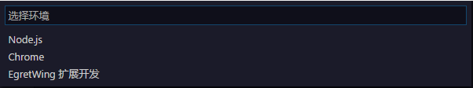

当需要运行或者调试当前项目时，需要设置启动配置。与任务配置类似，启动配置保存在当前工作空间下的 `.wing/launch.json` 中。
默认可以使用快捷键F5，**启动或者调试**当前项目。也可以切换左侧栏到调试选项卡在下拉框中选择一个启动配置，然后点击运行。

如果当前工作空间下不存在 `launch.json` 使用F5会出现选择启动配置模板的选择框。

对于一般的Egret项目，在创建项目的时候已经自动生成了与Egret项目匹配的启动配置： 包含使用内置播放器调试，使用Chrome调试，附加到Chrome进程等配置，轻松调试和启动Egret项目 。`tasks.json` 如下：

	{
	    "version": "0.2.0",
	    "configurations": [
	        {
	            "name": "Wing 内置播放器调试",
	            "type": "chrome",
	            "request": "launch",
	            "file": "index.html",
	            //"url": "http://mysite.com/index.html", //使用外部服务器时,请注释掉 file, 改用 url, 并将 useBuildInServer 设置为 false
	            "runtimeExecutable": "${execPath}",
	            "useBuildInServer": true,
	            "sourceMaps": true,
	            "webRoot": "${workspaceRoot}",
	            "preLaunchTask":"build",
	            "port":5437
	        },
	        {
	            "name": "使用本机 Chrome 调试",
	            "type": "chrome",
	            "request": "launch",
	            "file": "index.html",
	            //"url": "http://mysite.com/index.html", //使用外部服务器时,请注释掉 file, 改用 url, 并将 useBuildInServer 设置为 false
	            "runtimeExecutable": "C:\\Program Files (x86)\\Google\\Chrome\\Application\\chrome.exe", // 改成您的 Chrome 安装路径
	            "useBuildInServer": true,
	            "sourceMaps": true,
	            "webRoot": "${workspaceRoot}",
	            "preLaunchTask":"build",
	            "userDataDir":"${tmpdir}",
	            "port":5437
	        },
	        {
	            "name": "附加到 Chrome 进程",
	            "type": "chrome",
	            "request": "attach",
	            "port": 9222,
	            "webRoot": "${workspaceRoot}"
	        }
	    ]
	}

> 基本上自定义EgretWing都是去修改某一个json文件的内容。这种手动修改的方式对于一些初学者门槛有点高，目前我们正在计划让自定义配置文件可视化让更多人轻松自定义EgretWing。

