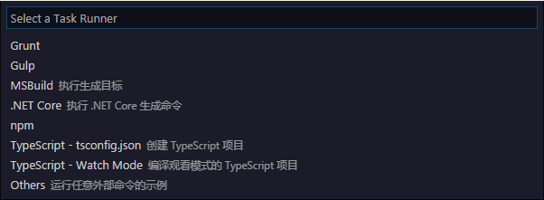

设置当前工作空间下 `.wing/tasks.json` 可以自定义任务。常见的任务如 构建，清理，发布。这些任务通过一般是执行命令行程序来实现的。
如果当前工作空间下的 `.wing` 文件夹没有 `tasks.json` 。可以通过命令面板中的 **Tasks: Configure Task Runner** 命令选择一个任务模板。

对于一般的Egret项目，在创建项目的时候已经自动生成了与Egret命令行匹配的任务： **构建(Ctrl+Shift+B)，清理，发布**。`tasks.json` 如下：

	{
	    "version": "0.1.0",
	    "command": "egret",
	    "isShellCommand": true,
	    "tasks": [
	        {
	            "taskName": "build",
	            "showOutput": "always",
	            "args": [
	                "build",
	                "-sourcemap"
	            ],
	            "problemMatcher": "$tsc"
	        },
	        {
	            "taskName": "clean",
	            "showOutput": "always",
	            "args": [
	                "build",
	                "-e"
	            ],
	            "problemMatcher": "$tsc"
	        },
	        {
	            "taskName": "publish",
	            "showOutput": "always",
	            "args": [
	                "publish"
	            ],
	            "problemMatcher": "$tsc"
	        }
	    ]
	}