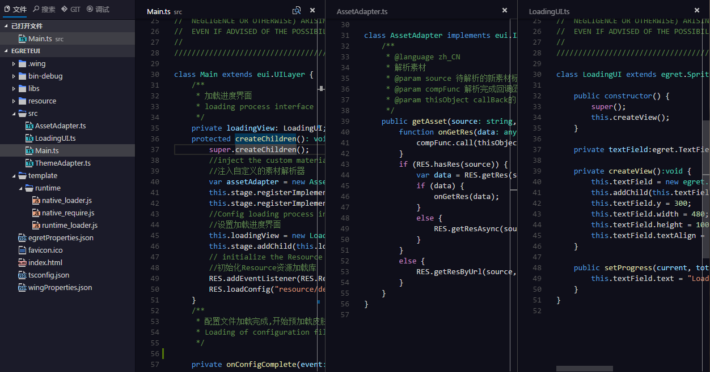
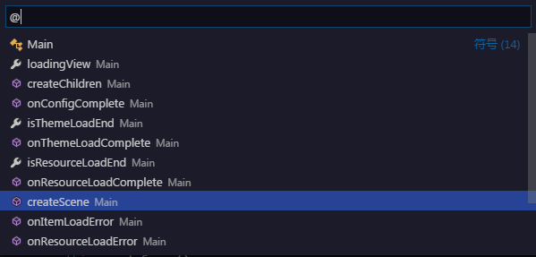
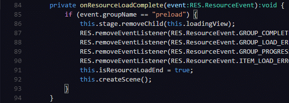

EgretWing3是Egret团队基于VSCode开发的最新编辑器，相比于EgretWing2.5最显著的优势就是快。

然而对于习惯使用EgretWing2.5的用户，初次使用EgretWing3可能会觉得难以上手。EgretWing2.5主要是参考eclipse，FlashBuilder等传统IDE设计的，对于习惯使用eclipse系列工具的开发者EgretWing2.5的上手是非常容易的，而EgretWing3的操作方式对于习惯于传统IDE的用户来说，并不是那么友好。本文主要介绍EgretWing3的一些基本用法。

# 基本概念 #

## 窗口布局 ##

如上图，EgretWing窗口主要有下面几个部分组成：

- **菜单栏(Menu Bar)** 可以通过菜单栏执行一些常用命令
- **左侧栏(Side Bar)** 位于编辑器左侧，由多个子视图组成(文件，搜索，Git，调试)
- **编辑器(Editor)** 编辑文件的主要区域
- **面板(Panel)** 位于编辑器下方，也由多个子视图组成(输出，调试，错误，终端)
- **右侧栏(Utility Bar)** 位于编辑器右侧，由多个子视图组成，子视图目前可以通过插件API扩展
- **状态栏(Status Bar)** 最下方，显示当前打开项目和文件的一些信息

**菜单栏**可以通过**切换菜单栏**命令来设置是否显示

**左侧栏，右侧栏，面板**可以通过视图菜单中的相关命令来切换是否显示

还可以通过鼠标操作来打开和关闭，如下图

## 工作空间 ##

EgretWing可以通过打开一个文件或者文件夹进行代码编写。EgretWing也可以同时打开多个窗口，每个窗口对应一个文件或者文件。当一个窗口打开的是一个文件夹时，这个文件夹被称为当前工作空间。

可以使用菜单栏中的 **文件---新建窗口** 命令(`Ctrl+Shift+N`)打开一个新窗口。
新建项目(`Alt+Shift+P`)在项目创建成功后也会自动打开新窗口。

一般来说，每个工作空间就对应一个项目。在工作空间目录下有一个特殊的文件夹 `.wing`。这个文件夹存放当前工作空间的一些设置和配置文件。常见的几个配置文件如 `task.json` , `launch.json` , `settings.json`，这几个文件的作用下面会具体说明。

> EgretWing和WebStorm都是基于文件夹来表示工作空间，这个工作空间就是文件系统中的一个目录。而Eclipse的工作空间则是由多个项目构成，每个项目对应一个目录，而工作空间是这些目录的集合。几乎所有的IDE都会有一个特殊的文件夹存放工作空间的配置。如 WebStorm的 `.idea` 文件夹， Eclipse的 `.metadata` 文件夹。EgretWing中的 `.wing` 文件夹也是类似，只不过里面的文件一般都是json文件，有时候我们也会手动修改这些配置设置工作空间的行为。

# 自定义 #

## 用户设置和工作空间设置 ##

EgretWing提供了包括 **编辑器设置，文件设置，窗口设置** 等近200个设置项来满足各种用户习惯。常用的设置如：

    // 字体.
    "editor.fontFamily": "",
    // 字体大小.
    "editor.fontSize": 0,
    // 显示行号
    "editor.lineNumbers": true,
    // 一个制表符等于的空格数
    "editor.tabSize": 4,
    // 按 "Tab" 时插入空格
    "editor.insertSpaces": true,
    
    // 读取或写入文件的默认编码格式.
    "files.encoding": "utf8",
    // 默认换行符
    "files.eol": "\r\n"

可以通过菜单栏，**文件---首选项**菜单打开**用户设置**或者**工作空间设置**

设置分为**用户设置**和**工作空间设置**。用户设置是全局的，在任何地方都可以生效，用户设置会覆盖默认设置。用户设置保存在用户缓存目录的 settings.json 中。
工作空间设置是针对某个文件夹的，只对当前工作空间有效，工作空间设置会覆盖用户设置。工作空间设置保存在当前工作空间下的 .wing/settings.json 中。
所以最终的优先级是 **工作空间设置  > 用户设置 > 默认设置**。

通过修改 `settings.json` 文件改变当前的设置。例如我习惯的用户配置就是这样写的

	{
		"editor.insertSpaces": false,
		"files.eol": "\n",
		"window.openFilesInNewWindow": false,
		"tslint.enable": false
	}

每个字段表示的功能可以通过默认配置中的字段说明找到具体的含义。

## 快捷键设置 ##

EgretWing提供了近300个快捷键设置项自定义命令的快捷键。可以通过菜单栏，`文件---首选项` 菜单打开 **快捷键** 选项。快捷键设置界面将打开两个编辑器，默认快捷键设置在左侧，编辑右侧编辑器中的 `keybindings.json` 文件自定义快捷键。一般在左侧找到要修改的快捷键命令，然后复制左侧的项到右侧，修改key字段就行。例如：

	[
	    {
	        "key": "ctrl+d",
	        "command": "editor.action.deleteLines",
	        "when": "editorFocus"
	    },
	    {
	        "key": "ctrl+i",
	        "command": "editor.action.format",
	        "when": "editorTextFocus"
	    },
	    {
	        "key": "f7",
	        "command": "workbench.action.debug.stepOut",
	        "when": "inDebugMode"
	    },
	    {
	        "key": "f6",
	        "command": "workbench.action.debug.stepOver",
	        "when": "inDebugMode"
	    },
	    {
	        "key": "f5",
	        "command": "workbench.action.debug.stepInto",
	        "when": "inDebugMode"
	    }
	]

在EgretWing3中有很多命令的快捷键与EgretWing2.5的默认快捷键不一样，可以使用 插件菜单中的 **IDE迁移向导 --- 导入其他IDE设置**，选择EgretWing2.5自动修改 `keybindings.json` 文件导入EgretWing2.5的快捷键。

## 任务配置 ##

设置当前工作空间下 `.wing/tasks.json` 可以自定义任务。常见的任务如 构建，清理，发布。这些任务通过一般是执行命令行程序来实现的。
如果当前工作空间下的 `.wing` 文件夹没有 `tasks.json` 。可以通过命令面板中的 **Tasks: Configure Task Runner** 命令选择一个任务模板。

对于一般的Egret项目，在创建项目的时候已经自动生成了与Egret命令行匹配的任务： **构建(Ctrl+Shift+B)，清理，发布**。`tasks.json` 如下：

	{
	    "version": "0.1.0",
	    "command": "egret",
	    "isShellCommand": true,
	    "tasks": [
	        {
	            "taskName": "build",
	            "showOutput": "always",
	            "args": [
	                "build",
	                "-sourcemap"
	            ],
	            "problemMatcher": "$tsc"
	        },
	        {
	            "taskName": "clean",
	            "showOutput": "always",
	            "args": [
	                "build",
	                "-e"
	            ],
	            "problemMatcher": "$tsc"
	        },
	        {
	            "taskName": "publish",
	            "showOutput": "always",
	            "args": [
	                "publish"
	            ],
	            "problemMatcher": "$tsc"
	        }
	    ]
	}

## 启动配置 ##

当需要运行或者调试当前项目时，需要设置启动配置。与任务配置类似，启动配置保存在当前工作空间下的 `.wing/launch.json` 中。
默认可以使用快捷键F5，**启动或者调试**当前项目。也可以切换左侧栏到调试选项卡在下拉框中选择一个启动配置，然后点击运行。

如果当前工作空间下不存在 `launch.json` 使用F5会出现选择启动配置模板的选择框。

对于一般的Egret项目，在创建项目的时候已经自动生成了与Egret项目匹配的启动配置： 包含使用内置播放器调试，使用Chrome调试，附加到Chrome进程等配置，轻松调试和启动Egret项目 。`tasks.json` 如下：

	{
	    "version": "0.2.0",
	    "configurations": [
	        {
	            "name": "Wing 内置播放器调试",
	            "type": "chrome",
	            "request": "launch",
	            "file": "index.html",
	            //"url": "http://mysite.com/index.html", //使用外部服务器时,请注释掉 file, 改用 url, 并将 useBuildInServer 设置为 false
	            "runtimeExecutable": "${execPath}",
	            "useBuildInServer": true,
	            "sourceMaps": true,
	            "webRoot": "${workspaceRoot}",
	            "preLaunchTask":"build",
	            "port":5437
	        },
	        {
	            "name": "使用本机 Chrome 调试",
	            "type": "chrome",
	            "request": "launch",
	            "file": "index.html",
	            //"url": "http://mysite.com/index.html", //使用外部服务器时,请注释掉 file, 改用 url, 并将 useBuildInServer 设置为 false
	            "runtimeExecutable": "C:\\Program Files (x86)\\Google\\Chrome\\Application\\chrome.exe", // 改成您的 Chrome 安装路径
	            "useBuildInServer": true,
	            "sourceMaps": true,
	            "webRoot": "${workspaceRoot}",
	            "preLaunchTask":"build",
	            "userDataDir":"${tmpdir}",
	            "port":5437
	        },
	        {
	            "name": "附加到 Chrome 进程",
	            "type": "chrome",
	            "request": "attach",
	            "port": 9222,
	            "webRoot": "${workspaceRoot}"
	        }
	    ]
	}

> 基本上自定义EgretWing都是去修改某一个json文件的内容。这种手动修改的方式对于一些初学者门槛有点高，目前我们正在计划让自定义配置文件可视化让更多人轻松自定义EgretWing。

# 常用面板 #

## 命令面板 ##

命令面板能方便的查找和执行命令，使用快捷键 **F1** 或者 **Ctrl+Shift+P** 呼出面板。

面板每一项都是一个命令，如果该命令有快捷键在右侧会显示对应的快捷键。

## 文件操作 ##

左侧栏的文件选项卡中，包含了当前工作空间的文件列表树。使用右键菜单能显示可以执行的命令。

## 全局搜索 ##

右侧栏的搜索选项卡中能对当前工作空间中的所有文件和内容进行搜索，并且支持正则表达式以及模式匹配和过滤等高级设置选项。

## GIT ##

EgretWing内置Git管理工具， 在右侧栏的GIT选项卡中能直接提交，拉取，推送代码到Git仓库。

在状态栏左侧也能显示远程仓库与本地仓库的同步状态。

单击更改的文件列表，在编辑器能打开比较编辑器查看改变的具体细节。

## 调试和调试控制台 ##

如果配置了 `launch.json` 可以通过快捷键F5 或者 调试面板启动调试。在调试模式下，调试选项卡中的**变量，监视，调用堆栈，断点**折叠菜单都是可用的。

面板中的调试面板中显示程序运行中的输出和报错信息，在下方的输入框中也能输入表达式并动态执行得到计算结果。这个面板与Chrome开发者工具中的Console面板功能类似。

## 输出 ##

输出面板显示一些提示消息，显示当前运行状态。输出面板有多个频道(`Channel`)区分不同输出的来源。

例如Tasks频道会输出项目编译过程中相关的信息，GIT频道输出Git执行过程中的信息，Project频道输出项目创建相关的信息等。

## 终端 ##

EgretWing内置了一个终端命令行执行窗口，能方便的直接在EgretWing内部使用命令行。

点击右侧的 `+` 图标能新建一个命令行窗口，右侧的列表显示当前所有打开的命令行窗口。

# 代码编辑 #

## 多编辑器 ##

EgretWing允许最多同时打开三个编辑器，并排在编辑器显示。

如果已经打开了一个编辑器，有多种方式在编辑器的右侧打开一个新的编辑器：

- 在文件选项卡的中按住`Ctrl`键(Mac下为`Cmd`键)，并点击要打开的文件
- 在当前激活的编辑器中使用快捷键 `Ctrl+\` 将把当前编辑器一分为二
- 在文件夹选项卡的右键菜单上选择 **在新编辑器中打开**

## 智能提示 ##

EgretWing支持多种语言的自动补全功能，如: JavaScript, JSON, HTML, CSS, Less, Sass, C# and TypeScript。

## 参数提示 ##

在 JavaScript，TypeScript中，输入方法的参数时能看到当前输入参数的类型和注释说明。如果是重载方法，可以通过 `上箭头` 和 `下箭头` 快捷键选择需要参数。

## 悬浮提示 ##

当鼠标移动到文字上时，如果该字符是一个变量或者下面例子中的css选择器，将出现一个悬浮提示框。

## 跳转到定义 ##

如果语言支持,可以按下快捷键`F12`跳转到光标所在位置的变量或者方法的定义。

也可以按下 `Ctrl` 键鼠标移动到变量或者方法上，将显示方法定义细节。

> 你还可以使用 `Ctrl+Click` 调整到定义，或者使用 `Ctrl+Alt+Click` 在新编辑器中打开定义。如果打开了一个新编辑器窗口，你能够使用 `Ctrl+Alt+Left` 返回到之前的编辑器。

## 快速大纲 ##

使用快捷键 `Ctrl+Shift+O` 能够打开快速大纲面板(在之前的EgretWing2.5版本中这个快捷键是`Ctrl+O`)显示当前文件中定义的所有类，方法和变量。

## 查找引用 ##

可以通过执行**查找所有引用**(快捷键`Shift+F12`)命令找到当前变量或者方法被引用的所有位置。

## 重命名变量 ##

一些语言(如TypeScript)支持全局重命名变量。使用快捷键`F2`输入变量的新名称并按下`Enter`，项目中所有使用该变量的位置将被重命名。

## 错误和警告 ##

当文件出现语法错误或者警告时，将提示错误，使用快捷键 `Ctrl+Shift+M` 查看所有的错误

也可以在错误面板中查看出现的错误

## 多选 ##

EgretWing支持多个光标，可以快速编辑相似的文本。 可以使用 `Alt+Click` 快捷键添加多个光标，每一个光标都是独立的。 也可以使用 `Ctrl+Alt+Down` 或者 `Ctrl+Alt+Up` 在下面或者上面插入光标。

## 跨行选择 ##

按住 `Shift+Alt` 移动光标可以选择多行文本。

## 代码折叠 ##

你可以使用在行号右边的折叠图标来折叠代码。

也可以使用快捷键折叠和展开代码：

- 折叠 (`Ctrl+Shift+[`)
- 展开 (`Ctrl+Shift+]`)
- 折叠所有 (`Ctrl+K Ctrl+O`)
- 展开 (`Ctrl+K Ctrl+J`)

## 常用快捷键 ##

在EgretWing3中编辑器中有很多实用功能的快捷键：

- 切换到上一个编辑器 (`Ctrl+Tab`)
- 切换到上一个编辑位置 (`Alt+Left`)
- 格式化代码 (`Shift+Alt+F`)，EgretWing2.5下为`Ctrl+I`
- 删除当前行 (`Ctrl+Shift+k`)，EgretWing2.5下为`Ctrl+D`