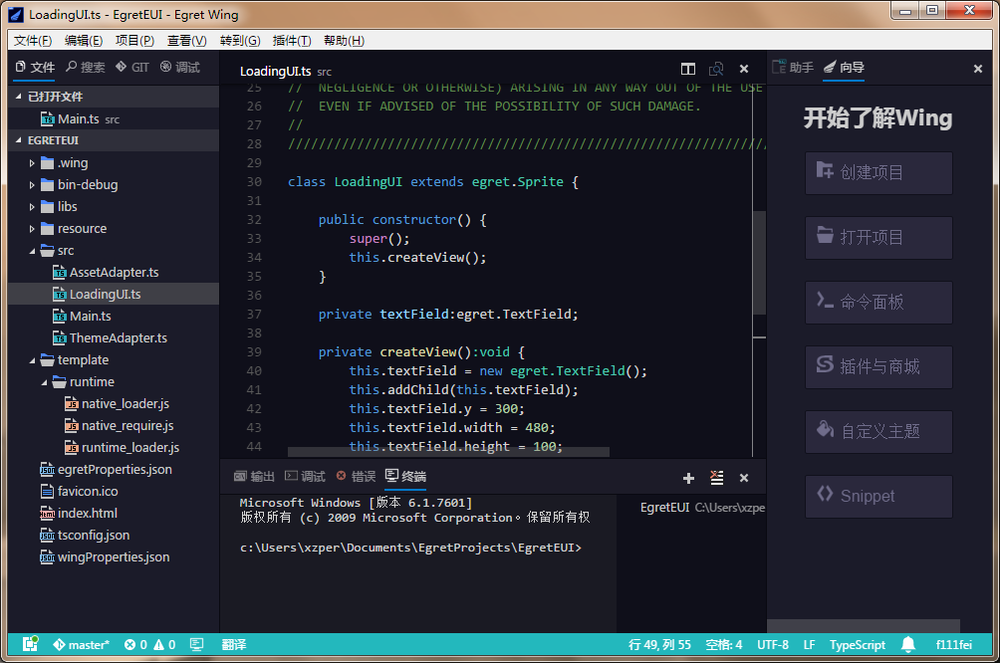
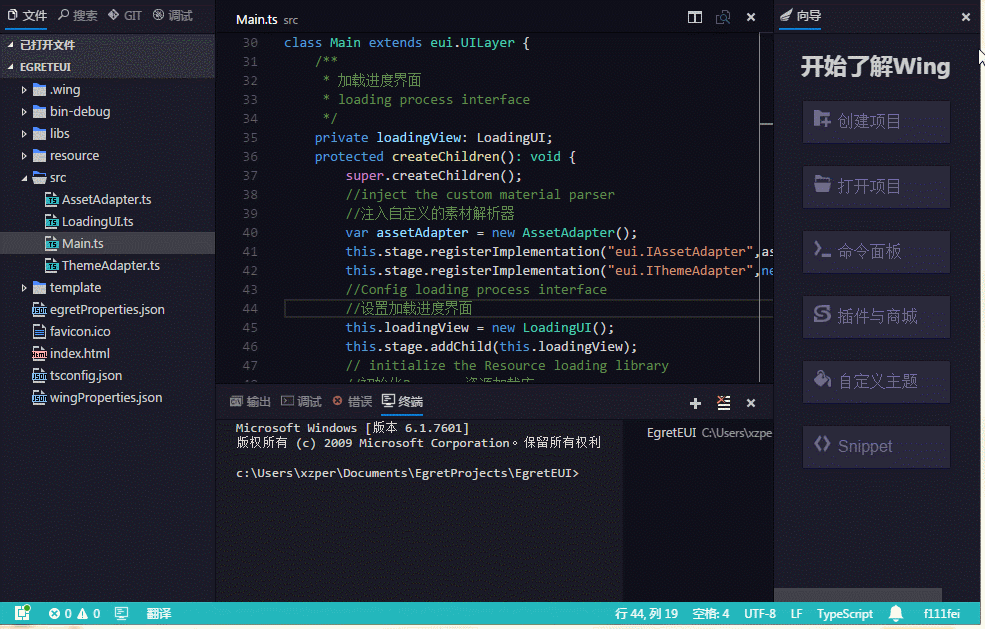

EgretWing3是Egret团队基于VSCode开发的最新编辑器，相比于EgretWing2.5最显著的优势就是快。

然而对于习惯使用EgretWing2.5的用户，初次使用EgretWing3可能会觉得难以上手。EgretWing2.5主要是参考eclipse，FlashBuilder等传统IDE设计的，对于习惯使用eclipse系列工具的开发者EgretWing2.5的上手是非常容易的，而EgretWing3的操作方式对于习惯于传统IDE的用户来说，并不是那么友好。本文主要介绍EgretWing3的一些基本用法。

# 基本概念 #

## 窗口布局 ##

如上图，EgretWing窗口主要有下面几个部分组成：

- **菜单栏(Menu Bar)** 可以通过菜单栏执行一些常用命令
- **左侧栏(Side Bar)** 位于编辑器左侧，由多个子视图组成(文件，搜索，Git，调试)
- **编辑器(Editor)** 编辑文件的主要区域
- **面板(Panel)** 位于编辑器下方，也由多个子视图组成(输出，调试，错误，终端)
- **右侧栏(Utility Bar)** 位于编辑器右侧，由多个子视图组成，子视图目前可以通过插件API扩展
- **状态栏(Status Bar)** 最下方，显示当前打开项目和文件的一些信息

**菜单栏**可以通过**切换菜单栏**命令来设置是否显示

**左侧栏，右侧栏，面板**可以通过视图菜单中的相关命令来切换是否显示

还可以通过鼠标操作来打开和关闭，如下图

## 工作空间 ##

EgretWing可以通过打开一个文件或者文件件夹进行代码编写。EgretWing也可以同时打开多个窗口，每个窗口对应一个文件或者文件。当一个窗口打开的是一个文件夹时，这个文件夹被称为当前工作空间。

可以使用菜单栏中的 **文件---新建窗口** 命令(`Ctrl+Shift+N`)打开一个新窗口。
新建项目(`Alt+Shift+P`)在项目创建成功后也会自动打开新窗口。

一般来说，每个工作空间就对应一个项目。在工作空间目录下有一个特殊的文件夹 `.wing`。这个文件夹存放当前工作空间的一些设置和配置文件。常见的几个配置文件如 `task.json` , `launch.json` , `settings.json`，这几个文件的作用下面会具体说明。

> EgretWing和WebStorm都是基于文件夹来表示工作空间，这个工作空间就是文件系统中的一个目录。而Eclipse的工作空间则是由多个项目构成，每个项目对应一个目录，而工作空间是这些目录的集合。几乎所有的IDE都会有一个特殊的文件夹存放工作空间的配置。如 WebStorm的 `.idea` 文件夹， Eclipse的 `.metadata` 文件夹。EgretWing中的 `.wing` 文件夹也是类似，只不过里面的文件一般都是json文件，有时候我们也会手动修改这些配置设置工作空间的行为。

