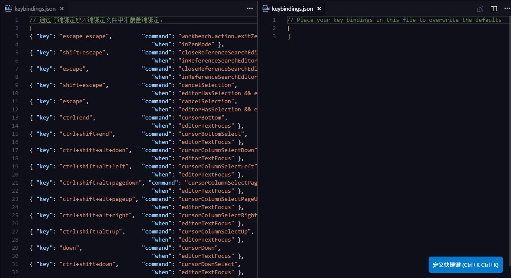
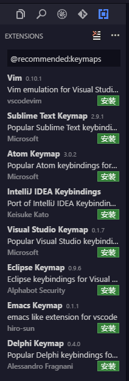

EgretWing提供了近300个快捷键设置项自定义命令的快捷键。点击`文件---首选项---快捷键设置面板`，
会进入到如下界面：

点击头侧齿轮按钮可以自定义快捷键。

也可以通过菜单栏，`文件---首选项` 菜单打开 **键盘快捷方式** 选项。快捷键设置界面将打开两个编辑器，默认快捷键设置在左侧，编辑右侧编辑器中的 `keybindings.json` 文件自定义快捷键。一般在左侧找到要修改的快捷键命令，然后复制左侧的项到右侧，修改key字段就行。如下图所示：

### 键映射扩展

点击`文件---首选项---键映射扩展`，可以安装其他IDE的键映射。

