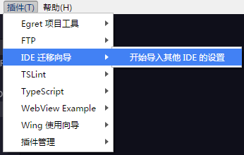

EgretWing提供了近300个快捷键设置项自定义命令的快捷键。可以通过菜单栏，`文件---首选项` 菜单打开 **快捷键** 选项。快捷键设置界面将打开两个编辑器，默认快捷键设置在左侧，编辑右侧编辑器中的 `keybindings.json` 文件自定义快捷键。一般在左侧找到要修改的快捷键命令，然后复制左侧的项到右侧，修改key字段就行。例如：

	[
	    {
	        "key": "ctrl+d",
	        "command": "editor.action.deleteLines",
	        "when": "editorFocus"
	    },
	    {
	        "key": "ctrl+i",
	        "command": "editor.action.format",
	        "when": "editorTextFocus"
	    },
	    {
	        "key": "f7",
	        "command": "workbench.action.debug.stepOut",
	        "when": "inDebugMode"
	    },
	    {
	        "key": "f6",
	        "command": "workbench.action.debug.stepOver",
	        "when": "inDebugMode"
	    },
	    {
	        "key": "f5",
	        "command": "workbench.action.debug.stepInto",
	        "when": "inDebugMode"
	    }
	]

在EgretWing3中有很多命令的快捷键与EgretWing2.5的默认快捷键不一样，可以使用 插件菜单中的 **IDE迁移向导 --- 导入其他IDE设置**，选择EgretWing2.5自动修改 `keybindings.json` 文件导入EgretWing2.5的快捷键。

