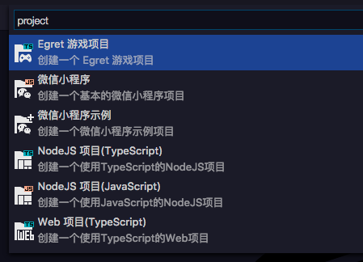
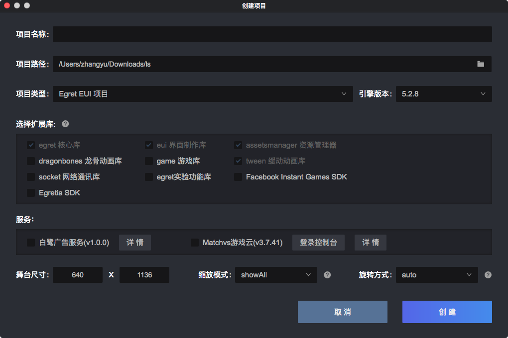

选择`文件---新建项目`，会弹出如下界面：

以游戏项目为例，点击Egret游戏项目。会启动 `Egret Launcher` 弹出配置面板，可以选择路径，扩展库，引擎版本号，舞台宽度高度，默认背景颜色，缩放模式，旋转模式等。

具体操作，可以[查看详细文档](http://developer.egret.com/cn/github/egret-docs/Engine2D/getStarted/helloWorld/index.html)
