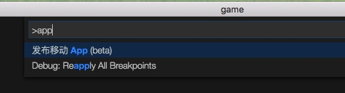

# Android/iOS 打包测试工具
## 功能简介：
- 该插件可以快速方便地在对应移动平台下进行工程&lt;font color=red&gt;打包测试&lt;/font&gt;- 是对Egret EDN中[iOS APP打包方案](../../Engine2D/publish/publishIOS/README.md), [Android APP打包](../../Engine2D/publish/publishAndroid/README.md)中打包过程的集成
- 插件自动完成了两步操作：
  - 将egret项目转化成android／ios对应的native项目
  - 对native项目进行构建
   - android项目会得到.apk文件
   - ios项目会得到可在模拟器中运行的.app文件

- android打包完成后会&lt;font color=red&gt;自动&lt;/font&gt;去查找可连接的设备,多台设备会以列表形式排列，&lt;font color=red&gt;点击即可安装&lt;/font&gt;- ios会自动启动模拟器，在模拟器中运行。

## 依赖条件：
### Android
* 1.egret engine [点击下载](http://www.egret.com/products/engine.html) 
* 2.android sdk [mac版下载](http://pan.baidu.com/s/1dD8WUL7) [windows版下载](http://pan.baidu.com/s/1gdsDRn9)
* 3.java sdk [mac版下载](http://www.oracle.com/technetwork/java/javase/downloads/jdk8-downloads-2133151.html) [windows版下载](http://www.oracle.com/technetwork/java/javase/downloads/jdk8-downloads-2133151.html)
* 4.ant [点击下载](http://ant.apache.org/bindownload.cgi)
* 5.egret-android-support [点击下载](http://www.egret.com/products/products-others.html#egret-support)

### iOS
* 1.egret engine [点击下载](http://www.egret.com/products/engine.html) 
* 2.egret-ios-support [点击下载](http://www.egret.com/products/products-others.html#egret-support)
* 3.xcode

## 使用流程:
* 1.设置项目构建所依赖工具的路径 [&lt;font color=red&gt;settings&lt;/font&gt;]
* 
* 或者
* 

* 

* 

* 2.选择对应的版本构建选项 [&lt;font color=red&gt;build android project&lt;/font&gt;] or [&lt;font color=red&gt;build ios project&lt;/font&gt;]

* 

* 3.生成&lt;font color=red&gt;debug&lt;/font&gt;版本后测试

## 注意：
- 强烈建议在配置环境时不使用带有中文字符或带有空格的路径。
- 由于不同版本之间存在诸如api level匹配之类的问题，android建议使用上面给出的下载版本
- 使用&lt;font color=red&gt;wing&lt;/font&gt;创建egret游戏后，执行命令会在&lt;font color=red&gt;同目录下&lt;/font&gt;生成对应的android和ios项目(&lt;font color=red&gt;请在创建之前确认没有重名文件夹&lt;/font&gt;)，目录结构如下：
 - --helloworld
 - --helloworld_android
 - - helloworld
 - --helloworld_ios
 - - helloworld

#### android
- android调试请&lt;font color=red&gt;打开usb调试&lt;/font&gt;功能，否则电脑无法正确发现android设备并完成安装（某些android设备连接电脑时还需要在手机上确认哦）。
- android调试，工程编译完成后会&lt;font color=red&gt;自动&lt;/font&gt;去检索设备，并在你选择的设备上自动安装app。你只需选择需要安装的设备即可。
  - 
  
#### ios
- 由于ios开发的特殊性，为了避免大家纠结在开发者证书，策略文件等的配置上，插件现在只生成可以在模拟器中运行的app文件（此文件不可在真机安装，因为没有签名）。
- 插件生成app文件后会自动启动模拟器加载app文件（请确保安装模拟器）。
   
## 未来:
- beta版现在只提供了配置项目构建所需环境的功能，未来将在此基础之上给用户更多的配置自由度，例如工程名称，路径。

# Q&amp;A
#### 在使用过程中，如果遇到问题，请到论坛发帖或联系相关人员(QQ：815612516)
## 下面是有同学遇到了的问题：
- 
  - 这可能是因为手动删除了项目，导致IDE在按照已有记录的路径去查找项目时失败。
    #### 解决方法：
      - 打开源项目，找到egretProperties.json文件，查看里面native字段下是否有android_path／ios_path
      - 如果有,将对应行删除掉，保存，然后重新按照流程导出即可。
        - 
      - 也有可能是环境配置没有配好。请新建一个测试项目，按照流程走一次，看能否成功导出。
  - 有同学说：我并没有删除项目。
    #### 解决办法:
      - 请重启电脑再试着导出一下。（极特殊情况下，重启电脑之后就好了。）

- 
  - 这是因为java环境变量配置不对引起的
    #### 解决方法：
    - 正确配置java环境变量，可参考博文:http://jingyan.baidu.com/article/f96699bb8b38e0894e3c1bef.html

 
 

